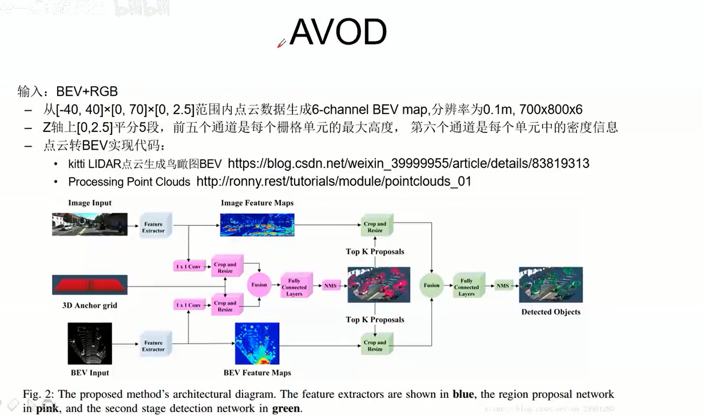

# 3D目标检测

## 1. 激光雷达点云

激光雷达产生

机械式Lidar：TOF、N个独立激光单元、旋转产生360度视场

MEMS式Lidar：不旋转

数据特点

简单：x y zi-稀疏:7%?

无序：N!（角度不同、震动、扫描顺序不同)

精确：+-2cm图像VS点云

点云：简单精确适合几何感知

图像：丰富多变适合语义感知

### 数据集

3D点云数据来源:

- CAD模型:—般分类问题的数据集是CAD
- LiDAR传感器
- RGBD相机

常用数据集:

- Classification(Feature Repfesentation)
  - ModelNet40/10
  - ShapeNetPart
- 无人驾驶场景:Detection / Segmentation / Tracking 
  - http://www.cvlibs.net/datasets/kitti/
  - http://lapolloscape.auto/
  - https://www.cityscapes-dataset.coml
  - https://bdd-data.berkeley.edu/

### KITTI

- 自动驾驶场景下的计算机视觉算法评测数据集:
  - 算法评测类别: stereol optical flow / visual odometry/ object detection / tracking
  - 数据采集场景:Road / City / Residential / Campus / Person
  - 3D物体检测: car, van, truck, pedestrian, pedestrian(sitting), cyclist,tram, misc

- REF:
  - 《Vision meets Robotics: The KITTI Dataset》
  - 《Are we ready for autonomous driving? The KITTl Vision Benchmark Suite》
  - https://blog.csdn.netlsolomon1558/articleldetails/70173223
  - https://blog.csdn.net/hit1524468/article/details/79766805
  - https://blog.csdn.net/weixin_35653315/article/details/79669601

### 坐标系

#### camera，lidar，IMU传感器

### 点云基础

Processing Point Clouds

- The Point Cloud Data
- lmage vs Point Cloud Coordinates
- Creating Birdseye View of Point Cloud Data
- Creating 360 degree Panoramic Views
- Interactive 3D Visualization using Mayavi
- lnteractive 3D Visualization using Matplotlib

BEV:鸟瞰图

- https://blog.csdn.net/weixin_39999955/articleldetails/83819313
- https://ligithub.com/yeyang1021/KITTI_VIZ_BEV

Lidar Point on lmage:点云图投影图片

- https://github.com/charlesq34/frustum-pointnets

#### 鸟瞰图

点云坐标系到图像坐标系

#### 投影图片实现

坐标系转换

激光雷达 => 参考相机0号相机，灰度图相机，Velo-to-camera变换矩阵实现

参考相机 => 矫正之后的坐标系，camera-to-cameraRect

矫正之后的坐标系 => 对应的坐标系2号，cameraRect-to-image

### 传统vs深度学习

传统:

- 基于点云的目标检测:分割地面->点云聚类->特征提取->分类
- 地面分割依赖于人为设计的特征和规则，如设置一些阈值、表面法线等，泛化能力差
- 多阶段的处理流程意味着可能产生复合型错误——聚类和分类并没有建立在一定的上下文基础上，目标周围的环境信息缺失
- 这类方法对于单帧激光雷达扫描的计算时间和精度是不稳定的，这和自动驾驶场景下的安全性要求（稳定,小方差）相悖
- ref:
  - Velodyne《LIDAR-based 3D Object Perception》
  - https://blog.csdn.net/AdamShan/article/details/83544089

深度学习:End-to-End

- 挑战:
  - 非结构化数据，只是一堆点XYZI，没有网格之类的组织结构
  - 无序性:相同的点云可以由多个完全不同的矩阵表示(只是点的摆放顺序不同而已)
  - 数量变化大:图像中像素数量是常数，点云的数量可能会有很大（例如:不同线的激光雷达)
  - 表现形式变化大:一辆车向左转，同一辆车向右转，会有不同的点云代表同一辆车
  - 缺少数据:没有图片数据多，扫描时通常被遮挡部分数据丢失，数据稀疏

## 2. 基于激光雷达点云检测算法

Pixel-Based

Voxel-Based

Tree-Based

Point-Based

实战基于点云的目标检测

### Pixel-Based

基本思想:

- 3D->2D，三维点云在不同角度的相机投影(映射)
- 再借助2D图像处理领域成熟的深度学习框架进行分析

典型算法

- MVCNN MV3D AVOD
- Appllo2.0 SqueezeSeg

#### MVCNN（分类):

最早用深度学习来处理点云数据的方法

实现CAD点云模型的分类:12个角度的图像〈http://vis-www.cs.umass.edu/mvcnn/)

#### AVOD

#### Apollo2.0

#### SqueezeSeg

### Voxel-Based

#### VoxelNet

### Tree-Based

### Point-Based

#### PointNet

#### PointNet++

#### PointCNN

#### Frustum-Pointnet

#### PointRCNN

## 简介

随着Faster-RCNN的出现，2D目标检测达到了空前的繁荣，各种新的方法不断涌现，百家争鸣，但是在无人驾驶、机器人、增强现实的应用场景下，普通2D检测并不能提供感知环境所需要的全部信息，2D检测仅能提供目标物体在二维图片中的位置和对应类别的置信度，但是在真实的三维世界中，物体都是有三维形状的，大部分应用都需要有目标物体的长宽高还有偏转角等信息。例如下图Fig.1中，在自动驾驶场景下，需要从图像中提供目标物体三维大小及旋转角度等指标，在鸟瞰投影的信息对于后续自动驾驶场景中的路径规划和控制具有至关重要的作用。

### 1.1 激光

Voxelnet，Voxelnet把激光点云在空间中均匀划分为不同的voxel，再把不同voxel中的点云通过提出的VFE（Voxel Feature Encoding）层转换为一个统一的特征表达，最后使用RPN（Region Proposal Network）对物体进行分类和位置回归，整体流程如图Fig.2所示。

### 1.2 单目相机

以开源的Apollo为例，Apollo中使用的YOLO 3D，在Apollo中通过一个多任务网络来进行车道线和场景中目标物体检测。其中的Encoder模块是Yolo的Darknet，在原始Darknet基础上加入了更深的卷积层同时添加反卷积层，捕捉更丰富的图像上下文信息。高分辨多通道特征图，捕捉图像细节，深层低分辨率多通道特征图，编码更多图像上下文信息。和FPN（Feature Paramid Network）类似的飞线连接，更好的融合了图像的细节和整体信息。Decoder分为两个部分，一部分是语义分割，用于车道线检测，另一部分为物体检测，物体检测部分基于YOLO，同时还会输出物体的方向等3D信息。

通过神经网络预测3D障碍物的9维参数难度较大，利用地面平行假设，来降低所需要预测的3D参数。1)假设3D障碍物只沿着垂直地面的坐标轴有旋转，而另外两个方向并未出现旋转，也就是只有yaw偏移角，剩下的Pitch和Roll均为0。障碍物中心高度和相机高度相当，所以可以简化认为障碍物的Z=0；2)可以利用成熟的2D障碍物检测算法，准确预测出图像上2D障碍物框(以像素为单位）；3)对3D障碍物里的6维描述，可以选择训练神经网络来预测方差较小的参数。

在Apollo中，实现单目摄像头的3D障碍物检测需要两个部分：

1、训练网络，并预测出大部分参数：

> 图像上2D障碍物框预测
> 障碍物物理尺寸
> 不被障碍物在图像上位置所影响，并且通过图像特征可以很好解释的障碍物yaw偏转角

2、通过图像几何学计算出障碍物中心点相对相机坐标系的偏移量X分量和Y分量

### 1.3 激光+单目相机

AVOD，AVOD输入RGB图像及BEV（Bird Eye View），利用FPN网络得到二者全分辨率的特征图，再通过Crop和Resize提取两个特征图对应的区域进行融合，挑选出3D proposal来进行3D物体检测，整个流程如图Fig.5所示。

在KITTI 3D object Detection的评测结果如下图Fig.6，目前领先的算法主要集中于使用激光数据、或激光和单目融合的方法，纯视觉做3D目标检测的方法目前在准确度上还不能和上述两种方法相提并论，在相关算法上还有很大的成长空间，在工业界有较大的实用性需求，本次分享主要集中在目前比较新的纯视觉单目3D目标检测。

## 2. 问题和难点

尽管目前对于3D目标检测已经有不少的研究，但是在实际应用中任然有许多的问题，首先，对物体遮挡、截断、周围动态环境的健壮性问题，其次，现有方式大都依赖于物体表面纹理或结构特征，容易造成混淆，最后，在满足准确率要求的条件下，算法效率有很大问题。

3D bounding box是在真实三维世界中包围目标物体的最小长方体，理论上，一个3D bounding box有9个自由度，3个是位置，3个是旋转，3个是维度大小。对于自动驾驶场景下的物体，绝大多数都是水平放置于地面，所以通过假设物体都放置于水平地面，可以设置滚动和倾斜角度相对于水平面为零，同时底面是水平面的一部分，这样就可以省略掉3个自由度，还有6个自由度，所以3D目标检测也是一个目标物体6D pose预测问题。

目前，3D目标检测的数据集主要包含Jura、Pascal3D+、LINEMOD、KITTI等，以KITTI数据集为例，如图Fig.7是KITTI数据集中对于一个3D障碍物的标注：

3D视觉目标检测的难点主要在于：

1）遮挡，遮挡分为两种情况，目标物体相互遮挡和目标物体被背景遮挡

2）截断，部分物体被图片截断，在图片中只能显示部分物体

3）小目标，相对输入图片大小，目标物体所占像素点极少

4）旋转角度学习，物体的朝向不同，但是对应特征相同，旋转角的有效学习有较大难度，如图Fig.8所示

5）缺失深度信息，2D图片相对于激光数据存在信息稠密、成本低的优势，但是也存在缺失深度信息的缺点

## 3. 主要方法

目前基于单目相机的3D目标检测的方法主要是复用2D检测中的一系列方法，同时加入多坐标点的回归、旋转角的回归或分类，同时也有采用自编码器的方法来进行姿态学习。

**▍3.1 SSD-6D：**

**Making RGB-Based 3D Detection and 6D Pose Estimation Great Again**