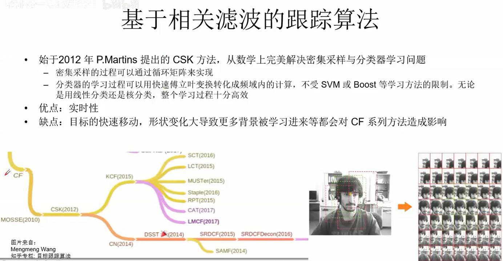

# 3D跟踪

跟踪算法简介

单目标跟踪算法

- 简介
- 产生式
- 鉴别式
- 基于相关滤波
- 基于深度学习

多目标跟踪算法

## 简介

## 单目标跟踪

### MeanShift

### 卡尔曼滤波

有关状态的信息，都会用到卡尔曼滤波。

#### 运动方程

前一个状态，到当前状态的变化

#### 观测方程

观测量和状态量的转换。

最重要的是设计增益，即权重g。

观测量已知，观测矩阵已知，噪声已知，估计当前状态；

由运动方程也估计出一个当前状态；

然后可以融合两个状态，更加准确。

g取0-1，取值不同，则偏向更信任哪一个值。g=0，完全信$X_{predict}$，g=1，完全信$X_{observation}$。

#### 核心公式

### 粒子滤波

### 生成式模型

#### TLD

### 基于滤波的目标跟踪

#### MOSSE

#### KCF

### 基于深度学习

## 多目标跟踪

### 二分图匹配-匈牙利算法

### 算法

CS2d：Center-Size，前一个框和当前框的中心点和size匹配，IOU，进行打分，两帧之间偏差不能太大

KCF：两个帧学习到特诊，相关滤波进行打分

dif：深度网络打分