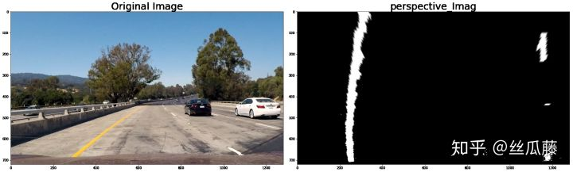

# 车道线检测

https://zhuanlan.zhihu.com/p/56712138

https://github.com/georgesung/advanced_lane_detection

参考： [Udacity Self-Driving Car Nanodegree](https://www.udacity.com/drive)

## 1. 主要步骤

- 计算给定一组棋盘图像的摄像机标定矩阵和畸变系数。
- 对原始图像进行失真校正。
- 使用颜色变换、梯度等，创建一个有阈值的二进制图像。
- 应用透视变换对二值图像(“鸟瞰图”)进行校正。
- 检测车道像素并找到车道边界，即去除非车道线部分，留下真正的车道线。
- 确定车道的曲率和车辆相对于中心的位置。
- 将检测到的车道边界扭曲回原始图像。
- 输出车道边界的可视化显示和车道曲率和车辆位置的数值估计。

## 2. 依赖

- Python 3.5
- Numpy
- OpenCV-Python
- Matplotlib
- Pickle


## 3. 相机标定

经过相机标定步骤后，得到相机的摄像头内参矩阵，畸变系数，就可以利用畸变矫正函数undistort来矫正图像。

Opencv 提供了简单的畸变矫正函数undistort，四个输入参数分别为：原图像，摄像头内参矩阵，畸变系数，None， 新内参矩阵（这里摄像头内参矩阵无变化，保持一致），输出矫正后的图片。

```python3
image_undistorted = cv2.undistort(image_0, mtx, dist, None, mtx)
```

## 4. 单张图片的车道线检测

### 4.1 颜色与梯度阈的总体理解

原始图片通过这个模块的处理，能够更加清晰的检测出图片中的车道线特征，且更加鲁棒，受车道线颜色、地面光线明暗、地面纹理特征变化的影响较小。简而言之，能够更加稳定的检测出车道线特征。如图所示：


```text
def color_gradient_threshold(image_undistorted):
    ksize = 15
# 原图进行梯度（边缘）检测
    gradx=abs_sobel_thresh(image_undistorted,orient='x',sobel_kernel=ksize,thresh=(50,90))
    grady=abs_sobel_thresh(image_undistorted,orient='y',sobel_kernel=ksize,thresh=(30,90))
# 原图进行颜色阈检测
    c_binary=color_thresh(image_undistorted,s_thresh=(70,100),l_thresh=(60,255),b_thresh=(50,255),v_thresh=(150,255))
    rgb_binary=rgb_select(image_undistorted,r_thresh=(225,255),g_thresh=(225,255),b_thresh=(0,255))
    combined_binary = np.zeros_like(s_channel)
# 将梯度检测结果和颜色阈检测结果进行组合叠加
    combined_binary[((gradx == 1) & (grady == 1) | (c_binary == 1) | (rgb_binary==1))] = 255
# 输出处理后的图片
    color_binary = combined_binary
    return color_binary, combined_binary  
```

从上面的代码中我们可以看出，该模块可以抽象为：


从上面的代码中我们可以看出，该模块可以抽象为：

### 4.2 梯度（边缘）检测

在简单车道线检测中，我们使用过canny边缘检测，这种方法能够在图片中提取出直线，但这样会提出出许多多余的直线，造成很多噪声。


实际上通过观察可以发现，车道线在接近垂直方向，因此我们可以单独选取x，y两个方向的梯度（边缘）变化情况看看：


从上图中可以看出x方向擅长检测垂直方向的直线，y防线擅长检测水平防线的直线。同理，我们还可以对x y进行组合例如abs(x), abs(y), tan(x/y) 不同的特征提取方式能够提取出不同的特征。我们这理使用了x，y两个方向结合的方式：

```text
# 原图进行梯度（边缘）检测
gradx=abs_sobel_thresh(image_undistorted,orient='x',sobel_kernel=ksize,thresh=(50,90))
grady=abs_sobel_thresh(image_undistorted,orient='y',sobel_kernel=ksize,thresh=(30,90))
```

这里使用了一个自定义函数，定义如下，其中的thresh值是可调的，感兴趣的读者可以自行调节组合。

```text
def abs_sobel_thresh(image, orient='x', sobel_kernel=3, thresh=(0, 255)):
# 计算X或Y方向的方向梯度
    # 转化成灰度图像
    gray = cv2.cvtColor(image, cv2.COLOR_RGB2GRAY)
    # 求X或Y方向的方向梯度
    if orient == 'x':
        abs_sobel = np.absolute(cv2.Sobel(gray, cv2.CV_64F, 1, 0, ksize=sobel_kernel))
    if orient == 'y':
        abs_sobel = np.absolute(cv2.Sobel(gray, cv2.CV_64F, 0, 1, ksize=sobel_kernel))
    # 数据重新缩放
    scaled_sobel = np.uint8(255*abs_sobel/np.max(abs_sobel))
    # 创建一个空矩阵，黑图片
    grad_binary = np.zeros_like(scaled_sobel)
    # 梯度在阈值范围内的，图片点亮
    grad_binary[(scaled_sobel >= thresh[0]) & (scaled_sobel <= thresh[1])] = 1
    return grad_binary
```

通过这个函数，能够检测出图像在对应方向（x或Y）上的梯度值，满足阈值像素点被点亮。该函数中使用了cv2.Sobel函数，这是opecv自带的梯度检测函数，输入值为：输入图片，图片格式，x方向是否求梯度（1：求，0：不求），y方向是否求梯度值，梯度提取算子的大小。

### 4.3 颜色阈值检测

#### 为什么需要不同颜色空间？

彩色图片有多种建模表示方法，其中RGB是采用红绿蓝三种颜色来衡量一张彩色图片，是最常见的表示方法之一。我们可以分别提取RGB三个通道的图像看看：

```text
R = image[:,:,0]
G = image[:,:,1]
B = image[:,:,2]
plt.imshow(R, cmap='gray')
plt.imshow(G, cmap='gray')
plt.imshow(B, cmap='gray')
```


从上面的图中可以看出，G通道和B通道中，左侧的黄色车道线已经看不清晰，R通道下右侧白色虚线也变得没那么清晰4.2）颜色阈值变化。因此我们需要其他对图像进行建模和表示的方法，于是就有了LUV（亮度 色度空间），HLS（色相 亮度 饱和度空间），HSV（色相 饱和度 颜色值空间），LAB（亮度，颜色空间）。举例说明hls空间下，图片呈现的状态。

```text
hls = cv2.cvtColor(image, cv2.COLOR_RGB2HLS)
H = hls[:,:,0]
L = hls[:,:,1]
S = hls[:,:,2]
plt.imshow(H, cmap='gray')
plt.imshow(L, cmap='gray')
plt.imshow(S, cmap='gray')
```

H：


L：


S：


从上面的图中可以看出：H通道下车道线完全看不出来，L通道下左侧黄色车道线不清晰，S通道下车道线比较清晰。

以上的分析基于单一图片，单一场景下的车道线的情况，单一颜色空间处理起来就已经比较有难度，一旦放到更加复杂的场景中，环境中光线和纹理变化多样，单靠单一的一种颜色通道很难得到理想的识别情况，因此才需要使用多种颜色空间相结合的方式。本文使用了四个颜色空间的模型相互结合（读者也可以根据自己的想法尝试其他颜色空间的组合）：

```text
# 颜色阈变化，分别将RGB图像转化成LUV，HLS，HSV，lab图像（分别用LUV，HLS，HSV，LAB
# 方式来表示同一张RGB图像
luv= cv2.cvtColor(image_undistorted, cv2.COLOR_RGB2LUV)
hls = cv2.cvtColor(image_undistorted, cv2.COLOR_RGB2HLS)
hsv = cv2.cvtColor(image_undistorted,cv2.COLOR_RGB2HSV) 
lab=cv2.cvtColor(image_undistorted, cv2.COLOR_RGB2LAB)
```

*PS：关于颜色空间的知识可以参考如下链接：*

*[【计算机视觉（二）】常用颜色空间及其转换 - 人工智障的博客 - CSDN博客](https://link.zhihu.com/?target=https%3A//blog.csdn.net/a584688538/article/details/80972799)*

*[RGB与Lab颜色空间互相转换 - Popeye_the_Sailor - CSDN博客](https://link.zhihu.com/?target=https%3A//blog.csdn.net/lz0499/article/details/77345166)*

### 4.4 颜色阈值检测

使用不同颜色空间下的不同通道，进行颜色阈值检测：

```python3
# 使用hsv中的s通道，lab中的b通道，luv中的l通道，hsv中的v通道，提取满足阈值的像素点
c_binary=color_thresh(image_undistorted,s_thresh=(70,100),l_thresh=(60,255),b_thresh=(50,255),v_thresh=(150,255))
# 使用rgb通道，提取满足阈值的像素点
rgb_binary=rgb_select(image_undistorted,r_thresh=(225,255),g_thresh=(225,255),b_thresh=(0,255))
```

这一步使用了两个自定义函数：color_*thresh和rgb*_select:

```text
# 使用hsv中的s通道，lab中的b通道，luv中的l通道，hsv中的v通道
def color_thresh(img, s_thresh, l_thresh, b_thresh, v_thresh):
    # 颜色阈变化，分别将RGB图像转化成LUV，HLS，HSV，lab图像（分别用LUV，HLS，HSV，LAB
    # 方式来表示同一张RGB图像）
    luv= cv2.cvtColor(image, cv2.COLOR_RGB2LUV)
    hls = cv2.cvtColor(image, cv2.COLOR_RGB2HLS)
    hsv = cv2.cvtColor(image,cv2.COLOR_RGB2HSV)
    lab=cv2.cvtColor(image, cv2.COLOR_RGB2LAB)
    # 提取hsv中的s通道，lab中的b通道，luv中的l通道，hsv中的v通道
    s_channel = hsv[:,:,1]
    b_channel=lab[:,:,2]
    l_channel = luv[:,:,0]
    v_channel= hsv[:,:,2]
    # 提取S通道中符合阈值的像素点
    s_binary = np.zeros_like(s_channel)
    s_binary[(s_channel > s_thresh[0]) & (s_channel <= s_thresh[1])] = 1
    # 提取b通道中符合阈值的像素点
    b_binary = np.zeros_like(b_channel)
    b_binary[(b_channel > b_thresh[0]) & (b_channel <= b_thresh[1])] = 1
    # 提取l通道中符合阈值的像素点
    l_binary = np.zeros_like(l_channel)
    l_binary[(l_channel > l_thresh[0]) & (l_channel <= l_thresh[1])] = 1
    # 提取v通道中符合阈值的像素点
    v_binary = np.zeros_like(v_channel)
    v_binary[(v_channel > v_thresh[0]) & (v_channel <= v_thresh[1])] = 1
    # 提取同时满足以上4个通道阈值的像素点
    combined = np.zeros_like(s_channel)
    combined[((s_binary == 1) & (b_binary == 1) & (l_binary == 1) & (v_binary == 1))] = 1
    
    return combined
```

该函数首先将原图片转化成不同颜色空间下的图片，然后提取单一通道下的图片，找出同时满足4个通道阈值的像素点。为了代码看上去简洁，将rgb三个通道单独写了一个函数如下，其逻辑与color_*thresh*一致*：*

```text
# rgb通道
def rgb_select(img, r_thresh, g_thresh, b_thresh):
    r_channel = img[:,:,0]
    g_channel=img[:,:,1]
    b_channel = img[:,:,2]
    r_binary = np.zeros_like(r_channel)
    r_binary[(r_channel > r_thresh[0]) & (r_channel <= r_thresh[1])] = 1
    
    g_binary = np.zeros_like(g_channel)
    g_binary[(g_channel > g_thresh[0]) & (g_channel <= g_thresh[1])] = 1
    
    b_binary = np.zeros_like(b_channel)
    b_binary[(b_channel > b_thresh[0]) & (b_channel <= b_thresh[1])] = 1
    
    combined = np.zeros_like(r_channel)
    combined[((r_binary == 1) & (g_binary == 1) & (b_binary == 1))] = 1
    return combined
```

以上就是颜色阈值检测，其中的颜色通道组合和各颜色通道的阈值大家可以自行调整组合，得到自己的颜色空间组合。

### 4.5 感兴趣区域

这里提取感兴趣区域的方法与[丝瓜藤：简单车道线识别](https://zhuanlan.zhihu.com/p/53172090)中一致，因此不在展开：

```text
def region_of_interest(img, vertices):
    mask = np.zeros_like(img)   
    if len(img.shape) > 2:
        channel_count = img.shape[2]  # i.e. 3 or 4 depending on your image
        ignore_mask_color = (255,) * channel_count
    else:
        ignore_mask_color = 255
    masked_image = cv2.bitwise_and(img, mask)
    return masked_image
def apply_region_of_interest_mask(image):
    x_factor = 40
    y_factor = 60
    vertices = np.array([[
        (0,image.shape[0]),
        (((image.shape[1]/2)- x_factor), (image.shape[0]/2)+ y_factor), 
         (((image.shape[1]/2) + x_factor), (image.shape[0]/2)+ y_factor), 
         (image.shape[1],image.shape[0])]], dtype=np.int32)
    return region_of_interest(image, vertices)
```

### 4.6 透视变换

透视变换的作用是让我们从另外一个角度观察图片中的场景，例如俯视。它能帮助我们避免例如“近大远小”造成的图像世界与现实世界的偏差，其方法的本质是“映射”，将原图像的像素点按照一定的“比例”映射到另外一张图上。

这个“比例”关系可以通过4个点的映射规律得到，从而推广到图片中的其他像素点。opecv中有函数帮组我们完成这些过程：

cv2.getPerspectiveTransform(src, dst):该函数的输入是：原图中的4个点坐标，映射后的4个点的坐标，输出是一个矩阵，也就是这个映射的“比例”关系。原图中的4个点的坐标可以直接利用画图工具，找原图上对应的一个矩形的四个角点，映射后的4个点的坐标是自己定义的，需要不断尝试调整。

```text
# 透视变换，输入为原图和进行阈值检测后的图
def perspective_transform(image_undistorted, combined_binary):
# 定义原图中待映射的4个点坐标
    top_left = [560, 470]
    top_right = [730, 470]
    bottom_right = [1080, 720]
    bottom_left = [200, 720]
# 定义映射后的4个点的坐标
    top_left_dst = [200,0]
    top_right_dst = [1100,0]
    bottom_right_dst = [1100,720]
    bottom_left_dst = [200,720]
    img_size = (image_undistorted.shape[1], image_undistorted.shape[0])
# 数据格式整理
    src = np.float32([top_left,top_right, bottom_right, bottom_left] )
    dst = np.float32([top_left_dst, top_right_dst, bottom_right_dst, bottom_left_dst])
# 求映射的关系矩阵
    M = cv2.getPerspectiveTransform(src, dst)
# 输出透视变换后的图片
    warped  = cv2.warpPerspective(combined_binary, M, img_size)
    return warped, Minv
```



### 4.7 提取车道线

通过透视变换的图片已经相对干净了，为了找出图中车道线的位置，我们可以进行统计分析：将每一列中的所有像素值进行相加：

```text
histogram = np.sum(warped[:,:], axis=0)
plt.plot(histogram)
```


从上图中可以观察到，对应有车道线那一列像素值较大，出现了两个波峰。从而我们可以利用这个两个波峰定位车道线在X方向的中心位置，以这个位置为起点，通过滑移窗口找到图片中的车位线的位置。

我们可以通过二次曲线拟合车道线： $f(y) = Ay^2 + By + C$

```python3
def finding_line(warped):
    # 将warped中每一列从360行开始加到720行；
    histogram2 = np.sum(warped[warped.shape[0]//2:,:], axis=0)
    out_img = np.dstack((warped, warped, warped))*255
    # 找到原图的中间点
    midpoint = np.int(histogram2.shape[0]/2)
    # 找到左侧波峰出现的横坐标，即为左侧车道线的中心
    leftx_base = np.argmax(histogram2[:midpoint])
    # 找到右侧波峰出现的横坐标，即为右侧车道线的中心
    rightx_base = np.argmax(histogram2[midpoint:])+midpoint
    # 以种个车道线中心为起点，画5个窗口
    nwindows = 5
    # 窗口大小为图片大小5等分
    window_height = np.int(warped.shape[0]/nwindows)

    # 提取原图中非零的像素点的坐标
    nonzero = warped.nonzero()
    nonzeroy = np.array(nonzero[0])
    nonzerox = np.array(nonzero[1])

    leftx_current = leftx_base
    rightx_current = rightx_base
   #定义窗口的宽度
    margin = 100
   #定义窗口内最小有效像素点的个数
    minpix = 50
    left_lane_inds = []
    right_lane_inds = []
    
    for window in range(nwindows):
        # 窗口的下边沿
        win_y_low = warped.shape[0]-(window+1)*window_height
        # 窗口的上边沿
        win_y_high = warped.shape[0]-window*window_height

        # 左侧车道线窗口的左边沿
        win_xleft_low = leftx_current-margin
        # 左侧车道线的右边沿
        win_xleft_high = leftx_current+margin
         
       # 右侧车道线的左右边沿
        win_xright_low = rightx_current - margin
        win_xright_high = rightx_current + margin

       # 画矩形
        cv2.rectangle(out_img,(win_xleft_low,win_y_low),(win_xleft_high,win_y_high),
        (0,255,0), 2) 
        cv2.rectangle(out_img,(win_xright_low,win_y_low),(win_xright_high,win_y_high),
        (0,255,0), 2) 
       # 非零的坐标落在矩形窗口内的，提取其序号
          ## 左侧
        good_left_inds = ((nonzeroy >= win_y_low) & (nonzeroy < win_y_high) & 
        (nonzerox >= win_xleft_low) &  (nonzerox < win_xleft_high)).nonzero()[0]
          ## 右侧
        good_right_inds = ((nonzeroy >= win_y_low) & (nonzeroy < win_y_high) & 
        (nonzerox >= win_xright_low) &  (nonzerox < win_xright_high)).nonzero()[0]
      # 将这些序号储存起来
        left_lane_inds.append(good_left_inds)
        right_lane_inds.append(good_right_inds)
        
      # 如果有效像素点的个数大于50，取这些像素点横坐标的均值作为新的中心点
        if len(good_left_inds) > minpix:
            leftx_current = np.int(np.mean(nonzerox[good_left_inds]))
        if len(good_right_inds) > minpix:        
            rightx_current = np.int(np.mean(nonzerox[good_right_inds]))
     # 数组拼接       
    left_lane_inds = np.concatenate(left_lane_这里提取感兴趣区域的方法与《简单车道线识别》中一致，因此不在展开：inds)
    right_lane_inds = np.concatenate(right_lane_inds)
    leftx = nonzerox[left_lane_inds]
    lefty = nonzeroy[left_lane_inds] 
    rightx = nonzerox[right_lane_inds]
    righty = nonzeroy[right_lane_inds] 
    # 根据点拟合出一条二次曲线，输出二次曲线的系数
    left_fit = np.polyfit(lefty, leftx, 2)
    right_fit = np.polyfit(righty, rightx, 2)
    # 画出车道线
    ploty = np.linspace(0, warped.shape[0]-1, warped.shape[0] )
    left_fitx = left_fit[0]*ploty**2 + left_fit[1]*ploty + left_fit[2]
    right_fitx = right_fit[0]*ploty**2 + right_fit[1]*ploty + right_fit[2]

    out_img[nonzeroy[right_lane_inds], nonzerox[right_lane_inds]] = [0, 0, 255]
       # 找出左车道线附近的像素点序号；
    left_lane_inds = ((nonzerox > (left_fit[0]*(nonzeroy**2) + left_fit[1]*nonzeroy + 
    left_fit[2] - margin)) & (nonzerox < (left_fit[0]*(nonzeroy**2) + 
    left_fit[1]*nonzeroy + left_fit[2] + margin))) 
         # 找出右车道线附近的像素点序号；
    right_lane_inds = ((nonzerox > (right_fit[0]*(nonzeroy**2) + right_fit[1]*nonzeroy + 
    right_fit[2] - margin)) & (nonzerox < (right_fit[0]*(nonzeroy**2) + 
    right_fit[1]*nonzeroy + right_fit[2] + margin)))  
    # 返回二次曲线的系数和车道线上的点
    return left_fitx, right_fitx,out_img, left_fit, right_fit,left_lane_inds,right_lane_inds
    
```

车道线提取结果：


### 4.8 计算车道线的曲率

在上一步中我们得到了拟合车道线的二次曲线，我们使用的是f(y)，而非f(x)，主要是因为车道线接近垂直，会存在一个x对应多个y的情况。

根据数学知识可以知道，曲线上某一点的曲率可以通过以下公式计算得到：


但是通过这个公式，我们求出的车道线曲率是像素级别的，如果要转换到真实世界坐标系下的曲率，需要知道像素与真实世界坐标系尺寸的对应关系，这里直接给出：

```text
ym_per_pix = 30/720 # y方向720个像素，对应30米
xm_per_pix = 3.7/960 # x方向960个像素，对应3.7米
```

除求出车道线的曲率外，我们还可以知道本车与车道线之间的相对位置关系，即本车与车道线中心的距离。假设摄像头布置在本车的中心，那么图像的中心即为本车的中心，两个车道线的中间点坐标就是车道线中心，从而可以求出两者之间的相对距离。需要说的是，这里求出的是像素级的距离，还需要将其转换到世界坐标下的距离。

```text
def CalculateCurvature(binary_image, left_fit, right_fit, l_lane_inds, r_lane_inds):

    img_size = (binary_image.shape[1], binary_image.shape[0])
    ploty = np.linspace(0, img_size[1]-1, img_size[1])
    y_eval = np.max(ploty)
    ym_per_pix = 30/720 # y方向720个像素，对应30米
    xm_per_pix = 3.7/960 # x方向960个像素，对应3.7米    
  # 找到图像中不为零的所有像素点的像素坐标
    nonzero = binary_image.nonzero()
    nonzeroy = np.array(nonzero[0])
    nonzerox = np.array(nonzero[1])
    # 将这些不为零的像素点坐标分成x，y车道线中
    leftx = nonzerox[l_lane_inds]
    lefty = nonzeroy[l_lane_inds] 
    rightx = nonzerox[r_lane_inds]
    righty = nonzeroy[r_lane_inds]
    # 将这些像素点对应到世界坐标系中，然后拟合成二次曲线
    left_fit_cr = np.polyfit(lefty*ym_per_pix, leftx*xm_per_pix, 2)
    right_fit_cr = np.polyfit(righty*ym_per_pix, rightx*xm_per_pix, 2) 
    # 计算曲线的曲率
    left_curverad = ((1 + (2*left_fit_cr[0]*y_eval*ym_per_pix + left_fit_cr[1])**2)**1.5) / np.absolute(2*left_fit_cr[0])
    right_curverad = ((1 + (2*right_fit_cr[0]*y_eval*ym_per_pix + right_fit_cr[1])**2)**1.5) / np.absolute(2*right_fit_cr[0])
    # 左右车道线曲率平均
    avg_curverad = (left_curverad + right_curverad) / 2   
## 以下计算本车在车道线中心的位置
    dist_from_center = 0.0
    if right_fit is not None:
        if left_fit is not None:
            # 摄像头位于图像中间，也是本车的中心
            camera_pos = img_size[0] / 2
        # 左右车道线最底端x坐标
            left_lane_pix = np.polyval(left_fit, binary_image.shape[0])
            right_lane_pix = np.polyval(right_fit, binary_image.shape[0])
        # 左右车道线中点x坐标
            center_of_lane_pix = (left_lane_pix + right_lane_pix) / 2
        # 摄像头（本车中心）与车道线中心的距离
            dist_from_center = (camera_pos - center_of_lane_pix) * 3.7/960
    return  avg_curverad, dist_from_center
```

### 4.9 在图上画车道线

利用opencv中的fillpoly函数可以画出一个矩形，代表车道线额位置：

```text
warp_zero = np.zeros_like(warped_0).astype(np.uint8)
color_warp = np.dstack((warp_zero, warp_zero, warp_zero))
pts_left = np.array([np.transpose(np.vstack([left_fitx, ploty]))])
pts_right = np.array([np.flipud(np.transpose(np.vstack([right_fitx, ploty])))])
pts = np.hstack((pts_left, pts_right))
cv2.fillPoly(color_warp, np.int_([pts]), (0,255, 0))
# 将画好的图片通过反透视变换投影到原图上
newwarp = cv2.warpPerspective(color_warp, Minv, (image_0.shape[1], image_0.shape[0])) 
result = cv2.addWeighted(image_undistorted_0, 1, newwarp, 0.3, 0)
```

### 4.10 在图上打印车道线曲率和本车位置

使用cv2.putText函数，其参数为：打印信息的图片，打印的文字，第一个字符左下角坐标，字体类型，字体大小，字体颜色，字体粗细，线型；

```text
def overlay_text_on_image (image, avg_curverad, dist_from_center):
    
    new_img = np.copy(image)
 # 字体和字体颜色   
    font = cv2.FONT_HERSHEY_SIMPLEX
    font_color = (255,255,255)
    
    num_format = '{:04.2f}'
    text = 'Radius of Curvature: ' + num_format.format(avg_curverad) + 'm'
    cv2.putText(new_img, text, (40,70), font, 1.5, font_color, 2, cv2.LINE_AA)
    
    direction = 'left'
    if dist_from_center > 0:
        direction = 'right'
    abs_dist = abs(dist_from_center)
    text = 'Vehicle is ' + num_format.format(abs_dist) + ' m ' + direction + ' of center'
    cv2.putText(new_img, text, (40,120), font, 1.5, font_color, 2, cv2.LINE_AA)  
    return new_img
```

单张图片车道线识别结果：


## 5. 离线视频识别车道线

### 5.1 将步骤4中的所有内容组织在一起：

```text
def main_pipline(image_0):
    
    #1 畸变矫正
    image_undistorted = cv2.undistort(image_0, mtx, dist, None, mtx)

    #2 颜色与梯度阈
    color_binary, combined_binary = color_gradient_threshold(image_undistorted)

    #3 感兴趣区域
    masked = apply_region_of_interest_mask(combined_binary)

    #4 透视变换
    warped_0, Minv = perspective_transform(masked, combined_binary)
    
    #5 滑动窗车道线提取
    left_fitx, right_fitx, out_img,left_fit, right_fit,left_lane_inds,right_lane_inds = finding_line(warped_0)
    
    #6 计算车道线的曲率
    avg_curverad, dist_from_center = CalculateCurvature(warped_0,left_fit, right_fit, left_lane_inds, right_lane_inds)
    
    #7 在图像上画车道线
    
    warp_zero = np.zeros_like(warped_0).astype(np.uint8)
    color_warp = np.dstack((warp_zero, warp_zero, warp_zero))
    pts_left = np.array([np.transpose(np.vstack([left_fitx, ploty]))])
    pts_right = np.array([np.flipud(np.transpose(np.vstack([right_fitx, ploty])))])
    pts = np.hstack((pts_left, pts_right))
    cv2.fillPoly(color_warp, np.int_([pts]), (0,255, 0))
    newwarp = cv2.warpPerspective(color_warp, Minv, (image_0.shape[1], image_0.shape[0])) 
    result = cv2.addWeighted(image_undistorted, 1, newwarp, 0.3, 0)

   #8 图像上显示文字
    result = overlay_text_on_image (result, avg_curverad, dist_from_center)
    return result
```

### 5.2 视频识别

```text
# 导入视频处理依赖库
from moviepy.editor import VideoFileClip
from IPython.display import HTML

def process_image(image):
    result = main_pipline(image)
    return result
# 定义处理后视频输出路径
white_output = './project_video.mp4.mp4'
# 读取待处理视频
clip1 = VideoFileClip("project_video.mp4")
# 视频车道线识别
white_clip = clip1.fl_image(process_image) 
```