# 基于滤波的跟踪算法（1） MOSSE

https://blog.csdn.net/asddongmen/article/details/105123735

https://blog.csdn.net/Perfect_Accepted/article/details/84636319

## 1. 简介

第一篇将correlation filter引入tracking领域内的文章，文中所提的Minimum Output Sum of Squared Error(MOSSE)，可以说是后来CSK、STC、Color Attributes等tracker的鼻祖。Correlation Filter（以下简称CF）源于信号处理领域，后被运用于图像分类等方面。

而Correlation Filter应用于tracking方面最朴素的想法就是：相关是衡量两个信号相似值的度量，如果两个信号越相似，那么其相关值就越高，而在tracking的应用里，就是需要设计一个滤波模板，使得当它作用在跟踪目标上时，得到的响应最大，如下图所示:

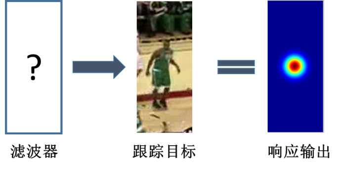


## 2. 预备知识

#### **卷积和互相关**

https://blog.csdn.net/u013498583/article/details/79481144

#### 快速傅里叶变换(FFT)

- 快速傅里叶变换,将时域问题转为频域问题,得到数字信号的分析频谱.
- 傅里叶变换的基本思想是:任何连续测量的时序或信号，都可以表示为不同频率的正弦波信号的无限叠加(带棱角的信号可以被无限接近).
- MATLAB中一维信号(如语音信号)用fft,二维信号(如图像信号)用fft2


#### 其他知识

- [傅里叶变换](https://blog.csdn.net/wenzhilu/article/details/79079183)-解释的非常详细
- [频谱泄露](https://blog.csdn.net/shenziheng1/article/details/52891807)-主要看频谱泄露问题，提到了采样频率问题(采样定理又称香农采样定理，奈奎斯特采样定理)
- [奈奎斯特采样定理](https://www.cnblogs.com/fellow1988/p/6291187.html)-解释了采样频率问题和混叠问题
- [混叠](https://zhuanlan.zhihu.com/p/23923059)-关于混叠的更详细解释
- [互相关与卷积问题](https://blog.csdn.net/voyagflyer/article/details/60580006)-介绍了互相关和卷积数学上的不同
- [循环卷积](https://baike.baidu.com/item/循环卷积)-循环卷积与线性卷积和互相关都不同，这里先做简单了解
- [高斯函数分析](https://blog.csdn.net/jorg_zhao/article/details/52687448)-很详细
- [标准正态分布](https://baike.baidu.com/item/标准正态分布)-由高斯函数我想到了标准正态分布
- [MATLAB窗函数](https://blog.csdn.net/wordwarwordwar/article/details/68951294)-为什么加窗，MATLAB窗种类
- [汉宁窗](https://blog.csdn.net/xinhuasz/article/details/51405737)-为什么加窗，介绍最常用的hann(汉宁窗)


## 3. 理论

我们需要寻找一个滤波模板，使得它在目标上的响应最大，那么写成公式就是如下所示：

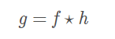

其中g表示响应输出，f表示输入图像，h表示我们的滤波模板。 g可以为任意形状的响应输出，在上图的示意图里我们就假设它为gaussian形状。那么显然，我们只要求出h就可以了。

这样做看起来很简单，但为何CF类方法的速度如此之快呢？就是因为在求解等一系列操作中，都利用了快速傅里叶变换FFT。**为了简化计算，将时域的卷积转化为频域的点乘积。**由卷积定理的correlation版本可知，函数互相关的傅里叶变换等于函数傅里叶变换的乘积，如下：

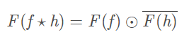

其中$F$表示傅里叶变换，$\odot$表示点乘。那么假设f所含的像素个数为n，而已知FFT的时间开销为，因此式(3)的计算开销也为 $O(nlogn)$！远比其他跟踪算法要快！

在傅里叶域内使用FFT计算图片相关性。
　　　　　　　　　　　　　　　　　　　　　　　　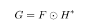

其中：Ｇ为目标跟踪区域图像，Ｆ为输入图像，$H^*$为过滤器的共轭。
(这里滤波器使用共轭函数$H^*$原因：在时域中ｇ = f⋆h,虽然文中一直说此为卷积操作，但是使用数学上的严格定义来说这里是互相关操作，但是在机器学习领域通常笼统的将互相关称为卷积，这种说法在Andrew Ng的深度学习课程中特地讲到过。)
则过滤器$H^*$为：

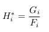

MOSSE找到一个滤波器H，它使实际卷积输出（预测值）与期望输出（期望值）的平方误差之和最小。即：

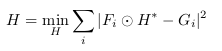

因为在傅里叶域内所有操作是相关元素乘法，所以滤波器H的每个元素都可以独立优化。因此优化问题可以从多变量优化问题转换为独立优化H的每个元素问题。

上式为凸函数，所以其只有一个最优解。因此在元素域内对H求偏导，使偏导为0的H即为最优解。


则：
　　　　　　　　　　　　　　　　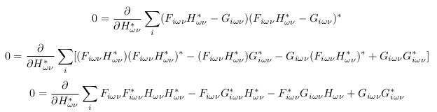

得：
　　　　　　　　　　　　　　　　　　　　　　　　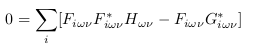
　　　　　　　　　　　　　　　　　　　　　　　　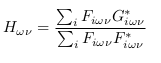

使用原始符号重写表达式：
　　　　　　　　　　　　　　　　　　　　　　　　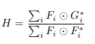

运算时要将分母加入小的噪音进行了正则化，适当的正则化可以使滤波器产生好的波形，同时避免了分母为零，也提高了系统鲁棒性：
　　　　　　　　　　　　　　　　　　　　　　　　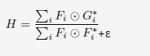

将上式求平均值，可以使滤波器快速跟踪对象，提高跟踪器速度：
　　　　　　　　　　　　　　　　　　　　　　　　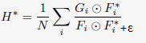


上面我们完成了MOSSE滤波器在理论上的建模，在实际代码实现中我们定义MOSSE滤波器为：
　　　　　　　　　　　　　　　　　　　　　　　　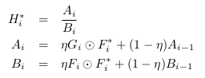

$\eta$为学习率。加入$\eta$可以使模型更加重视最近的帧，并使先前的帧的效果随时间呈指数衰减。文中给出的实验过程中得出的最优$\eta=0.125$，可以使滤波器快速适应目标外观的变化，同时仍保持好的稳健性。


### Preprocessing

论文中提到,FFT卷积算法的一个问题是图像和滤波器被映射到环面的拓扑结构,人为的连接图像的边界引入影响相关输出的伪像,也就是造成了频谱泄露。为了解决上述问题,进行数据预处理：

- 使用对数函数变换图像像素值，有助于低对比度情况。
- 将像素值归一化为平均值为0，方差为1。
- 将图像进行加窗(文中直接提到加余弦窗)处理，主要是为了将边缘像素值减小至0，突出目标中心位置，有效防止频谱泄露。

注意的是:

- 要进行加窗操作一般在时域中进行,因为在时域中是点乘操作,在频域中是卷积操作.因此加窗操作是在傅里叶变换之前。
- 奇怪的是在 mosse_amou版本代码加窗后跟踪效果反而更差通过输出加窗前后特征图对比可以看到,加窗操作造成了许多特征信息丢失.
  解释:其实并不是加窗后跟踪效果变差,加窗操作就是突出裁剪图的中心位置,减弱边缘位置,因此加窗后跟踪器就将关注点放在了裁剪图的中心,而不是整个裁剪图,但是当我们裁剪整个物体时就会发现,跟踪器只跟踪物体中心位置,这就造成了误以为跟踪效果差的原因

### Discussion

有许多简单的方法可以改进跟踪器：

- 如果目标相对稳定，则可以通过基于第一帧随机重定位来减轻漂移。
- 通过将更新之后的过滤跟踪窗口进行对数极坐标变换，可以使跟踪器应对目标尺度变化和旋转的问题。


### 实现过程总结：

本文的记号方式与论文一致，使用小写来表示时域下的图片如fi，使用大写来表示经过傅里叶变换后频域下的图片如Fi。

1. 读取第一帧图片，若是RGB图像则转化成灰度图像，接着对图片矩阵进行归一化处理
2. 手工框出 / 用目标检测算法检测出 / 使用数据集中的ground truth来标定出视频第一帧图片中的需要跟踪的目标(x, y, w, h)
3. 根据第2步得到的框，截取出目标区域图片_fi
4. 生成一个（w*h）大小的高斯核，并对其进行傅里叶变换，得到_G
5. 初始化_Ai, _Bi, 大小都为 （w*h）
6. 对_fi进行随机重定位(rand_wrap)
7. 对_fi进行preprocessing(取对数，标准化，通过窗函数)
8. 对_fi进行傅里叶变换得到Fi,并根据Fi和_G计算出_Ai和_Bi，到此处第一帧处理结束。
9. 根据_Ai和_Bi计算出当前帧的Hi
10. 根据上一帧目标框，获取当前帧的fi，并对其进行预处理和fft，得到Fi
11. 根据Hi和Fi更新Gi，然后Gi进行逆傅里叶变换得到gi
12. gi中最大值位置即为第二帧图像目标所在位置，经过计算之后得到当前帧目标框的中心(x_c, y_c)
13. 根据(x_c, y_c)更新当前帧的fi，并对其进行预处理和fft，得到Fi
14. 根据论文中的公式，使用Fi，_G, 和_Ai, _Bi来更新 _Ai, _Bi
15. 回到第九步，直到计算结束。


## 代码

首先说明，本文的记号方式与论文一致，使用小写来表示时域下的，如fi，使用大写来表示经过傅里叶变换后频域下的，如Fi。

```
# 根据中心和宽高裁剪得到目标区域图像fi
self._fi=cv2.getRectSubPix(first_frame,(w,h),self._center)
# 经过傅里叶变换得到Fi
Fi=np.fft.fft2(self._preprocessing(fi,self.cos_window))
```

算法开始：

#### 第一帧，初始步骤：

第一帧进来之后，需要对一些变量进行初始化，所以`init`函数主要是初始化一些工作：

```
def init(self,first_frame,bbox):
    if len(first_frame.shape)!=2:
        assert first_frame.shape[2]==3
        first_frame=cv2.cvtColor(first_frame,cv2.COLOR_BGR2GRAY)
    first_frame=first_frame.astype(np.float32)/255
    # 获取目标区域的图像位置和大小信息
    x,y,w,h=tuple(bbox)
    self._center=(x+w/2,y+h/2)
    self.w,self.h=w,h
    w,h=int(round(w)),int(round(h))
    # 汉宁窗，汉宁窗的越靠近边缘值越小，故起到突出中心目标的作用，弱化边缘信息
    self.cos_window=cos_window((w,h))
    # 根据中心和宽高裁剪得到目标区域图像fi
    self._fi=cv2.getRectSubPix(first_frame,(w,h),self._center)
    ...
```

这里生成和目标一样尺寸的高斯模板，就是公式中的Gi，就是期望的输出，在整个过程中不会改变：


```
	# 生成和检测框一样大小的高斯核，然后傅里叶变换，初始化_G
    self._G=np.fft.fft2(gaussian2d_labels((w,h),self.sigma))
    ...
```


```
	# 裁剪区域大小
	self.crop_size=(w,h)
```

初始化`_Ai, _Bi`，此时通过对前面得到的fi随机旋转8次，来初始化，增加鲁棒性

就是根据公式来求`_Ai, _Bi`的，只不过这个式子是运行过程中更新`_Ai, _Bi`的，初始化稍有不同而已：


```
    self._Ai=np.zeros_like(self._G)
    self._Bi=np.zeros_like(self._G)
    # 每张图像经过8次随机的旋转，增加鲁棒性
    for _ in range(8):
        fi=self._rand_warp(self._fi)

        # 预处理归一化，将图像进行加窗(文中直接提到加余弦窗)处理，从而可以将边缘像素值减小至0，有效防止频谱泄露。
        # 加窗操作一般在时域中进行,因为在时域中是点乘操作,在频域中是卷积操作.因此加窗操作是在傅里叶变换之前。
        Fi=np.fft.fft2(self._preprocessing(fi,self.cos_window))
        self._Ai+=self._G*np.conj(Fi)                           # 根据Fi和_G计算出_Ai和_Bi
        self._Bi+=Fi*np.conj(Fi)
```

#### 第二帧开始，更新步骤：

```
def update(self,current_frame,vis=False):
	# 图像转为灰度图
    if len(current_frame.shape)!=2:
        assert current_frame.shape[2]==3
        current_frame=cv2.cvtColor(current_frame,cv2.COLOR_BGR2GRAY)
    current_frame=current_frame.astype(np.float32)/255
    ...
```

根据`_Ai和_Bi`**计算出的滤波器Hi：**

当前帧目标框位置更新前的Hi值，即利用上一帧更新的`_Ai和_Bi`来计算

也就是根据求导公式而来，求得优滤波器的解：

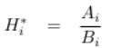

```
	Hi=self._Ai/self._Bi
    ...
```

此时目标框位置还未更新，所以利用上一次的框中心，对当前帧截取框图像得到fi，然后经过汉宁窗处理：

```
	fi=cv2.getRectSubPix(current_frame,(int(round(self.w)),int(round(self.h))),self._center)
    fi=self._preprocessing(fi,self.cos_window)
    ...
```

根据公式得到**实际的预测值Gi：**


```
    Gi=Hi*np.fft.fft2(fi)
    # 对频域下的Gi进行逆傅里叶变换得到实际的gi
    gi=np.real(np.fft.ifft2(Gi))
    if vis is True:
        self.score=gi
	# 最大值位置即为第二帧图像目标所在位置
    curr=np.unravel_index(np.argmax(gi, axis=None),gi.shape)
	...
```

此处有个特别容易混淆的地方，这里解释一下：

此处的Gi是预测值，为根据当前滤波器Hi（当前帧更新前）和当前帧刚刚取得的fi（当前帧更新前）而得到的实际的Gi值（预测值），与前面的我们的期望输出`_G`（初始化步骤中的值）有所区别

其实分别对应如下公式：公式中$F_i \odot H^*$其实是代码中的Gi（预测值），而公式中的Gi就是代码中的_G（期望值）


根据刚刚求得的最大响应位置，来**更新目标所在位置：**

```
    dy,dx=curr[0]-(self.h/2),curr[1]-(self.w/2)
    x_c,y_c=self._center
    x_c+=dx
    y_c+=dy
    self._center=(x_c,y_c)
	...
```

根据新的目标所在位置为中心重新对当前帧图像进行裁剪得到fi，主要是为了更新`_Ai和_Bi`：

```
    fi=cv2.getRectSubPix(current_frame,(int(round(self.w)),int(round(self.h))),self._center)
    fi=self._preprocessing(fi,self.cos_window)
    Fi=np.fft.fft2(fi)                                                                       # 预处理得到新的目标框Fi
	...
```

利用刚刚得到的新的Fi更新_Ai, _Bi，根据公式而来：

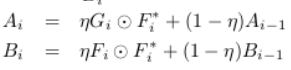

```
    self._Ai=self.interp_factor*(self._G*np.conj(Fi))+(1-self.interp_factor)*self._Ai
    self._Bi=self.interp_factor*(Fi*np.conj(Fi))+(1-self.interp_factor)*self._Bi
    return [self._center[0]-self.w/2,self._center[1]-self.h/2,self.w,self.h]
```

可以看到**公式中的Gi**对应**代码中的_G**（期望值），所以整个过程中`_G`都是最初的高斯模板，没有改变过。而更新步骤中的Gi（预测值），通过滤波器`Hi`和`_fi`得来，就是为了让这个预测值`Gi`去尽量接近期望值`_G`，由此不断在处理当前帧末尾出更新`_Ai和_Bi`，然后下一帧开始处更新滤波器`Hi`。

所以整个算法流程比较简单，至此介绍完毕。