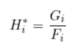
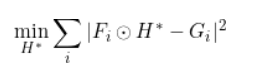
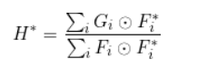
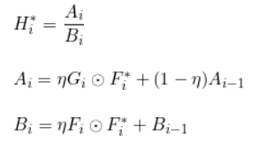
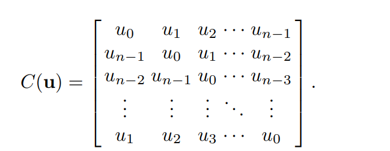
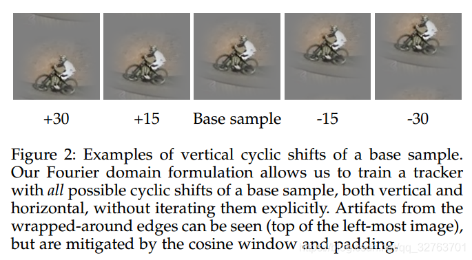
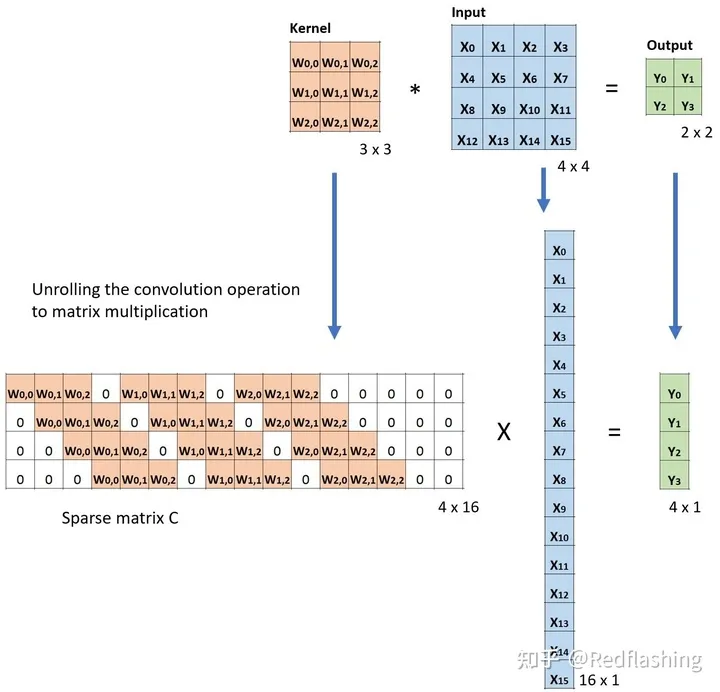
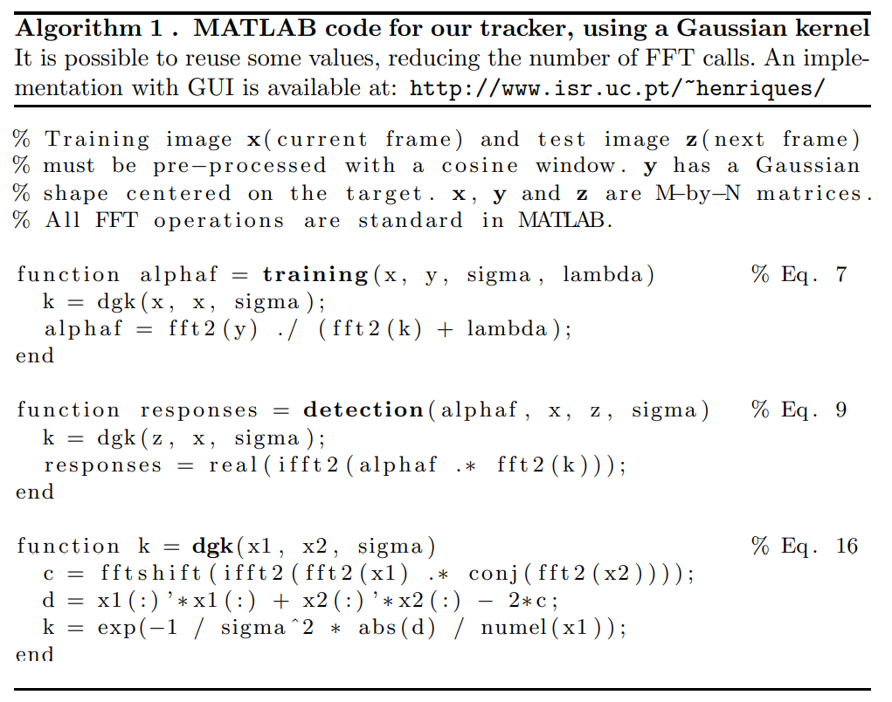

# 基于滤波的跟踪算法（2） CSK

https://blog.csdn.net/qq_32763701/article/details/83691393

## 1. 简介

### 回顾MOSSE

在MOSSE中，作者MOSSE在频域内通过最小二乘法来求解相关滤波器$H^*$：



上式是元素点除，转化为通过最小二乘法来求解：



求导即可得到MOSSE的闭式解：



得到滤波器的更新公式如下：



### 引出CSK

回顾完MOSSE的过程原理，在拓展到CSK方法上

与MOSSE相比，CSK主要贡献在于：

- 主要是增加了正则化手段，防止过拟合
- 对窗口（目标框扩大一倍）进行密集采样，此处就引入了循环矩阵（核矩阵具有循环的结构）的思想，加快运算
- kernel核函数的应用
- 闭式，快速，精确的求解


CSK提出用一个线性分类器来求解相关滤波器：

$$
\min _{\mathbf{w}, b} \sum_{i=1}^{m} L\left(y_{i}, f\left(\mathbf{x}_{i}\right)\right)+\lambda\|\mathbf{w}\|^{2}
$$
上述公式其实也是最小二乘法，只不过是增加了L2正则化项，也称为岭回归。w即为MOSSE中的相关滤波器H；

L为最小二乘法的损失函数：

$$
L\left(y_{i}, f\left(x_{i}\right)\right)=\left(y_{i}-f\left(x_{i}\right)\right)^{2} \quad f\left(x_{i}\right)=<w, x_{i}>+b
$$
**期望值y**是理想的高斯模板

m表示样本数量

**预测值f(xi)**表示图像xi与滤波器w的在频域内的点积

< , >表示点乘，和符号$\odot$一样

b是偏置项，可以省略。

所以$L(y_i, f(x_i))$就是MOSSE中的$||F_i \odot H^* - G_i||^2$

CSK所用的公式就只是在后面多了一个正则项$\lambda ||w||^2$

**加正则项的目的是为了防止求得的滤波器H过拟合**。通过最小二乘法求得的相关滤波器与当前帧输入的图像F的相关性是最高的，然而我们是要用求得的滤波器结果H去预测下一帧图像中目标所在的位置。因为下一帧图像不可能和当前帧的图像一模一样，所以拟合度过高反而会影响检测的准确度，所以加入正则项来减小输入图像和滤波器之间的拟合程度，使求得的滤波器H泛化能力更强。

## 2 原理

### 核函数

作者还用到了核函数来进行求解。

先来个定义：某些问题在低位空间无法求解，映射到高位空间则可以求解。可以通过某非线性变换 φ( x) ，将输入空间映射到高维特征空间。但是高位特征空间的维数可能非常高，在高位空间求解会造成很大的开销。如果求解只用到内积运算，而在低维输入空间又存在某个函数 K(x, y) ，它恰好等于在高维空间中这个内积，即K( x, y) =<φ( x) ⋅φ( y) > 。那么求解过程中就不用计算复杂的非线性变换，而由这个函数 K(x, y) 代替非线性变换φ( x)后的内积，使大大简化了计算。这样的函数 K(x, y) 称为核函数。

举个例子：核函数K（Kernel Function）为：K(x,y')=<φ(x),φ(y)>，其中，< , >表示点积，φ(.)表示低维到高维的映射。

x=(x1,x2,x3)；y=(y1,y2,y3)

φ(x)=(x1x1,x1x2,x1x3,x2x1,x2x2,x2x3,x3x1,x3x2,x3x3)

φ(y)=(y1y1,y1y2,y1y3,y2y1,y2y2,y2y3,y3y1,y3y2,y3y3)

令x=(1,2,3)，y=(4,5,6)；

那么

φ(x)=(1,2,3,2,4,6,3,6,9)；

φ(y)=(16,20,24,20,25,30,24,30,36)；

<φ(x),φ(y)>=16+40+72+40+100+180+72+180+324=1024

因为我们把三维空间数据映射到九维空间中，所以计算复杂。

如果我们通过核函数，直接在低维空间中计算呢？

令核函数K(x,y)=(<x,y>)^2

则K(x,y)=(4+10+18)^2=1024

避开了非线性变换 φ的计算是不是方便很多，速度也快很多。所以核技巧就是用来避开这些繁琐的计算的。并且如果是将数据映射到无限维空间，通过普通的算法是无法计算的，而通过核函数却可以，如：高斯核RBF: K(x,y)=exp(-||x-y||^2)。


### 循环矩阵

作者用到了循环矩阵这一概念

引入循环矩阵是为了利用循环矩阵的特性达到**密集采样（dense sampling）和转到频域提高运算效率**的目的。

如果是要求密集采样（而不是随机采样）的话，要求卷积模板在这一区域从第一个像素滑动到最后一个像素，在这一区域产生大量候选窗（这些候选窗重合度还很大），最终目标匹配得到最后的输出结果。这一过程明显计算量巨大，影响跟踪速度。

所以引入循环矩阵：



1. **直接利用循环矩阵去和滤波器点乘**（后面会解释）很直观地**省略了卷积模板在检测区域内滑动的过程**，**简化了对重合度高的候选窗的运算**，提高了速度。
   也可以理解为滤波器模板在频域内与样本特征边缘求相关时**边界循环补充**的结构。
   （解释见(https://blog.csdn.net/qq_17783559/article/details/82321239)）



2. 另一方面，如上图所示，循环矩阵对像素的移动产生了目标发生上下位移的结果，可以理解为在这一帧里**样本数增加**了。**更多的样本数意味着训练的结果更准确。**

3. 此外，**循环矩阵傅里叶对角化特性**也是引入循环矩阵重要的原因之一。根据循环矩阵的特点，存在$u⊗v=C(u)v=F^{−1}(F(u)⊙F(v))$

   利用这一特性证明**循环矩阵的和、点积、求逆都是循环矩阵**，在频域利用这一特性大大提高了运算速率。
   （证明见(https://blog.csdn.net/shenxiaolu1984/article/details/50884830)）


下面的例子展示了这种运算在计算机内的工作方式。它将输入平展（16×1）矩阵，并将卷积核转换为一个稀疏矩阵（4×16）。然后，在稀疏矩阵和平展的输入之间使用矩阵乘法。之后，再将所得到的矩阵（4×1）转为（2×2）输出。




### 核化的最小二乘法（KRLS）

CSK算法使用核技巧是为了提高在高维特征空间中分类样本的速度。

令φ(x)表示特征空间，K(x,x')=<φ(x),φ(x')>表示其核函数，根据支持向量机核定理可得，

#### **滤波器：**

在高维空间中滤波器（SVM的权重）可以表示为样本的线性组合：
$$
\begin{aligned}
W &=\alpha_{1} \varphi\left(X_{1}\right)+\alpha_{2} \varphi\left(X_{2}\right)+\cdots \\
&=\sum_{j=1}^{n} \alpha_{j} \varphi\left(X_{j}\right)
\end{aligned}
$$
#### **对于线性分类器：**

$$
\begin{aligned}
f\left(X_{i}\right) &=<W, \varphi\left(X_{i}\right)>+b \\
&=<\sum_{j=1}^{n} \alpha_{j} \varphi\left(X_{j}\right), \varphi\left(X_{i}\right)>+b \\
&=\sum_{j=1} \alpha_{j}<\varphi\left(X_{j}, \varphi\left(X_{i}\right)>+b\right.\\
&=\sum_{j=1}^{n} \alpha_{j} \kappa\left(X_{j}, X_{i}\right) \\
&=\sum_{j=1}^{n} \alpha_{j} \kappa\left(X_{i}, X_{j}\right)
\end{aligned}
$$
其中核函数：$\kappa\left(X_{i}, X_{j}\right)=<\varphi\left(X_{j}, \varphi\left(X_{i}\right)>, \kappa\left(X_{i}, X_{j}\right)\right.$，是矩阵$K$的第i行第j列。$K$的第i行为：$K_{i}=\left[\begin{array}{llll}
\kappa\left(X_{i}, X_{1}\right) & \kappa\left(X_{i}, X_{1}\right) & \cdots & \kappa\left(X_{i}, X_{j}\right)
\end{array}\right]$。

#### **对于正则项：**

$$
\begin{aligned}
\frac{1}{2}\|W\|^{2} &=\frac{1}{2} W^{T} W \\
&=\frac{1}{2} \sum_{j=1}^{n} \alpha_{j}\left(\varphi\left(X_{j}\right)\right)^{T} \cdot \sum_{j=1}^{n} \alpha_{j} \varphi\left(X_{j}\right) \\
&=\frac{1}{2} \sum_{j=1}^{n} \sum_{j=1}^{n} \alpha_{j} \alpha_{j}\left(\varphi\left(X_{j}\right)\right)^{T} \varphi\left(X_{j}\right) \\
&=\frac{1}{2} \sum_{j=1}^{n} \sum_{j=1}^{n} \alpha_{j} \alpha_{j}<\varphi\left(X_{j}\right), \varphi\left(X_{j}\right)>\\
&=\frac{1}{2} \sum_{j=1}^{n} \sum_{j=1}^{n} \alpha_{j} \alpha_{j} K_{j j} \\
&=\alpha_{1}^{2} K_{11}+\alpha_{1}^{2} K_{11}+\cdots \alpha_{n}^{2} K_{n n} \\
&=\alpha^{T} K \alpha
\end{aligned}
$$
那么求解公式可转换成如下形式：
$$
\min _{w} \sum_{i}^{n} L\left(y_{i}, f\left(x_{i}\right)\right)+\lambda\|w\|^{2}=\min _{\alpha} \sum_{i}^{n}\left(y_{i}-K \alpha\right)^{2}+\lambda \alpha^{T} K \alpha
$$
求最小值，K是核函数，无论是高斯核函数还是什么核函数，它都可以当做已知量，所以只需要求$\alpha$即可。上式除以2没有影响，等价于
$$
F=\frac{1}{2}\min_{\alpha}\sum_{i}^{n}(y-K\alpha)^T(y-K\alpha)+\frac{\lambda}{2}\alpha^TK\alpha
$$
通过求导来求解最小值：

$$
\nabla F_{\alpha}=(y-K \alpha)^{T}(-K)+\lambda K \alpha=-K y+K^{2} \alpha+\lambda K \alpha=0
$$
求得：

$$
\alpha=(K+\lambda I)^{-1} y
$$
#### **引入循环矩阵：**

作者定义一个n×n的循环矩阵，u是n×1的向量：


u可以暂时理解为输入图像，第一行表示原始的图像，后面的每一行都是通过循环得到的。

循环矩阵的每一行都是上一行最后一列的元素或矢量移动到第一列，所以定义一个**位移矩阵**$P^i$，所以密集采样得到循环矩阵$C\left(\varphi(X)\right)$，其中每一行$X_{i}$表示为$P^iX$。


#### **那么是如何通过循环矩阵来稠密采样的呢？**

假设输入图片为x，为n×1的向量，构造循环矩阵为：

$$
C(x)=\left[\begin{array}{c}
P^{0} x \\
P^{1} x \\
P^{2} x \\
\cdots \\
P^{n-1} x
\end{array}\right] = \left[\begin{array}{c}
x_0 \\
x_1 \\
x_2 \\
\cdots \\
x_{n-1} 
\end{array}\right]
$$
其中，$P$表示循环移位操作，每次移动一个元素。

定义：
$$
k_{i}=K_{i j}=\kappa\left(X_{i}, X_{j}\right)=\kappa\left(X, P^{i} X\right)
$$
因为采样的结果$\varphi(X)$变成循环矩阵$C\left ( \varphi(X)\right)$，所以原来的$K$也改为$k_{i}$的循环矩阵$C\left (k\right)$简化运算。

那么$K$矩阵可以表示为：
$$
K=\left[\begin{array}{ccccc}
k\left(P^{0} x, P^{0} x\right) & k\left(P^{0} x, P^{1} x\right) & k\left(P^{0} x, P^{2} x\right) & \ldots & k\left(P^{0} x, P^{n-1} x\right) \\
k\left(P^{1} x, P^{0} x\right) & k\left(P^{1} x, P^{1} x\right) & k\left(P^{1} x, P^{2} x\right) & \ldots & k\left(P^{1} x, P^{n-1} x\right) \\
k\left(P^{2} x, P^{0} x\right) & k\left(P^{2} x, P^{1} x\right) & k\left(P^{2} x, P^{2} x\right) & \ldots & k\left(P^{2} x, P^{n-1} x\right) \\
\ldots & \ldots & \ldots & \ldots & \ldots \\
k\left(P^{n-1} x, P^{0} x\right) & k\left(P^{n-1} x, P^{1} x\right) & k\left(P^{n-1} x, P^{2} x\right) & \ldots & k\left(P^{n-1} x, P^{n-1} x\right)
\end{array}\right]
$$
所以$K$也是一个循环矩阵。
$$
K=C(k)=\left[\begin{array}{c}
k\left(x, P^{0} x\right) \\
k\left(x, P^{1} x\right) \\
k\left(x, P^{2} x\right) \\
\ldots \\
k\left(x, P^{n-1} x\right)
\end{array}\right]
$$
$x$表示输入图片，长度为$n$，所以这里的$K$是$n×n$的矩阵，且为循环矩阵。


我们把单位矩阵$I$也看作是一个循环矩阵，即：$I=C(\delta)，\delta=[1, 0, 0, ..., 0]$
$$
\boldsymbol{\alpha}=(C(\mathbf{k})+\lambda C(\boldsymbol{\delta}))^{-1} \mathbf{y}=(C(\mathbf{k}+\lambda \boldsymbol{\delta}))^{-1} \mathbf{y}
$$

> 根据傅里叶变换性质，有如下等式：
>
> $$
> u⊗v=C(u)v=F^{−1}(F(u)⊙F(v))
> $$
> 这其实就是相关转换到频域计算的公式，作者只是把傅里叶变换边界循环补充的结构给表示出来了。之所以使用循环矩阵的形式表示出来，是为了利用循环矩阵的特性：**循环矩阵的和、点积、求逆都是循环矩阵**。

则上式可以转为如下：
$$
\boldsymbol{\alpha}=\left(C\left(F^{-1}(F(\mathbf{k})+\lambda \mathbb{1})\right)\right)^{-1} \mathbf{y}=C\left(F^{-1}\left(\frac{1}{F(\mathbf{k})+\lambda}\right)\right) \mathbf{y}
$$
则有：
$$
\boldsymbol{\alpha}=F^{-1}\left(\frac{F(\mathbf{y})}{F(\mathbf{k})+\lambda}\right)
$$
利用以上封闭解可以在频域快速得到滤波器$W$参量$\boldsymbol{\alpha}$


#### **对于响应图：**

$$
Y=F^{-1}(F(k) \odot F(\alpha))
$$


$$
Y=<W, \varphi(Z)>=\sum \alpha_{i}<\varphi\left(X_{i}\right), \varphi(Z)>=K \boldsymbol{\alpha}
$$
Z是该帧未定位（求相关之前）提取的图像特征，X是该帧二次提取的图像特征，X,Z均可为循环矩阵。

所以有：
$$
Y=\alpha C(K)
$$
即得到：
$$
Y=F^{-1}(F(k) \odot F(\alpha))
$$
其中核函数使用高斯核：
$$
\mathbf{k}^{\text {gauss }}=\exp \left(-\frac{1}{\sigma^{2}}\left(\|\mathbf{x}\|^{2}+\left\|\mathbf{x}^{\prime}\right\|^{2}-2 F^{-1}\left(F(\mathbf{x}) \odot F^{*}\left(\mathbf{x}^{\prime}\right)\right)\right)\right)
$$
也叫做径向基函数（Radial Basis Function 简称 RBF），是某种沿径向对称的标量函数。通常定义为空间中任一点x到某一中心xc之间欧氏距离的单调函数 ，可记作 k（||x-xc||）， 其作用往往是局部的，即当x远离xc时函数取值很小。

## 3. 代码-算法流程

其实配合这些公式和大致算法流程，整个流程就非常清楚了：



#### 第一帧 初始化：

```
    def init(self,first_frame,bbox):
        if len(first_frame.shape)==3:
            assert first_frame.shape[2]==3
            first_frame=cv2.cvtColor(first_frame,cv2.COLOR_BGR2GRAY)
        first_frame=first_frame.astype(np.float32)
        bbox=np.array(bbox).astype(np.int64)
        x,y,w,h=tuple(bbox)
        self._center=(x+w/2,y+h/2)
        self.w,self.h=w,h
        # 将target_size目标区域扩充一倍得到搜索窗口
        self._window=cos_window((int(round(2*w)),int(round(2*h))))
        self.crop_size=(int(round(2*w)),int(round(2*h)))
        # 得到窗口区域图像
        self.x=cv2.getRectSubPix(first_frame,(int(round(2*w)),int(round(2*h))),self._center)/255-0.5
        self.x=self.x*self._window
        # 得到高斯模板的sigma，原论文代码sigma就是目标区域大小w*h/16
        s=np.sqrt(w*h)/16
        self.y=gaussian2d_labels((int(round(2*w)),int(round(2*h))),s)
```

其中`trainning`函数就是用来更新$\alpha$的，传入其中的期望值$y$是初始化步骤中的$y$，是一个window_size搜索窗口大小（即目标框扩大一倍得到）的高斯模板，整个流程保持不变。


#### 第二帧开始 更新

```
	def update(self,current_frame,vis=False):
        if len(current_frame.shape)==3:
            assert current_frame.shape[2]==3
            current_frame=cv2.cvtColor(current_frame,cv2.COLOR_BGR2GRAY)
        current_frame=current_frame.astype(np.float32)
        # Z是当前帧未定位（求相关之前）提取的图像特征，即当前帧上一次窗口区域位置图像
        z=cv2.getRectSubPix(current_frame,(int(round(2*self.w)),int(round(2*self.h))),self._center)/255-0.5
        z=z*self._window
        self.z=z
        # 求得响应值
        responses=self._detection(self.alphaf,self.x,z)
        if vis is True:
            self.score=responses
        curr=np.unravel_index(np.argmax(responses,axis=None),responses.shape)
        dy=curr[0]-self._init_response_center[0]
        dx=curr[1]-self._init_response_center[1]
        x_c, y_c = self._center
        x_c -= dx
        y_c -= dy
        # 新的中心窗口
        self._center = (x_c, y_c)
        # 对新的窗口中心再提取窗口图像
        new_x=cv2.getRectSubPix(current_frame,(2*self.w,2*self.h),self._center)/255-0.5
        new_x=new_x*self._window
        # interp_factor：用之前的alpha和新算出来的alpha按一定占比更新得到新alpha
        self.alphaf=self.interp_factor*self._training(new_x,self.y)+(1-self.interp_factor)*self.alphaf
        self.x=self.interp_factor*new_x+(1-self.interp_factor)*self.x
        return [self._center[0]-self.w/2,self._center[1]-self.h/2,self.w,self.h]
```

得到z，即当前帧未更新前，window_size窗口的图像

获得x和z的响应，通过detection函数完成

更新目标框位置

更新alpha

所以可以看到，整个流程其实就是更新$alpha$，而K是通过核函数对z或者x求出来的。