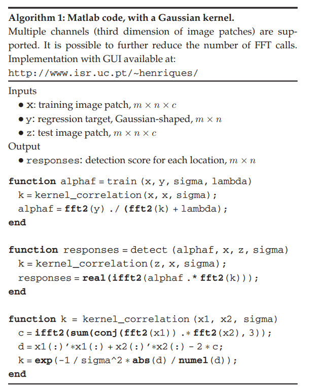

# 基于滤波的跟踪算法（3） KCF

## 1. 简介

其实整个核心流程和CSK算法的思想差不多，一些方便做了改进：

- 对多通道图像的支持
- 增加多种提取特征的方式：如HOG（梯度直方图）
- 多种核函数：线性核和高斯核


**核相关矩阵：**
$$
K^Z=C(k^{XZ})
$$
$k^{XZ}$是X和Z的核相关矩阵，所以$K$也是循环矩阵。


**$\alpha$的更新公式：**
$$
\hat{\boldsymbol{\alpha}}=\frac{\hat{\mathbf{y}}}{\hat{\mathbf{k}}^{\mathbf{x} \mathbf{x}}+\lambda}
$$
其中$\hat k^{XX}$就是核矩阵$K$的第一行元素，$\hat y$表示$F(y)$，即傅里叶变换。


**响应值$f(Z)$：**
$$
\mathbf{f}(\mathbf{z})=\left(K^{\mathbf{z}}\right)^{T} \boldsymbol{\alpha}
$$
$\mathbf{f}(\mathbf{z})$是一个向量，包括$\mathbf{z}$的所有循环位移结果。


## 2. 算法流程




### 第一帧 初始

```
    def init(self,first_frame,bbox):
        assert len(first_frame.shape)==3 and first_frame.shape[2]==3
        if self.features=='gray':
            first_frame=cv2.cvtColor(first_frame,cv2.COLOR_BGR2GRAY)
        bbox = np.array(bbox).astype(np.int64)
        x0, y0, w, h = tuple(bbox)
        self.crop_size = (int(np.floor(w * (1 + self.padding))), int(np.floor(h * (1 + self.padding))))# for vis
        self._center = (np.floor(x0 + w / 2),np.floor(y0 + h / 2))
        self.w, self.h = w, h
        # 提取特征的窗口大小，原有目标框大小扩大到1+padding大小
        # 相当于在此窗口做响应，目标移动后仍在这个窗口范围，就可以找到目标移动后的最大相应位置，然后更新目标位置
        self.window_size=(int(np.floor(w*(1+self.padding)))//self.cell_size,int(np.floor(h*(1+self.padding)))//self.cell_size)
        # 汉宁窗，为了突出目标，越往边缘值越小，中间值大，得以保留目标
        self._window = cos_window(self.window_size)

        # 高斯模板的sigma值
        s=np.sqrt(w*h)*self.output_sigma_factor/self.cell_size
        # yf代表理想响应值，初始为高斯模板标签
        self.yf = fft2(gaussian2d_rolled_labels(self.window_size, s))

        if self.features=='gray' or self.features=='color':
            first_frame = first_frame.astype(np.float32) / 255
            x=self._crop(first_frame,self._center,(w,h))
            x=x-np.mean(x)
        elif self.features=='hog':
            # 第一帧时，称为x，后面都是z，就是当前帧未定位前的目标图像特征
            # 裁剪获取到目标位置的window_size大小的图像
            x=self._crop(first_frame,self._center,(w,h))
            # 为了提取hog特征，需要将cell_size大小的几个像素捆绑作为一个bin来处理，具体涉及到提hog特征的思路
            # 所以需要放大cell_size倍
            x=cv2.resize(x,(self.window_size[0]*self.cell_size,self.window_size[1]*self.cell_size))
            # 对放大的裁剪图像提取特征
            # 所以x保存当前帧目标所在window_size大小的图像特征
            x=extract_hog_feature(x, cell_size=self.cell_size)
        elif self.features=='cn':
            x = cv2.resize(first_frame, (self.window_size[0] * self.cell_size, self.window_size[1] * self.cell_size))
            x=extract_cn_feature(x,self.cell_size)
        else:
            raise NotImplementedError

        # 用汉宁窗处理，突出中心目标位置，弱化边缘位置
        self.xf = fft2(self._get_windowed(x, self._window))
        self.init_response_center = (0,0)
        # 利用理想响应yf（最初就是高斯模板）与当前目标特征图像，求出alpha的初值
        self.alphaf = self._training(self.xf,self.yf)
```


### 第二帧开始 更新

```
    def update(self,current_frame,vis=False):
        assert len(current_frame.shape) == 3 and current_frame.shape[2] == 3
        if self.features == 'gray':
            current_frame = cv2.cvtColor(current_frame, cv2.COLOR_BGR2GRAY)
        if self.features=='color' or self.features=='gray':
            current_frame = current_frame.astype(np.float32) / 255
            z = self._crop(current_frame, self._center, (self.w, self.h))
            z=z-np.mean(z)

        elif self.features=='hog':
            z = self._crop(current_frame, self._center, (self.w, self.h))
            z = cv2.resize(z, (self.window_size[0] * self.cell_size, self.window_size[1] * self.cell_size))
            z = extract_hog_feature(z, cell_size=self.cell_size)
        elif self.features=='cn':
            z = self._crop(current_frame, self._center, (self.w, self.h))
            z = cv2.resize(z, (self.window_size[0] * self.cell_size, self.window_size[1] * self.cell_size))
            z = extract_cn_feature(z, cell_size=self.cell_size)
        else:
            raise NotImplementedError

        # 第二帧开始，z就是当前帧未定位前（即目标框位置还未更新，还是前一帧目标框位置）目标window_size大小的图像特征
        zf = fft2(self._get_windowed(z, self._window))
        # 使用当前特征zf和前一帧的特征xf做响应
        # 虽然目标框位置未移动，但此时目标已经移动，故最大响应位置就发生了改变
        responses = self._detection(self.alphaf, self.xf, zf, kernel=self.kernel)
        if vis is True:
            self.score=responses
            self.score = np.roll(self.score, int(np.floor(self.score.shape[0] / 2)), axis=0)
            self.score = np.roll(self.score, int(np.floor(self.score.shape[1] / 2)), axis=1)

        # 获取响应值最大的位置
        curr =np.unravel_index(np.argmax(responses, axis=None),responses.shape)

        if curr[0]+1>self.window_size[1]/2:
            dy=curr[0]-self.window_size[1]
        else:
            dy=curr[0]
        if curr[1]+1>self.window_size[0]/2:
            dx=curr[1]-self.window_size[0]
        else:
            dx=curr[1]
        dy,dx=dy*self.cell_size,dx*self.cell_size
        x_c, y_c = self._center
        x_c+= dx
        y_c+= dy
        # 修改中心位置到新的最大响应位置
        self._center = (np.floor(x_c), np.floor(y_c))

        if self.features=='color' or self.features=='gray':
            new_x = self._crop(current_frame, self._center, (self.w, self.h))
        elif self.features=='hog':
            # 利用新的中心位置，再取得window_size大小的图像特征
            new_x = self._crop(current_frame, self._center, (self.w, self.h))
            new_x = cv2.resize(new_x, (self.window_size[0] * self.cell_size, self.window_size[1] * self.cell_size))
            new_x= extract_hog_feature(new_x, cell_size=self.cell_size)
        elif self.features=='cn':
            new_x = self._crop(current_frame, self._center, (self.w, self.h))
            new_x = cv2.resize(new_x, (self.window_size[0] * self.cell_size, self.window_size[1] * self.cell_size))
            new_x = extract_cn_feature(new_x,cell_size=self.cell_size)
        else:
            raise NotImplementedError
        new_xf = fft2(self._get_windowed(new_x, self._window))
        # 利用新的xf和yf求出alpha值，interp_factor一定程度保留过去的alpha值
        self.alphaf = self.interp_factor * self._training(new_xf, self.yf, kernel=self.kernel) + (1 - self.interp_factor) * self.alphaf
        # 更新xf的值，interp_factor一定程度保留过去的xf值
        self.xf = self.interp_factor * new_xf + (1 - self.interp_factor) * self.xf
        return [(self._center[0] - self.w / 2), (self._center[1] - self.h / 2), self.w, self.h]
```

