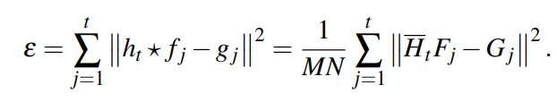
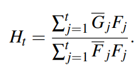
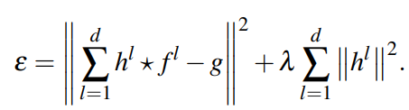
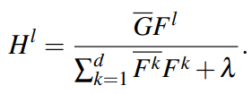
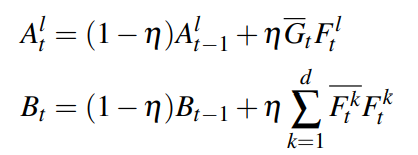
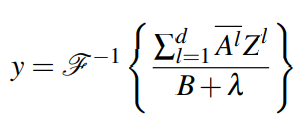
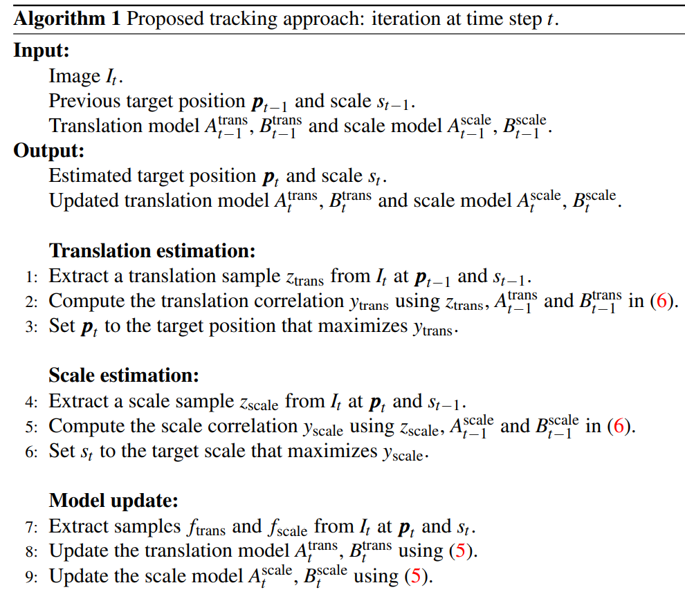
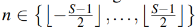

# 基于滤波的跟踪算法（5） DSST

DSST（Accurate Scale Estimation for RobustVisual Tracking）

DSST算法也是基于KCF算法改的较好的一种。DSST（Accurate Scale Estimation for RobustVisual Tracking）是2015年BMVC（InProceedings of the British Machine Vision Conference）上的文章，并在2014VOT比赛中夺得了第一名，算法简洁，性能优良，可移植性高。

文章是基于MOSSE，KCF基础上的改进，主要有两个方面：（1）引入多特征融合机制，这个和SAMF算法一样，使用的特征为HOG+CN+灰度特征；（2）文中最大的创新点是对于尺度的改进。

## 2. 学习判别式相关滤波

误差损失函数：

$f_j$代表目标框外观的一系列灰度图作为训练样本，$g_i$表示理想的输出，$h_t$是时间步t通过最小化上述误差得到的，就是我们要学习的滤波器。

大写表示经过傅里叶变换得到，可以将时域内相关操作转为频域内点积。

## 3. 论文提出的方法

### 3.1 多维特征的判别式相关滤波

使用HOG特征作为平移滤波器，

使用d维特征图来表示图像，f表示从特征图中提取的目标框，每一个维度都有一个滤波器

$h^l$是第$l$维度的滤波器，g是训练图像f对应的理想输出值，$\lambda$正则项系数控制正则化的影响程度。

于是滤波器可以通过如下式子求得：

分子分母可以分别更新（式5）：

响应值y（式6）：

### 3.2 穷举尺度空间跟踪

论文提出的3维尺度空间滤波器，$M×N×S$，S表示不同尺度的数量

**更新滤波器：**

首先考虑目标区域的一系列特征金字塔，训练样本f就是特征金字塔的长方体，长方体的大小为M×N×S，以目标的估计位置和比例尺为中心。对应的3维高斯模板作为期望值g。最后通过更新$A_t^l$，$B_t^l$，还更新滤波器。

**定位新一帧中目标位置：**

首先根据上一次的目标中心位置提取特征金字塔M×N×S大小的长方体Z，通过前面公式计算响应值y，然后可以得到最大响应位置，便可以更新该帧目标位置。

算法流程：

**初始：**

给出第一帧目标框位置$P_0$，初始化尺度$s_0$

**输入：**图像，给出上一帧目标框位置$P_{t-1}$，初始化尺度$s_{t-1}$

**输出：**

- 目标下一帧的目标框位置$P_{t}$，尺度$s_t$
- 更新平移维度的$A_{t}^{trans}$,$B_{t}^{trans}$，尺度维度的$A_{t}^{scale}$,$B_{t}^{scale}$

**平移预测：**

1. 从当前t输入的图像帧中根据$P_{t-1}$，$s_{t-1}$提取$z_{trans}$
2. 计算平**移相关响应**$y_{trans}$，使用$z_{trans}, A_{t-1}^{trans}, B_{t-1}^{trans}$
3. 通过得到最大化响应位置更新得到$P_{t}$

**尺度预测：**

1. 从当前t输入的图像帧中根据$P_{t}$，$s_{t-1}$提取$z_{scale}$
2. 计算**尺度相关响应**$y_{scale}$，使用$z_{scale}, A_{t-1}^{scale}, B_{t-1}^{scale}$
3. 通过得到最大化响应尺寸更新得到$s_{t}$

**模型更新：**

1. 根据前面求得的新的目标框位置$P_{t}$，尺度$s_t$，提取训练样本$f_{trans}, f_{scale}$
2. 更新平移模型$A_{t}^{trans}$,$B_{t}^{trans}$
3. 更新尺度模型$A_{t}^{scale}$,$B_{t}^{scale}$

该帧处理完毕。

### 3.3 快速尺度空间跟踪

将比例估算合并到跟踪器中会带来较高的计算成本。 理想情况下，精确的比例估计方法应具有鲁棒性，同时计算效率也很高。 为了实现这一目标，我们提出了一种通过学习用于平移和缩放的单独过滤器的快速缩放估计方法。 通过将搜索区域限制在比例尺空间的较小部分，这将有所帮助。 此外，我们获得了为每个过滤器独立选择特征表示的自由。

通过学习一个单独的一维相关滤波器来估计图像中的目标比例，从而增加基线。 通过使用以目标为中心的可变尺度大小块提取特征来计算用于更新尺度过滤器的训练示例f。 令P×R表示当前帧中的目标大小，而S为缩放过滤器的大小。

提取S个的特征图像块$J_n$大小分别为$a^nP×a^nR$，作者给出S维33，即有33个不同尺度大小去提取目标位置的特征图。

将训练样本f的尺度大小n的值f(n)设置为$J_n$的d维特征描述符。 最后，使用(5)用新样本f更新尺度滤波器$h_{scale}$。

在视觉跟踪场景中，两帧图像之间的尺度差异通常比平移图像小。因此，在给定新一帧首先应用平移滤波器，跟新目标位置。然后，将比例过滤器应用于新的目标位置。 使用与f相同的过程从该位置提取示例z。 通过最大化$h_{scale}$和z之间的相关输出（6），我们可以获得尺度差。算法1提供了我们的跟踪器的简要概述。我们的方法在计算效率高的同时，准确地估计了平移和尺度。