# 基于滤波的跟踪算法（6） SRDCF

https://blog.csdn.net/sinat_27318881/article/details/79703947

## 1. 简介

### 1.1 贡献

## 2. 判别式相关滤波

### 2.1 标准的DCF流程

训练样本$\{x_k, y_k\}$，每一个训练样本$x_k$包含d维从图像区域提取的特征图，大小为$M×N$

在每个空间位置$(m，n) \in Ω := {0,...,M − 1}×{0,...,N − 1} := {0,...,M − 1}×{0,...,N − 1}$，都有d维特征向量$x_k(m, n) \in R^d$，$x_k^l$表示第$k$个样本的第$l$个维度。理想期望输出$y_k$是$Ω$域上的标量值函数。

考虑滤波器，每个特征图上卷积滤波器$f^l$都是$M×N$大小的，滤波器f和样本的卷积响应S通过下式求出：

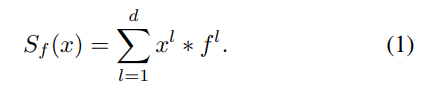

`∗`表示循环卷积。

滤波器就是通过最小化响应值$S_f(x)$和标签值$y_k$之间的平方损失求得：

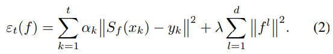

$\alpha_k$控制每个样本$x_k$的权重，应为考虑到有的样本离目标中心近，而有的样本离目标中心远，故增加权重参数，$\lambda$是正则项系数。

其实卷积操作可以通过傅里叶变换转换为点积：

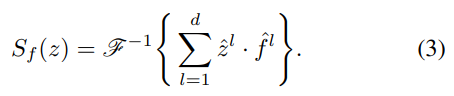

$ \sdot $表示点积，逐元素相乘。^表示傅里叶转换操作，如$\hat z^l$表示$F(z^l)$。$-1$表示傅里叶逆变换。则通过上述变换后，时间复杂度变为$O(dMN log MN)$，而不是$O(dM^2N^2)$。

注意，第(1)中的操作 Sf (x)对应于以滑动窗口的方式将线性分类器 f 应用于样本 x 的周期性扩展(参见图1)。这在训练(2)和检测(3)步骤中引入了不被期望的周期性边界效应。

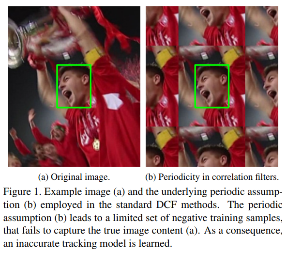

## 3. 空间正则化相关滤波器

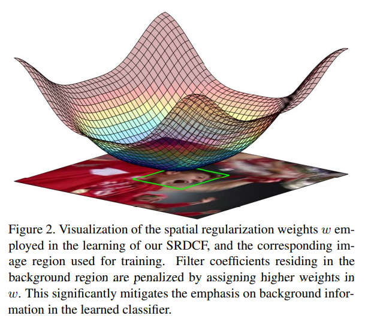

通过在w中分配较高的权重，可对位于背景区域的滤波器系数进行惩罚。 这大大减少分类器中对背景信息的倾斜。

### 3.1 空间正则化

为了减轻由（1）中的循环卷积引起的问题，我们用更通用的Tikhonov正则化替换了（2）中的正则化项。 我们引入空间权重函数w：Ω→R，用于惩罚学习中滤波器系数的大小。 调节权重w取决于滤波器系数f1的空间位置确定滤波器系数f1的重要性。 通过在w中分配较高的权重可以抑制位于目标区域外部的系数，反之亦然。 结果优化问题表示为

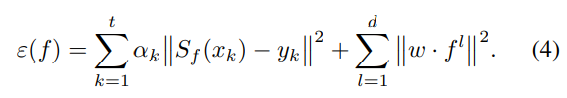

接近目标边缘的视觉特征往往不如接近目标中心的特征可靠，这是由于目标旋转和遮挡等原因。因此，我们让正则化权值平滑地从目标区域到背景改变。这也增加了傅里叶域中 w 的稀疏度。注意(4)对于统一权重 w (m，n) = √ λ 简化为标准 DCF (2)。

转换到傅里叶域中：

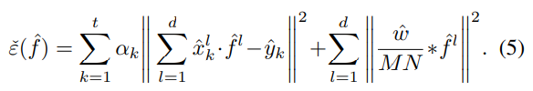

向量化后的表示：

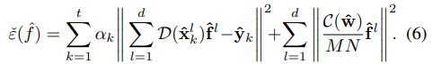

粗体字体代表向量化的表示，$\mathcal{D}(\bold{v})$是$\bold{v}$向量对角化的表示，即元素位于对角线上。$MN × MN$矩阵$\mathcal{C}(\hat{\bold{w}})$表示$\hat{\bold{w}}$的2D循环矩阵，则：$\mathcal{C}(\hat{\mathbf{w}}) \hat{\mathbf{f}}^{l}=\operatorname{vec}\left(\hat{w} * \hat{f}^{l}\right)$，$\mathcal{C}(\hat{\bold{w}})$中每一行由$\hat{\bold{w}}$循环排列得到。

实值函数的密度泛函是厄米对称的。因此，在实值滤波$f^l$集上最小化(4)相当于在厄米对称 DFT 系数$\hat{f}^l$集上最小化(5)

我们将(6)公式化为等价的实值优化化问题，通过保持厄米特对称性来确保更快的收敛。设 ρ: Ω → Ω 为点反射 ρ (m，n) = (- m mod m,-n mod n)。区域 Ω 可划分为 Ω0，Ω+ 和 Ω-，其中 Ω0 = ρ (Ω0)和 Ω-= ρ (Ω+)。因此，Ω0表示频谱的一部分，没有对应的反射频率，而 Ω- 包含反射频率在 Ω+ 。我们定义

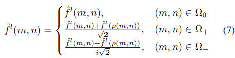

$\tilde{f}^l$表示关于$\hat{f}^l$厄米对称的实值，可以通过$MN × MN$的酉矩阵B来表示$\tilde{f}^l = B\hat{f}^l$

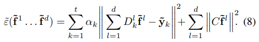

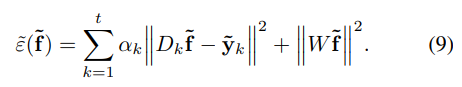

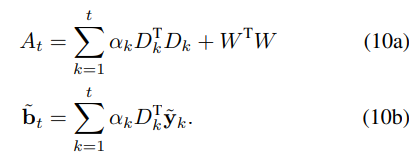