# 基于滤波的跟踪算法（7） BASF

CF的基本缺点是无法随时间对目标背景进行建模，这可能会导致性能欠佳。 最近的跟踪算法建议通过从更具区分性的深度特征（例如DeepSRDCF [9]和CCOT [11]）中学习CF或学习复杂的深度跟踪器（例如MDNet [28]和FCNT [33]）来解决此缺陷。 ）。提出了一个基于手工特征（HOG [6]）的背景感知CF，该CF可以有效地建模对象的前景和背景如何随时间变化。 与常规CF一样，我们的方法具有极高的计算效率，并且在多个跟踪基准上进行了广泛的实验，证明了与最新的跟踪器相比，我们的方法具有更高的准确性和实时性能。

然而，学习频域 CF 跟踪器需要付出很高的代价，因为要学习前景目标的循环移位实例。这些位移图像块通过频域相关的循环特性隐式生成，并作为反例用于训练滤波器[20]。所有移动块都受到圆形边界效应的困扰，并不能真正代表现实世界中的负样本[17]。

由于多种因素，这些边界效应已对跟踪性能产生了巨大影响。 首先，从有限的位移块中学习可能会导致训练过度拟合的滤波器，该滤波器不能很好地推广到快速的视觉变形，例如由快速运动引起的[10]。 其次，缺乏真正的负样本会严重降低此类跟踪器在杂乱背景下的鲁棒性，因此，特别是当目标和背景显示相似的视觉提示时，会增加跟踪漂移的风险。 第三，从学习过程中丢弃背景信息可能会降低跟踪器将目标与遮挡块区分开的能力。 这限制了这种跟踪器在闭塞或平面外运动后重新检测的可能性[10]。

有限边界的CFs方法（CFLB）被提出学习具有较少边界效应的CFs来进行人脸界标定位和目标跟踪的任务。 尽管取得了令人鼓舞的结果，但该方法仅限于从像素强度中学习CF，如图[16]所示，该方法不足以表现出检测视觉内容中具有挑战性的模式的能力。 与我们的工作类似，空间正则化CF（SRDCF）[10]提出从具有较大空间支持的训练示例中学习过滤器。 该方法的主要缺点是，即使在傅立叶域中，正规化目标的优化成本也很高。 此外，为了形成正则化权重，必须仔细调整一组超参数，如果未正确执行，则会导致跟踪性能变差。

**贡献：**

我们的方法能够从背景中密集提取的真实负面样本中学习/更新过滤器。 我们证明了从负背景图像块而不是移位的前景图像块学习跟踪器，可以实现更高的准确性。 本文提供以下贡献：

1. 我们的追踪器是从真实的负样本中训练出来的，密集地从背景中提取
2. 我们提出了一种基于乘数交替方向法（ADMM）的有效方法，用于学习我们的多通道特征（例如HOG）滤波器，其计算成本为O（LKT log（T）），其中T是矢量化帧的大小， K是特征通道的数量，L是ADMM的迭代次数

使用Sherman-Morrison引理计算模型更新，以应对目标和背景表现的变化以及实时性能。 我们对OTB50，OTB100，Temple-Color128和VOT2015数据集进行了广泛的评估。 结果表明，与基于CF的最新技术和深度跟踪器相比，我们的方法具有很高的竞争力，在CPU上具有约40 FPS的出色实时跟踪速度。

## 3. 相关滤波

单个样本时：

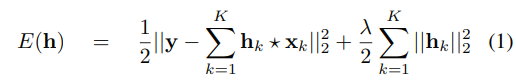

$x_k$，$h_x$分别对应第$k$个特征通道的图像和滤波器，size都是D：$x_k \in R^D$，$h_k \in R^D$

$y \in R^D$，是期望响应值

展开成更一般的形式：

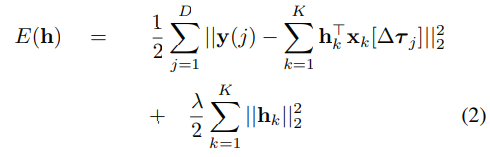

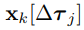表示对样本第k个通道$x_k$进行循环移位操作得到。

## 4. 背景感知相关过滤器

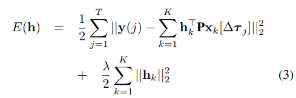

$P \in  R^{D × T}$大小的二值矩阵(元素都是0或1)，用来对样本$x_k \in R^T$进行裁剪出size为D×1大小的元素，所以$Px_K \in R^{D×1}$，其中$x_k \in R^T, y \in R^T, h_k \in R^D$，其中$T >> D$

对于跟踪任务，x、 y 和 h 分别是具有较大空间支持度的训练样本，y 是以目标为中心的相关输出，h 是空间大小远小于训练样本的相关滤波器。在训练样本上应用循环移位算子，然后是裁剪算子$Px_k [ \Deltaτj ]$，返回整个帧中 size为D的所有可能的图像块。

裁剪块相关响应输出峰值的对应于目标(正样本)，相关响应输出0值的对应于背景内容(负样本)。

转换到频域，而且通过向量化表示：

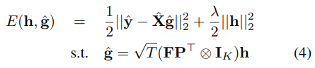

$\hat X = [diag(\hat{x_1})^T, ..., diag(\hat{x_K})^T]$， $\hat{X} \in R^{T×KT}$。$h=[h_1^T, ..., h_K^T]^T$，$h \in R^{KD×1}$。$\hat{g}=[\hat{g}_1^T, ..., \hat{g}_K^T]^T$，$h \in R^{KT×1}$。这些都是通过拼接各自K个通道的向量化表示得来的。$I_K$是$K×K$的单位矩阵，⊗表示克罗内克积，^都表示经过傅里叶变换而来。$\hat{\bold{a}}=\sqrt{T}\bold{Fa}$，F是正交的$T×T$正交傅里叶变换矩阵。

其中$h_k^TPx_k[\Delta τ_j]$变为$\hat{X}\hat{g}$：

$\hat{X}=[X_1^T, ..., X_K^T]$，按列拼接K个通道而成。其中每一行代表一个样本，由循环操作合并而成。循环矩阵有如下性质：

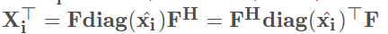

所以$X_i^T \hat{g}=\sqrt{T}F^Hdiag(\hat{x_i})^TF(\bold{P^T} ⊗ I_K)h$。

所以$\hat{g}=\sqrt{T}(\bold{FP^T} ⊗ I_K)h$。其中$P^T \in R^{T×D}, I_K \in R^{K×K}$，故$P^T ⊗ I_K \in R^{KT×KD}$， 由于$h \in R^{KD×1}$，故$\hat{g} \in R^{KT×1}$。

### 4.1 构造拉格朗日函数

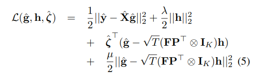

对g和h进行分别优化求解：

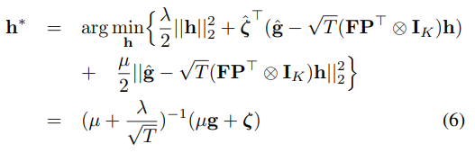

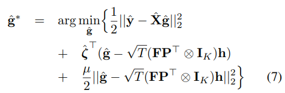

该求解复杂度为$O(T^3 K^3)$经过傅里叶变换，对每个值分别求解：

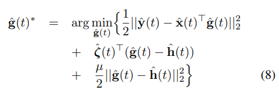

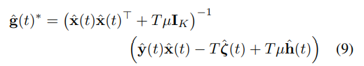

这时复杂度变为：$O(T K^3)$。

对求逆公式进行化简：

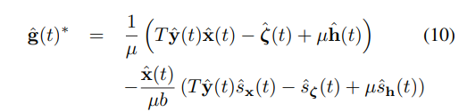

