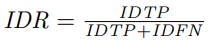

# 多目标跟踪综述

Deep Learning in Video Multi-Object Tracking A Survey 2019

https://blog.csdn.net/qq_41614538/article/details/103307352

## 1. 介绍

贡献：

- 关于深度学习在多目标跟踪中的应用的全面调查，重点是从单摄像机视频中提取的2D 数据，包括过去的调查和评论没有涵盖的最近的工作。
- 确定了MOT算法中的四个常见步骤，并描述了每个步骤中采用的不同DL模型和方法，包括使用它们的算法环境。 表格中还总结了每个分析工作所使用的技术，以及指向可用源代码的链接，以作为将来研究的快速参考。
- 收集了最常用的 MOT 数据集上的实验结果，对它们进行了数值比较，同时确定了性能最佳算法的主要趋势。
- 讨论了未来可能的研究方向。

## 2. MOT: algorithms, metrics and datasets

### 2.1 Introduction to MOT algorithms

四个步骤：

- Detection stage：检测得到物体框
- Feature extraction/motion prediction stage：根据物体框提取特征，外观，动作和/或互动功能。对每一个跟踪目标的位置预测。
- Affinity stage：上一帧中物体框和当前帧物体框的相似度/距离计算
- Association stage：数据关联，即上一帧中物体框和当前帧物体框的匹配

### 2.2 Metrics

https://my.oschina.net/u/4264644/blog/3307384

相关的指标是 Wu 和 Nevatia定义的metrics，即所谓的 CLEAR MOT metrics，以及最近的 ID metrics。这些度量集旨在反映测试模型的总体性能，并指出每个模型可能存在的缺点。因此，这些指标的定义如下：

#### Classical metrics：

- Mostly Tracked (MT)	至少80%帧数被正确追踪的目标数量
- Fragments	（一段真实轨迹可能被多个追踪片段共同组成）至多覆盖真实轨迹80%帧的片段的数量
- Mostly Lost (ML)	少于20%帧数被正确追踪的目标数量
- False trajectories	不能对应到真实目标的预测轨迹的数量
- ID switches	目标被正确追踪，但ID被错误改变的次数

#### CLEAR MOT metrics

真实框$o_i$和假设框$h_j$在$t-1$帧中匹配上，在$t$中$IoU(o_i , h_j ) ≥ 0.5$则认为匹配成功。未关联的真实框称为false negatives，未关联的假设框称为false positives：

- FP：整个视频中false positives的数量
- FN：整个视频中false negatives的数量
- Fragm：fragments总数量
- IDSW：ID switches总数量

定义：MOTA (Multiple Object Tracking Accuracy) 和 MOTP (Multiple Object Tracking Precision)：

> GT是ground truth boxes的数量

> $c_t$是第t帧中能正确匹配的目标数量, $d_{t,i}$是检测目标i与其对应gt目标的IoU.

MOTA被用于检测tracking的质量，而MOTP更关注detection的质量，即bounding box的精确程度(IoU).

#### ID scores

- Identification precision：
- Identification recall：
- Identification F1：

### 2.3 Benchmark datasets

- **MOTChallenge**：最大的行人跟踪数据集，这些数据集目前已公开提供
- **KITTI**：行人和车辆跟踪数据集
- **Other datasets**：UA-DETRAC，通过交通灯处的车辆；TUD和PETS2009，行人跟踪数据集。

## 3. Deep learning in MOT

### 3.1 DL in detection step

detection的精度可以极大影响整个目标追踪算法的效果，因此许多数据集都提供了公开的detection结果供大家使用，使各个算法之间的性能对比可以更公平。不过，有一些算法集成了一些独特的detection算法，借此提高tracking performance.

- faster RCNN

> [Simple Online and Realtime Tracking (SORT) algorithm](https://arxiv.org/abs/1602.00763) 2016 IEEE ICIP，第一个使用CNN做行人目标检测 `<-highlight`
>
> [Multiple object tracking with high performance detection and appearance feature](https://arxiv.org/abs/1610.06136) 2016 ECCV，modified faster-RCNN with skip-pooling and multi-region features，SOTA on MOT16

- SSD

> [Automatic individual pig detection and tracking in pig farms](https://www.mdpi.com/1424-8220/19/5/1188/xml) 2019 Sensors，DCF based online tracking method with HOG and Color Names feature to predict **tag-boxes**，refine bbox by DCF
>
> [Joint detection and online multi-object tracking](http://openaccess.thecvf.com/content_cvpr_2018_workshops/papers/w29/Kieritz_Joint_Detection_and_CVPR_2018_paper.pdf) 2018 CVPR，refine SSD detection results by other steps in tracking algorithm，use affinity scores to replace NMS in SSD `<-highlight`
>
> [Multi-object tracking with correlation filter for autonomous vehicle](https://www.ncbi.nlm.nih.gov/pmc/articles/PMC6068606/) 2018 Sensors，use a CNN-based Correlation Filter(CCF) to allow SSD to generate more accurate bbox by cropped RoI

- other use of CNNs in the detection step

> [Instance flow based online multiple object tracking](https://arxiv.org/abs/1703.01289) 2017 IEEE ICIP，obtain **instance-aware semantic segmentation map** in current frame by Multi-task Network Cascade，then use **optical flow** to predict the position and shape in the next frame. `<-适合 moving camera`

### 3.2 DL in feature extraction and motion prediction

- auto-encoders

> [Learning deep features for multiple object tracking by using a multi-task learning strategy](https://projet.liris.cnrs.fr/imagine/pub/proceedings/ICIP-2014/Papers/1569912181.pdf) 2014 IEEE ICIP，第一个提出在MOT算法中应用deep learning方法，use auto-encoders to refine visual features. 它提出feature refinement可以极大提高tracking模型的效果。

- CNNs as visual feature extractors

  -> use pre-trained CNN to extract features.

> [DeepSORT: Simple online and realtime tracking with a deep association metric](https://arxiv.org/abs/1703.07402) 2017 IEEE ICIP，extract feature vectors by **custom residual CNN**, add cosine distance of vectors to affinity scores. 克服了原SORT算法的主要弱点，即 ID Switch太多。
>
> [An Automatic Tracking Method for Multiple Cells Based on Multi-Feature Fusion](https://ieeexplore.ieee.org/document/8532102) 2018 IEEE Access，可以区分移动快/慢的目标，对不同的目标采用不同的相似度计算准则

- Siamese networks孪生神经网络

  

> [Similarity mapping with enhanced siamese network for multi-object tracking](https://arxiv.org/abs/1609.09156) 2016 NIPS，train Siamese network with **contrastive loss**, take two images/ their IoU score/ their ratio as input
>
> [Tracking persons-of-interest via adaptive discriminative features](https://faculty.ucmerced.edu/mhyang/papers/eccv16_face_tracking) 2016 ECCV，SymTriplet loss 三胞胎网络
>
> [Multi-object tracking with quadruplet convolutional neural networks](http://openaccess.thecvf.com/content_cvpr_2017/papers/Son_Multi-Object_Tracking_With_CVPR_2017_paper.pdf) 2017 CVPR，四胞胎网络，考虑detection之间的时序距离
>
> [Online multi-target tracking with tensor- based high-order graph matching](https://ieeexplore.ieee.org/document/8545450) 2018 ICPR，三胞胎网络 triplet based on Mask R-CNN
>
> [Eliminating exposure bias and loss-evaluation mismatch in multiple object tracking](https://arxiv.org/abs/1811.10984) 2019 CVPR，ReID triplet CNN + bidirectional LSTM
>
> [Online multi-object tracking with dual matching attention networks](https://arxiv.org/abs/1902.00749) 2018 ECCV，spatial attention networks(SAN) + bidirectional LSTM 通过注意力机制来排除bbox中的背景部分。这整个网络可以在ECO进行hard example mining丢失目标时，从遮挡条件下恢复检测。 `<- highlight`

- more complex approaches for visual feature extraction

> [Learning to track multiple cues with long-term dependencies](https://arxiv.org/abs/1701.01909) 2017 ICCV，使用三种RNN来计算多类特征(appearance + motion + interactions)，将输出的特征再传入一个LSTM来计算affinity. 论文发表时在MOT15和MOT16达到SOTA. `<-highlight`
>
> [Online multi-object tracking by decision making](http://cvgl.stanford.edu/papers/xiang_iccv15.pdf) 2015 ICCV，前一篇论文与该论文整体算法相似，本论文用了Markov Decision Processes(MDP) based framework
>
> [A directed sparse graphical model for multi-target tracking](http://openaccess.thecvf.com/content_cvpr_2018_workshops/papers/w34/Ullah_A_Directed_Sparse_CVPR_2018_paper.pdf) 2018 CVPR，减少相似度计算复杂度。通过用隐马尔可夫模型预测物体接下去几帧的位置，只对检测结果中足够靠近HMM预测的detections计算相似度。

- CNNs for motion prediction: correlation filters

> [Hierarchical convolutional features for visual tracking](https://www.cv-foundation.org/openaccess/content_iccv_2015/papers/Ma_Hierarchical_Convolutional_Features_ICCV_2015_paper.pdf) 2015 ICCV，**correlation filter**, whose output is a **response map** for the tracked object & an estimation of the new position of the object in the next frame

### 3.3 DL in affinity computation

许多模型计算由CNN提取出的tracklet和detection的特征间距离，作为相似性度量。以下介绍其他一些直接使用深度模型来计算相似性的方法，这些方法不需要人为预定义特征间的distance metric。主要可以分为LSTM和CNN两大类。

- RNN and LSTMs

> [Online multi-target tracking using recurrent neural networks](https://arxiv.org/abs/1604.03635) 2017 AAAI，首次提出用深度网络来计算相似度，end-to-end learning approach for online MOT. 运行速度快(165FPS)，未使用appearance features `<- highlight`
>
> 

- Siamese LSTMs

> [An online and flexible multi-object tracking framework using long short-term memory](http://openaccess.thecvf.com/content_cvpr_2018_workshops/papers/w21/Wan_An_Online_and_CVPR_2018_paper.pdf) 2018 CVPR. 第一步，计算IoU作为affinity measures，捕获short reliable tracklets；第二步，将motion/appearance feature作为输入，用Siamese LSTM计算affinity。

- Bidirectional LSTMs

> [Online multi-object tracking with dual matching attention networks](https://arxiv.org/abs/1902.00749) 参考[3.2节](https://blog.csdn.net/qq_41614538/article/details/103307352#2)孪生神经网络

- Use of LSTMs in MHT frameworks

**Multiple Hypothesis Tracking(MHT)**: 为每个候选目标建立一个潜在跟踪假设的树，这样可以为数据关联问题提供一个系统的解决方法。计算每一个跟踪的概率，然后选出最有可能的跟踪组合。

> [Multiple hypothesis tracking revisited](https://www.cv-foundation.org/openaccess/content_iccv_2015/papers/Kim_Multiple_Hypothesis_Tracking_ICCV_2015_paper.pdf) 2015 ICCV. 回顾经典的基于tracking-by-detection框架的多假设跟踪算法，提出MHT-DAM (Multiple Hypothesis Tracking with Discriminative Appearance Modeling)
>
> [Eliminating exposure bias and loss-evaluation mismatch in multiple object tracking](http://openaccess.thecvf.com/content_CVPR_2019/papers/Maksai_Eliminating_Exposure_Bias_and_Metric_Mismatch_in_Multiple_Object_Tracking_CVPR_2019_paper.pdf) 2019 CVPR. 在一个MHT的变种算法中，使用LSTM来计算tracklet scores，并且循环迭代式进行剪枝和增枝，最终选出最有可能的跟踪组合。该论文核心贡献是提出并解决了两个应用RNN于MOT时常见的问题，**loss-evaluation mismatch**和**exposure bias**。该算法在多个数据集上达到最高的IDF1，但是MOTA不是最优。 `<-highlight`

- CNNs for affinity computation

> [Multiple people tracking by lifted multicut and person re-identification](http://openaccess.thecvf.com/content_cvpr_2017/papers/Tang_Multiple_People_Tracking_CVPR_2017_paper.pdf) 2017 CVPR. A novel **graph-based** formulation that links and **clusters** person hypotheses over time by solving an instance of a minimum cost lifted multi-cut problem. SOTA on MOT16. `<-highlight`

- Siamese CNNs

Siamese CNNs 是一种常用的计算相似度的方法。不同于3.2节中提到用它得到两张图的feature vector，再计算特征向量的距离；这里直接使用Siamese CNN的网络输出作为相似度。

### 3.4 DL in Association/Tracking step

相对于上述其他步骤而言，在association步骤中深度学习的应用比较少。传统算法，如[Hungarian algorithm](https://blog.csdn.net/u011837761/article/details/52058703)依然被广泛使用。以下介绍3种被尝试用在association步骤中的深度学习算法。

- RNNs

> [Online multi-target tracking using recurrent neural networks](https://arxiv.org/abs/1604.03635) 参考[3.3节]

- Deep Multi-Layer Perception

> [Joint detection and online multi-object tracking](http://openaccess.thecvf.com/content_cvpr_2018_workshops/papers/w29/Kieritz_Joint_Detection_and_CVPR_2018_paper.pdf) 参考[3.1节]

- Deep Reinforcement Learning agents

> [Multi-agent reinforcement learning for multi-object tracking](http://ifaamas.org/Proceedings/aamas2018/pdfs/p1397.pdf) 2018 ICAAMS
>
> [Collaborative deep reinforcement learning for multi-object tracking](http://openaccess.thecvf.com/content_ECCV_2018/papers/Liangliang_Ren_Collaborative_Deep_Reinforcement_ECCV_2018_paper.pdf) 2018 ECCV `<-highlight`

## 4 Analysis and comparisons

### 4.1 Setup and organization

为了公平的对比，只展示了在MOTChallenge的整个test set上进行的实验结果。

实验首先被划分为使用了public / private detections 的两类，再进一步划分为online / batch算法。MOTA作为最主要的评价指标，算法速度一栏则不太可靠，因为这些实验结果通常没有计算detections的运行时间（这一步由于使用深度学习，往往是计算量最大的步骤），此外它们测试时使用的硬件也不同。

具体实验结果对比图请参考论文。

### 4.2 Discussion of the results

#### 4.2.1 General observations

- 每个数据集上表现最好的算法都采用了private detections，证明detection质量主导了整个tracker的表现。
- batch算法的表现略微超过online算法，但online算法正在逐渐接近batch算法的效果。
- online算法的一个共同问题是更高的fragmentations数量（在遇到目标被暂时遮挡/丢失检测时，它无法使用前后帧的信息进行插值，补充中间帧的目标位置）。
- MOTA成绩可以看作是FP/FN/IDSW的归一化和。在目前实际检测中，FN比FP高一个数量级，比IDSW高两个数量级，因此**FN主导了MOTA成绩**。目前在使用public detections的基础上有效降低FN的策略非常少，因此使用private detections来发现之前遗漏的目标（进而降低FN）成为了提高MOTA的主要方法。

> 有一些尝试在public detections基础上，弥补missing detections进而降低FN的论文:
>
> [Heterogeneous association graph fusion for target association in multiple object tracking](https://ieeexplore.ieee.org/document/8540450) 2018 IEEE TCSVT. superpixel extraction algorithm
>
> [Real-time multiple people tracking with deeply learned candidate selection and person re-identification](https://arxiv.org/abs/1809.04427) 2018 ICME. MOTDT:use R-FCN to integrate missing detections with new detections, best MOTA and lowest FN among online algorithms on MOT17
>
> [Online multi-object tracking with convolutional neural networks](https://ieeexplore.ieee.org/document/8296360) 2017 ICIP. Employ a **Particle Filter algorithm** and rely on detections only to initialize new targets and to recover lost ones.
>
> [Collaborative deep reinforcement learning for multi-object tracking](http://openaccess.thecvf.com/content_ECCV_2018/papers/Liangliang_Ren_Collaborative_Deep_Reinforcement_ECCV_2018_paper.pdf) 参考[3.4节](https://blog.csdn.net/qq_41614538/article/details/103307352#4) learn **motion model** of objects. The 2nd best among online methods in MOT16

- 使用gt trajectories来训练affinity networks可能会产生次优的结果，因为test-time网络接受的是一个不同的数据分布，往往包含missing/wrong detections。为解决这个问题，许多算法事实上采用的是actual detections或添加人工噪音的gt trajectories进行训练。

#### 4.2.2 Best approaches in the four MOT steps

| steps              | best approach                                                |
| ------------------ | ------------------------------------------------------------ |
| private detection  | Faster R-CNN (SSD is faster but perform worse)               |
| feature extraction | CNN to extract appearance feature (appearance是最重要的特征，但许多表现最好的算法还使用了多种其他特征来共同计算相似度，尤其重要的是motion特征，常用LSTM / [**Kalman Filters**](https://blog.csdn.net/qq_41614538/article/details/103307352#https://blog.csdn.net/u010665216/article/details/80556000) / Bayesian filter来提取) |
| affinity           | hand-crafted distance metrics on feature vectors / Siamese CNN |
| association        | -                                                            |

#### 4.2.3 Other trends in top-performing algorithms

- SOT-based MOT
  - 尽管能达到很高的MOTA，但由于tracker drift导致ID switch次数太多。
  - 更高质量的detector不可避免会预测出更多FP，注意不能持续追踪假轨迹。
  - a SOT tracker on private detections可能是一个不错的研究方向，目前还没有相关应用
- association步骤常被作为一个graph optimization问题来解决，batch methods基于此可以做全局优化
  - minimum cost lifted multicut problem
  - heterogeneous association graph fusion and correlation clustering
- bounding box的精度可以极大影响tracking的效果
  - 设计一个可集成在MOT算法中的effective bounding box regressor
  - batch methods可以利用前后帧的appearance信息来辅助回归更精准的bbox

## 5 Conclusion and future directions

**共性发现**

- detection quality is important
- CNNs are essential in feature extraction
- SOT trackers and global graph optimization work

**未来可行的研究方向**

- researching more strategies to mitigate detection errors
- applying DL to track different targets, like vehicles, animals, etc.
- investigating the robustness of current algorithms
- applying DL to guide association
- combining SOT trackers with private detections
- investigating bounding box regression
- investigating post-tracking processing

