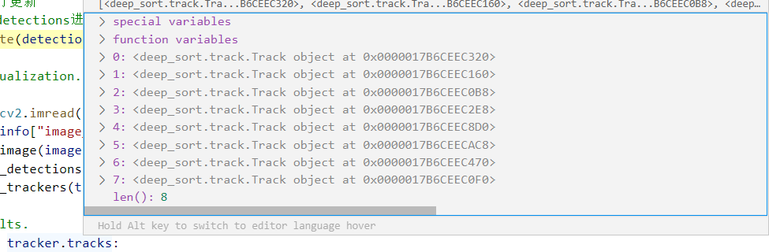
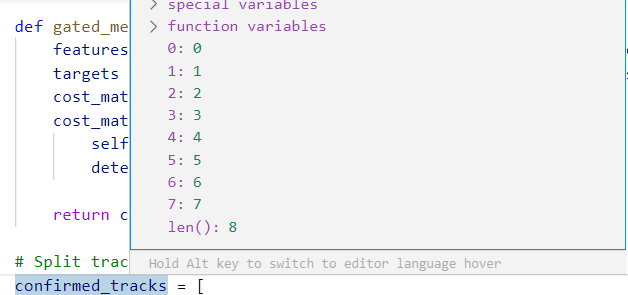
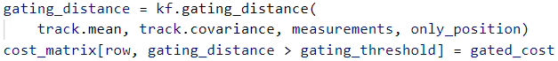
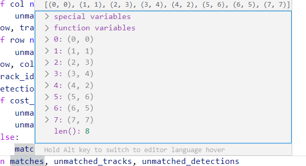

# 多目标跟踪论文（2）DeepSort论文

[Simple online and realtime tracking with a deep association metric](https://ieeexplore.ieee.org/abstract/document/8296962/)

https://github.com/nwojke/deep_sort


https://blog.csdn.net/cdknight_happy/article/details/79731981


## 代码流程

https://blog.csdn.net/cdknight_happy/article/details/79731981

1.读取当前帧目标检测框的位置及各检测框图像块的深度特征(此处在处理实际使用时需要自己来提取)；

2.根据置信度对检测框进行过滤，即对置信度不足够高的检测框及特征予以删除；

3.对检测框进行非最大值抑制，消除一个目标身上多个框的情况；

4.预测：使用kalman滤波预测目标在当前帧的位置

执行kalman滤波公式1和2：

$x(k)=Ax(k−1)$和$p(k)=Ap(k-1)A^T+Q$，其中，

$x(k-1)$为目标的状态信息（代码中的mean），为上一帧中目标的信息[center x,center y,aspect ration,height,0,0,0,0];

$p(k-1)$为目标的估计误差(代码中的covariance)；A为状态转移矩阵；Q为系统误差；

```
	self._std_weight_position = 1. / 20
	self._std_weight_velocity = 1. / 160
	
	def initiate(self, measurement):
        """Create track from unassociated measurement.

        Parameters
        ----------
        measurement : ndarray
            Bounding box coordinates (x, y, a, h) with center position (x, y),
            aspect ratio a, and height h.

        Returns
        -------
        (ndarray, ndarray)
            Returns the mean vector (8 dimensional) and covariance matrix (8x8
            dimensional) of the new track. Unobserved velocities are initialized
            to 0 mean.

        """
        #mean
        mean_pos = measurement
        mean_vel = np.zeros_like(mean_pos)
        mean = np.r_[mean_pos, mean_vel]

		#covariance
        std = [
            2 * self._std_weight_position * measurement[3],
            2 * self._std_weight_position * measurement[3],
            1e-2,
            2 * self._std_weight_position * measurement[3],
            10 * self._std_weight_velocity * measurement[3],
            10 * self._std_weight_velocity * measurement[3],
            1e-5,
            10 * self._std_weight_velocity * measurement[3]]
        covariance = np.diag(np.square(std))
        return mean, covariance
```

```
#矩阵A
self._motion_mat = np.eye(2 * ndim, 2 * ndim)
for i in range(ndim):
self._motion_mat[i, ndim + i] = dt

0:array([1., 0., 0., 0., 1., 0., 0., 0.])
1:array([0., 1., 0., 0., 0., 1., 0., 0.])
2:array([0., 0., 1., 0., 0., 0., 1., 0.])
3:array([0., 0., 0., 1., 0., 0., 0., 1.])
4:array([0., 0., 0., 0., 1., 0., 0., 0.])
5:array([0., 0., 0., 0., 0., 1., 0., 0.])
6:array([0., 0., 0., 0., 0., 0., 1., 0.])
7:array([0., 0., 0., 0., 0., 0., 0., 1.])
```

```
	def predict(self, mean, covariance):
        """Run Kalman filter prediction step.

        Parameters
        ----------
        mean : ndarray
            The 8 dimensional mean vector of the object state at the previous
            time step.
        covariance : ndarray
            The 8x8 dimensional covariance matrix of the object state at the
            previous time step.

        Returns
        -------
        (ndarray, ndarray)
            Returns the mean vector and covariance matrix of the predicted
            state. Unobserved velocities are initialized to 0 mean.

        """
        std_pos = [
            self._std_weight_position * mean[3],
            self._std_weight_position * mean[3],
            1e-2,
            self._std_weight_position * mean[3]]
        std_vel = [
            self._std_weight_velocity * mean[3],
            self._std_weight_velocity * mean[3],
            1e-5,
            self._std_weight_velocity * mean[3]]
		#矩阵Q
        motion_cov = np.diag(np.square(np.r_[std_pos, std_vel]))
		
		#kalman滤波公式1
        mean = np.dot(self._motion_mat, mean)
        #kalman滤波公式2
        covariance = np.linalg.multi_dot((
            self._motion_mat, covariance, self._motion_mat.T)) + motion_cov

        return mean, covariance
```

预测完之后，对每一个追踪器设置`self.time_since_update += 1`

5.更新：更新kalman追踪器参数及特征集，另外进行目标消失、新目标出现的判断

5.1检测结果与追踪预测结果的匹配

5.1.1区分已确认状态的追踪器和未确认状态的追踪器；

5.1.2已确认状态的追踪器进行级联匹配

5.1.2.1对同一消失时间的多个追踪器，计算当前帧新检测的每个目标的深度特征与各追踪器已保存的特征集之间的余弦距离矩阵。假如当前帧有11个检测目标，已有10个追踪器，每个追踪器已保留前面6帧目标的深度特征，则计算得到的cost_matrix大小为10×11，计算过程为首先对每一个追踪器的6个特征，计算与当前帧11个新检测目标特征之间的（1 - 余弦距离），得到6×11矩阵，对每个检测块取最小余弦距离，得到1×11矩阵，存入cost_matrix对应行，表示对当前追踪器而言与当前各检测块之间最小的余弦距离；

```
	def distance(self, features, targets):
        #distance函数
        cost_matrix = np.zeros((len(targets), len(features)))
        for i, target in enumerate(targets):
            cost_matrix[i, :] = self._metric(self.samples[target], features)
        return cost_matrix

def _nn_cosine_distance(x, y):
    #_metric函数
    distances = _cosine_distance(x, y)
    return distances.min(axis=0)
```

5.1.2.2在计算特征的cost_matrix的基础上，计算kalman滤波预测位置与检测框之间的马氏距离，具体过程为，先将各检测框由[x,y,w,h]转化为[center x,center y, aspect ration,height]，对每一个追踪器，也就是cost_matrix中的每一行，计算预测结果与检测结果之间的马氏距离，假设该帧有11个检测结果，那么马氏距离为1×11的矩阵，对cost_matrix中当前行，将马氏距离大于指定阈值的位置处置为1e+5。这样做实现了作者论文中所说的两种度量方式的gating，但是没有体现λ参数的作用，另外使用cholesky分解计算马氏距离部分不是很理解。
5.1.2.3将cost_matrix中大于max_distance的元素置为cost_matrix > max_distance
5.1.2.4使用匈牙利算法以cost_matrix为输入进行指派
5.1.2.5指派完成后，分类未匹配的检测、未匹配的追踪、匹配对(cost_matrix中阈值大于max_distance的匹配对也送入未匹配检测和未匹配追踪中去)
5.1.3 未级联匹配上追踪器和未确认状态的追踪与未级联匹配上的检测之间基于IOU进行匹配，具体实现是计算cost_matrix矩阵，矩阵的每一行表示一个追踪器和每一个检测结果之间的（1 - IOU）。对cost_matrix中大于max_distance的元素置为max_distance，然后使用匈牙利算法以cost_matrix矩阵作为输入进行指派，指派完成后依然统计matchs，unmatched_detections,unmatched_tracks；

5.2匹配上的，去做参数更新

- 参数更新的过程就是计算kalman滤波的公式3，4，5。其中公式3中的R矩阵为

```
	def project(self, mean, covariance):
        """Project state distribution to measurement space.

        Parameters
        ----------
        mean : ndarray
            The state's mean vector (8 dimensional array).
        covariance : ndarray
            The state's covariance matrix (8x8 dimensional).

        Returns
        -------
        (ndarray, ndarray)
            Returns the projected mean and covariance matrix of the given state
            estimate.

        """
        std = [
            self._std_weight_position * mean[3],
            self._std_weight_position * mean[3],
            1e-1,
            self._std_weight_position * mean[3]]
        innovation_cov = np.diag(np.square(std))

        mean = np.dot(self._update_mat, mean)
        covariance = np.linalg.multi_dot((
            self._update_mat, covariance, self._update_mat.T))
        return mean, covariance + innovation_cov

	def update(self, mean, covariance, measurement):
        """Run Kalman filter correction step.

        Parameters
        ----------
        mean : ndarray
            The predicted state's mean vector (8 dimensional).
        covariance : ndarray
            The state's covariance matrix (8x8 dimensional).
        measurement : ndarray
            The 4 dimensional measurement vector (x, y, a, h), where (x, y)
            is the center position, a the aspect ratio, and h the height of the
            bounding box.

        Returns
        -------
        (ndarray, ndarray)
            Returns the measurement-corrected state distribution.

        """
        projected_mean, projected_cov = self.project(mean, covariance)

        chol_factor, lower = scipy.linalg.cho_factor(
            projected_cov, lower=True, check_finite=False)
        kalman_gain = scipy.linalg.cho_solve(
            (chol_factor, lower), np.dot(covariance, self._update_mat.T).T,
            check_finite=False).T
        innovation = measurement - projected_mean

        new_mean = mean + np.dot(innovation, kalman_gain.T)
        new_covariance = covariance - np.linalg.multi_dot((
            kalman_gain, projected_cov, kalman_gain.T))
        return new_mean, new_covariance
```

- 参数更新完成之后，特征插入追踪器特征集，对应参数进行重新初始化

```
    // track.py
    def update(self, kf, detection):
        """Perform Kalman filter measurement update step and update the feature
        cache.

        Parameters
        ----------
        kf : kalman_filter.KalmanFilter
            The Kalman filter.
        detection : Detection
            The associated detection.

        """
        self.mean, self.covariance = kf.update(
            self.mean, self.covariance, detection.to_xyah())
        self.features.append(detection.feature)

        self.hits += 1
        self.time_since_update = 0
        if self.state == TrackState.Tentative and self.hits >= self._n_init:
            self.state = TrackState.Confirmed
```

5.3未匹配的追踪器有可能要删除

未匹配的追踪器表示虽然预测到了新的位置，但是检测框匹配不上

```
    def mark_missed(self):
        """Mark this track as missed (no association at the current time step).
        """
        #待定状态的追踪器直接删除
        if self.state == TrackState.Tentative:
            self.state = TrackState.Deleted

        #已经时confirm状态的追踪器，虽然连续多帧对目标进行了预测， 
        #但中间过程中没有任何一帧能够实现与检测结果的关联，说明目标 
        #可能已经移除了画面，此时直接设置追踪器为待删除状态
        elif self.time_since_update > self._max_age:
            self.state = TrackState.Deleted
```

5.4未匹配的检测，初始化为新的追踪器
没有匹配上的检测，说明是出现了新的待追踪目标，此时初始化一个新的kalman滤波器，再初始化一个新的追踪器

```
    # tracker.py
    def _initiate_track(self, detection):
        # 未匹配的检测，初始化为新的追踪器
        #根据初始检测位置初始化新的kalman滤波器的mean和covariance
        mean, covariance = self.kf.initiate(detection.to_xyah())
        #初始化一个新的tracker
        self.tracks.append(Track(
            mean, covariance, self._next_id, self.n_init, self.max_age,
            detection.feature))
		#总的目标id++
        self._next_id += 1

	# track.py
    def __init__(self, mean, covariance, track_id, n_init, max_age,
                 feature=None):

        #Tracker的构造函数
        self.mean = mean #初始的mean
        self.covariance = covariance #初始的covariance
        self.track_id = track_id
        self.hits = 1
        self.age = 1
        self.time_since_update = 0 #初始值为0

        self.state = TrackState.Tentative #初始为待定状态
        self.features = []
        if feature is not None:
            self.features.append(feature) #特征入库

        self._n_init = n_init
        self._max_age = max_age
```

5.5删除待删除状态的追踪器

```
self.tracks = [t for t in self.tracks if not t.is_deleted()]
```

5.6更新留下来的追踪器的特征集

```
    # nn_matching.py
    def partial_fit(self, features, targets, active_targets):
        """Update the distance metric with new data.

        Parameters
        ----------
        features : ndarray
            An NxM matrix of N features of dimensionality M.
        targets : ndarray
            An integer array of associated target identities.
        active_targets : List[int]
            A list of targets that are currently present in the scene.

        """
        #每个activate的追踪器保留最近的self.budget条特征
        for feature, target in zip(features, targets):
            self.samples.setdefault(target, []).append(feature)
            if self.budget is not None:
                self.samples[target] = self.samples[target][-self.budget:]
        #以dict的形式插入总库
        self.samples = {k: self.samples[k] for k in active_targets}
```


```
// 获取要检测文件的信息，包括所有图片帧和每个图片帧对应的检测框信息
seq_info = gather_sequence_info(sequence_dir, detection_file)
// 使用余弦距离作为距离指标
metric = nn_matching.NearestNeighborDistanceMetric("cosine", max_cosine_distance, nn_budget)
// 初始化tracker检测器
tracker = Tracker(metric)
	// 初始卡尔曼滤波
	self.kf = kalman_filter.KalmanFilter()
```


检测器


卡尔曼滤波

```

```


### 每一帧详细流程分析

```
def frame_callback(vis, frame_idx):函数开始
```


#### 第1帧

第一帧有9个框

```
len():9
```


```
Processing frame 00001
```


```
为每一帧的所有框创建detections
detections = create_detections(seq_info["detections"], frame_idx, min_detection_height)
```


```
# 过滤置信度小于阈值的框
detections = [d for d in detections if d.confidence >= min_confidence]
```


```
# 对框进行非极大值抑制
detections = [detections[i] for i in indices]
```

##### 预测：

使用卡尔曼滤波预测当前帧

但是第一帧没有tracker，故什么都不做

```
# 卡尔曼滤波对tracker跟踪器进行状态预测
# 第一帧没有tracker
tracker.predict()
```


##### 更新：

```
# 对跟踪器进行更新
# 对未匹配的detections进行初始化，添加track
tracker.update(detections)
```

=>展开：

运行级联匹配

```
matches, unmatched_tracks, unmatched_detections = \
	self._match(detections)
```

=>展开

将所有track分为已确认和未确认两个状态，但此时tracks为空，也什么都不做

```
confirmed_tracks = [
	i for i, t in enumerate(self.tracks) if t.is_confirmed()]
unconfirmed_tracks = [
	i for i, t in enumerate(self.tracks) if not t.is_confirmed()]
```


```
matches_a, unmatched_tracks_a, unmatched_detections = \
            linear_assignment.matching_cascade(
                gated_metric, self.metric.matching_threshold, self.max_age,
                self.tracks, detections, confirmed_tracks)
```

matches, unmatched_tracks, unmatched_detections 结果如下

[], [], [0, 1, 2, 3, 4, 5, 6, 7, 8]

所有detections都是未匹配

为每个未匹配的detections创建新的tracker

```
for detection_idx in unmatched_detections:
	self._initiate_track(detections[detection_idx])
```

```
    def _initiate_track(self, detection):
        # 未匹配的检测，初始化为新的追踪器
        #根据初始检测位置初始化新的kalman滤波器的mean和covariance
        mean, covariance = self.kf.initiate(detection.to_xyah())
        #初始化一个新的tracker
        self.tracks.append(Track(
            mean, covariance, self._next_id, self.n_init, self.max_age,
            detection.feature))
        self._next_id += 1
```

每个tracker在创建是状态都是待定的

```
    def __init__(self, mean, covariance, track_id, n_init, max_age,
                 feature=None):

        #Tracker的构造函数
        self.mean = mean #初始的mean
        self.covariance = covariance #初始的covariance
        self.track_id = track_id
        self.hits = 1
        self.age = 1
        self.time_since_update = 0 #初始值为0

        self.state = TrackState.Tentative #初始为待定状态
        self.features = []
        if feature is not None:
            self.features.append(feature) #特征入库

        self._n_init = n_init
        self._max_age = max_age
```

```
class TrackState:
    """
    Enumeration type for the single target track state. Newly created tracks are
    classified as `tentative` until enough evidence has been collected. Then,
    the track state is changed to `confirmed`. Tracks that are no longer alive
    are classified as `deleted` to mark them for removal from the set of active
    tracks.

    """

    Tentative = 1
    Confirmed = 2
    Deleted = 3
```

因为第一帧的tracker刚刚创建，还没有确认，所以不会吧跟踪器的结果显示出来，只能看到检测框

```
    if display:
        image = cv2.imread(
        seq_info["image_filenames"][frame_idx], cv2.IMREAD_COLOR)
        vis.set_image(image.copy())
        vis.draw_detections(detections)
        vis.draw_trackers(tracker.tracks)
```

```
	def draw_trackers(self, tracks):
        self.viewer.thickness = 2
        for track in tracks:
            if not track.is_confirmed() or track.time_since_update > 0:
                continue
            self.viewer.color = create_unique_color_uchar(track.track_id)
            self.viewer.rectangle(
                *track.to_tlwh().astype(np.int), label=str(track.track_id))
            # self.viewer.gaussian(track.mean[:2], track.covariance[:2, :2],
            #                      label="%d" % track.track_id)
```


#### 第2帧

第2帧有12个框

```
len():12
```

```
Processing frame 00002
```

第1帧里面创建了9个tracker，此时利用卡尔曼滤波，在当前帧得到9个跟踪器的预测结果。


预测完成之后，需要对每一个tracker的age和time_since_update加1

```
self.age += 1
self.time_since_update += 1
```


目前有9个tracker，12个detections，需要匹配detections和tracker，以及对tracker进行update

**一、首先要进行检测结果（detections）和跟踪（tracker）的预测结果的匹配**

```
matches, unmatched_tracks, unmatched_detections = self._match(detections)
```

①、将已存在的tracker分为confirmed_tracks和unconfirmed_tracks，

```
confirmed_tracks = [i for i, t in enumerate(self.tracks) if t.is_confirmed()]
unconfirmed_tracks = [i for i, t in enumerate(self.tracks) if not t.is_confirmed()]
```

这9个tracker都是unconfirmed_tracks：


②、针对已经confirmed_tracks，将它们与当前的检测结果进行级联匹配：

```
matches_a, unmatched_tracks_a, unmatched_detections = \
            linear_assignment.matching_cascade(
                gated_metric, self.metric.matching_threshold, self.max_age,
                self.tracks, detections, confirmed_tracks)
```

但是当前9个检测框都是unconfirmed_tracks，所以没有级联匹配。

unconfirmed tracks和②中没有匹配的tracker (unmatched_tracks_a)一起组成iou_track_candidates，与还没有匹配上的检测结果(unmatched_detections)及进行IOU匹配。

```
iou_track_candidates = unconfirmed_tracks + [
            k for k in unmatched_tracks_a if
            self.tracks[k].time_since_update == 1]
unmatched_tracks_a = [
            k for k in unmatched_tracks_a if
            self.tracks[k].time_since_update != 1]
matches_b, unmatched_tracks_b, unmatched_detections = \
            linear_assignment.min_cost_matching(
                iou_matching.iou_cost, self.max_iou_distance, self.tracks,
                detections, iou_track_candidates, unmatched_detections)
```

iou track candidates有9个(9+0)，还没match 的det有12个:


首先计算这些框两两之间的iou，经由1-iou得到cost_matrix:

```
cost_matrix = distance_metric(
        tracks, detections, track_indices, detection_indices)
```

```
bbox = tracks[track_idx].to_tlwh()
candidates = np.asarray([detections[i].tlwh for i in detection_indices])
cost_matrix[row, :] = 1. - iou(bbox, candidates)
```


把cost大于阈值0.7的，都设置成0.7

```
cost_matrix[cost_matrix > max_distance] = max_distance + 1e-5
```


把cost_matrix作为匈牙利算法的输入，得到线性匹配结果：

```
indices = linear_assignment(cost_matrix)
```


注意:如果某个组合的cost值大于阈值，这样的组合还是认为是不match的，相应的，还要把组合中检测框和跟踪框都踢到各自的unmatch列表中。

```
    for row, col in indices:
        track_idx = track_indices[row]
        detection_idx = detection_indices[col]
        if cost_matrix[row, col] > max_distance:
            unmatched_tracks.append(track_idx)
            unmatched_detections.append(detection_idx)
        else:
            matches.append((track_idx, detection_idx))
```

经过上述处理，根据IOU得到当前的匹配结果：

matches：


unmatched_tracks：


unmatched_detections：


**二、根据匹配情况进行后续相应操作**
①针对match 的，要用检测结果去更新相应tracker的参数;

```
for track_idx, detection_idx in matches:
	self.tracks[track_idx].update(self.kf, detections[detection_idx])
```

注意注意，更新包括以下几个操作:

和sort一样，更新卡尔曼滤波的一系列运动变量、命中次数以及重置time_since_update。

detections的深度特征保存到这个trk的特征集中。

如果已经连续命中3帧，将tracker的状态由tentative改为confirmed。

```
self.mean, self.covariance = kf.update(self.mean, self.covariance, detection.to_xyah())
self.features.append(detection.feature)

self.hits += 1
self.time_since_update = 0
if self.state == TrackState.Tentative and self.hits >= self._n_init:
	self.state = TrackState.Confirmed
```


②针对unmatched_tracks:

如果这个tracker是还没经过确认的，直接从tracker列表中删除;

如果这个是之前经过确认的，但是已经连续max_age帧(程序中设置的3)没能匹配检测结果了,

我们也认为这个tracker无效了，需要从tracker列表中删除。

```
for track_idx in unmatched_tracks:
	self.tracks[track_idx].mark_missed()
```

```
def mark_missed(self):
    """Mark this track as missed (no association at the current time step).
    """
    #待定状态的追踪器直接删除
    if self.state == TrackState.Tentative:
    	self.state = TrackState.Deleted

    #已经时confirm状态的追踪器，虽然连续多帧对目标进行了预测， 
    #但中间过程中没有任何一帧能够实现与检测结果的关联，说明目标 
    #可能已经移除了画面，此时直接设置追踪器为待删除状态
    elif self.time_since_update > self._max_age:
    	self.state = TrackState.Deleted
```

```
self.tracks = [t for t in self.tracks if not t.is_deleted()]
```

③针对unmatched_detections，要为其创建新的tracker。

```
for detection_idx in unmatched_detections:
	self._initiate_track(detections[detection_idx])
```

```
    def _initiate_track(self, detection):
        # 未匹配的检测，初始化为新的追踪器
        #根据初始检测位置初始化新的kalman滤波器的mean和covariance
        mean, covariance = self.kf.initiate(detection.to_xyah())
        #初始化一个新的tracker
        self.tracks.append(Track(
            mean, covariance, self._next_id, self.n_init, self.max_age,
            detection.feature))
        self._next_id += 1
```


**三、更新已经确认的trk 的特征集。**

```
# Update distance metric.
active_targets = [t.track_id for t in self.tracks if t.is_confirmed()]
features, targets = [], []
for track in self.tracks:
	if not track.is_confirmed():
    	continue
    
    features += track.features
    targets += [track.track_id for _ in track.features]
    track.features = []
    self.metric.partial_fit(np.asarray(features), np.asarray(targets), active_targets)
```

```
def partial_fit(self, features, targets, active_targets):
        """Update the distance metric with new data.

        Parameters
        ----------
        features : ndarray
            An NxM matrix of N features of dimensionality M.
        targets : ndarray
            An integer array of associated target identities.
        active_targets : List[int]
            A list of targets that are currently present in the scene.

        """
        #每个activate的追踪器保留最近的self.budget条特征
        for feature, target in zip(features, targets):
            self.samples.setdefault(target, []).append(feature)
            if self.budget is not None:
                self.samples[target] = self.samples[target][-self.budget:]
        #以dict的形式插入总库
        self.samples = {k: self.samples[k] for k in active_targets}
```

当前帧还没有已确认的tracker，所以没有进行这些操作

同样，这帧的结果还未得到确认，所以不会把 tracker 的结果输出到txt 中。同时，未确认的tracker 的结果也不会画在图上，所以第2帧只能看到检测结果（红色标出)。

#### 第3帧

第3帧有11个检测框：


```
Processing frame 00003
```


当前有12个tracker，还都没完成confirm(击中次数还没到3)，状态还都 tentative:



目前有11个detections，9个tracker，如何匹配检测和跟踪，以及如何tracker 的update 呢? ? ?

**一、首先要进行检测结果和跟踪预测结果的匹配。**

包含如下步骤:

① 将已存在的tracker分为confirmed tracks和unconfirmed tracks。


② 针对之前已经confirmed tracks，将它们与当前的检测结果进行级联匹配。

由于当前帧还没有confirmed tracks，所以没有级联匹配。


③ unconfirmed tracks和②中没有匹配的tracker (unmatched_tracks_a)一起组成iou_rack_candidates，与还没有匹配上的检测结果(unmatched_detections)进行IOU匹配。

iou_track_candidates有9个(9+0)，还没match 的 det有14个:


首先计算这些框两两之间的iou，经由1-iou得到cost_matrix:


把cost_matrix作为匈牙利算法的输入，得到线性匹配结果：


经过上述处理，根据IOU得到当前的匹配结果：


**二、根据匹配情况进行后续相应操作**
①针对match 的，要用检测结果去更新相应tracker的参数;

因为有8个tracker的命中帧数已经是3帧，所以它们的状态改为confirmed。


```
self.hits += 1
self.time_since_update = 0
if self.state == TrackState.Tentative and self.hits >= self._n_init:
	self.state = TrackState.Confirmed
```

② 针对unmatched_tracks :

如果这个tracker是还没经过确认的，直接从tracker列表中删除;(没有)

如果这个是之前经过确认的，但是已经连续max_age帧没能匹配检测结果了，我们也认为这个tracker无效了，需要从tracker列表中删除。


③针对unmatched_detections，要为其创建新的 tracker。(3个)


**三、更新已经确认的tracker的特征集。**
因为当前帧已经有确认的tracker（有11个)，所以有了activate target。

```
active_targets = [t.track_id for t in self.tracks if t.is_confirmed()]
```

把这些activate target之前保存的feature(之前每帧只要能匹配上，都会把与之匹配的detections的 feature保存下来)，用于更新卡尔曼滤波的distance metric。

注意:程序中 budget 为 100，也就是tracker最多保存最近与之匹配的100帧检测结果的feature.


```
        active_targets = [t.track_id for t in self.tracks if t.is_confirmed()]
        features, targets = [], []
        for track in self.tracks:
            if not track.is_confirmed():
                continue
            features += track.features
            targets += [track.track_id for _ in track.features]
            track.features = []
        self.metric.partial_fit(
            np.asarray(features), np.asarray(targets), active_targets)
```

```
    def partial_fit(self, features, targets, active_targets):
        """Update the distance metric with new data.

        Parameters
        ----------
        features : ndarray
            An NxM matrix of N features of dimensionality M.
        targets : ndarray
            An integer array of associated target identities.
        active_targets : List[int]
            A list of targets that are currently present in the scene.

        """
        #每个activate的追踪器保留最近的self.budget条特征
        for feature, target in zip(features, targets):
            self.samples.setdefault(target, []).append(feature)
            if self.budget is not None:
                self.samples[target] = self.samples[target][-self.budget:]
        #以dict的形式插入总库
        self.samples = {k: self.samples[k] for k in active_targets}
```

因为当前帧不仅有检测结果，还有已经确认的tracker，这些tracker的跟踪结果也会画在图上(有8个)。同时，已经确认的tracker的跟踪结果也会保存在txt中。


#### 第4帧

第4帧有11个检测框


依据已经得到的 trk，对当前帧进行跟踪结果预测。预测完之后，需要对每一个tracker的self.time_since _update +=1。当前有11个trk，其中有8个是已确认状态，有3个是tentative状态:




目前有14个det，14个trk(ll 个confirmed，3个tentative)，如何匹配检测和跟踪，以及如何tracker的update 呢? ? ?

**一、首先要进行检测结果和跟踪预测结果的匹配。包含如下步骤:**

① 将已存在的 tracker分为confirmed tracks和 unconfirmed tracks。

② 针对之前已经confrmed tracks，将它们与当前的检测结果进行级联匹配。终于，第4帧有confirmed tracks 了，可以进行级联匹配操作了......步骤如下:

为啥叫做“级联匹配”？？？

就是因为这个匹配操作需要从刚刚匹配成功的trk循环遍历到最多已经有30次(cascade_depth)没有匹配的 trk。

```
        # Associate confirmed tracks using appearance features.
        matches_a, unmatched_tracks_a, unmatched_detections = \
            linear_assignment.matching_cascade(
                gated_metric, self.metric.matching_threshold, self.max_age,
                self.tracks, detections, confirmed_tracks)
```


```
    for level in range(cascade_depth):
        if len(unmatched_detections) == 0:  # No detections left
            break

        track_indices_l = [
            k for k in track_indices
            if tracks[k].time_since_update == 1 + level
        ]
        if len(track_indices_l) == 0:  # Nothing to match at this level
            continue

        matches_l, _, unmatched_detections = \
            min_cost_matching(
                distance_metric, max_distance, tracks, detections,
                track_indices_l, unmatched_detections)
        matches += matches_l
    unmatched_tracks = list(set(track_indices) - set(k for k, _ in matches))
    return matches, unmatched_tracks, unmatched_detections
```

因为这8个turk在上一帧中都经历了update (time_since_update被重置为0)，在刚刚的 predict 中time_since_update增加1变为1。


所以当前而言，有效循环仅有level=0这一层。

下面这个distance_matric包括外观（深度特征）和运动信息(马氏距离)。

```
cost_matrix = distance_metric(tracks, detections, track_indices, detection_indices)
```

计算当前帧每个新检测结果的深度特征与这一层中每个trk已保存的特征集之间的余弦距离矩阵。(红框里面完成的操作)


具体过程是针对trk的每个特征（因为每个trk都有一个特征集)，计算它们与当前这11个det 的特征之间的(1-余弦距离)。然后取最小值作为该trk与检测结果之间的计算值。


由此，分别得到这8个trk 与这11个det之间的计算值。

接着，在 cost_matrix 中，进行运动信息约束。


展开来说，先将各检测结果由[x,y.w.h]转化为[center x,center y. aspect ration.height]:


对每个trk，计算其预测结果和检测结果之间的马氏距离，并将cost_matrix中，相应的trk 的马氏距离大于阈值(gating_threshold)的值置为100000 (gated _cost，相当于设为无穷大)



将经过马氏距离处理的矩阵cost_matrix继续经由max_distance处理，(程序中max_distance=0.2)得到处理过的cost_matrix:


将cost_matrix 作为匈牙利算法的输入，得到线性匹配结果:


对匹配结果进行筛选，删去两者差距太大的:


由此得到当前level的匹配结果:




组合各层的匹配:


回到，进行循环

得到经由级联匹配得到的匹配结果:


③ unconfirmed tracks和②中没有匹配的tracker (unmatched_tracks_a)一起组成iou_track_candidates,与还没有匹配上的检测结果(unmatched_detections)进行IOU匹配。

iou_track_candidates有3个(3+0)，还没match的det 有3个:


首先计算这些框两两之间的iou，经由1-iou得到cost_matrix:


把cost_matrix作为匈牙利算法的输入，得到线性匹配结果：


经由两者之间距离阈值处理之后，得到当前匹配结果:


经由以上（级联匹配以及IOU匹配)，得到当前的匹配结果:

**四、根据匹配情况进行后续相应操作。**
① 针对match的(11个)，要用检测结果去更新相应的tracker的参数;
这11个match 的 trk中，有8个是之前已经confimed的，有3个是tentative且仅仅 hit了2帧（第3 帧和第4 帧)的，所以它的状态还是tentative。

② 针对unmatched_tracks:
如果这个trk是还没经过确认的，直接从tuk列表中删除;(没有)
如果这个是之前经过确认的，但是已经连续max_age 帧（30帧）没能匹配检测结果了，我们也认为这个trk无效了，需要从tlk列表中删除。


③ 针对unmatched_detections，要为其创建新的tracker。(没有)


**五、更新已经确认的trk 的特征集。**

当前帧已经确认的trk还是第3帧中那8个，第3帧中的active_targets对应的id:


第4帧中的active_targets对应的id:


把这些activate target之前保存的feature(之前每帧只要能匹配上，都会把与之匹配的det的 feature保存下来)，用于更新卡尔曼滤波的distance metric。


因为当前帧不仅有检测结果，还有已经确认的trk，这些trk的跟踪结果也会画在图上(有11个)。同时，已经确认的trk的跟踪结果也会保存在txt中。


### 总结

**Deep sort的处理流程如下:**

※ 从txt中获取当前帧的检测结果。

※ 筛选检测框，只保留检测框的h大于min_height，且检测框的置信度大于min_confidence的。

※ 利用nms进行筛选。(程序中nms _max_overlap设置为1，所以没有进行这步操作。)

※ 依据已经得到的 trk，对当前帧进行跟踪结果预测。预测完之后，需要对每一个tracker 的self.time_since_update += 1。

※ 更新tk。步骤如下:

#### 一、首先进行检测结果和跟踪预测结果的匹配。

包含如下步骤:

① 将已存在的tracker分为confirmed tracks 和 unconfirmed tracks。

② 针对之前已经confinmed tracks，将它们与当前的检测结果进行级联匹配。这个匹配操作需要从刚刚匹配成功的trk循环遍历到最多已经有30次(cascade_depth)没有匹配的trk。这样做是为了对更加频繁出现的目标赋予优先权。

(注意，已经确认的trk 连续max_age 帧(30 帧）没能匹配检测结果才会删除。所以，那种状态为confirmed，但却已经好多帧没有匹配到检测结果的trk是存在于deep sort中的。)

遍历:(最后合并匹配结果)

⚪ 计算当前帧每个新检测结果的深度特征与这一层中每个trk已保存的特征集之间的余弦距离矩阵cost_matrix。(取最小值作为该turk 与检测结果之间的计算值。)

⚪ 在cost_matrix 中，进行运动信息约束。对每个trk，计算其预测结果和检测结果之间的马氏距离，并将cost_matrix 中，相应的trk的马氏距离大于阈值(gating_threshold)的值置为无穷大。

⚪ 将经由max_distance处理之后的 cost_matrix 作为匈牙利算法的输入，得到线性匹配结果，并去除差距较大的匹配对。

③ unconfirmed tracks和②中没有匹配的tracker (unmatched_tracks_a)一起组成iou_track_candidates,与还没有匹配上的检测结果(unmatched_detections)进行IOU匹配。缓解因为表观突变或者部分遮挡导致的较大变化。这样做也有可能导致一些新产生的轨迹被连接到了一些旧的轨迹上。

④ 合并②和③的结果，得到最终的匹配结果。

#### 二、根据匹配情况进行后续相应操作。

①针对match的，要用检测结果去更新相应的tracker的参数;

注意注意，更新包括以下几个操作:

⚪ 和sort一样，更新卡尔曼滤波的一系列运动变量、命中次数以及重置time_since_update。

⚪ det的深度特征保存到这个trk的特征集中。

⚪ 如果已经连续命中3帧，将trk的状态由tentative改为confirmed。

②针对unmatched_tracks:

⚪ 如果这个trk是还没经过确认的，直接从trk列表中删除;

⚪ 如果这个是之前经过确认的，但是已经连续max_age帧没能匹配检测结果了则该trk 无效，从trk列表中删除。

③ 针对unmatched_detections，为其创建新的tracker。

#### 三、更新已经确认的trk的特征集。

trk最多保存最近与之匹配的100帧检测结果的 feature。

※ 输出已经确认的tk的跟踪预测结果。(画在图上 and 输出到txt)