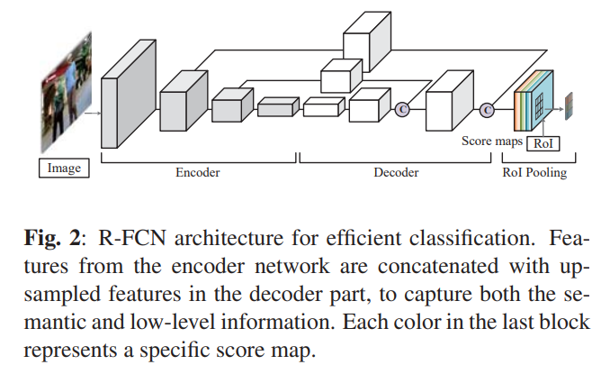
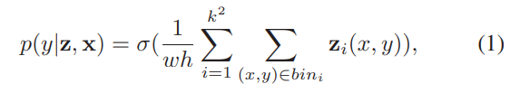
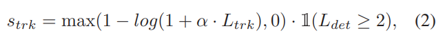
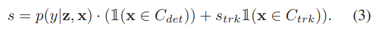
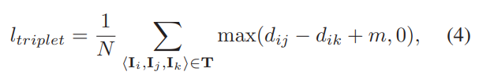
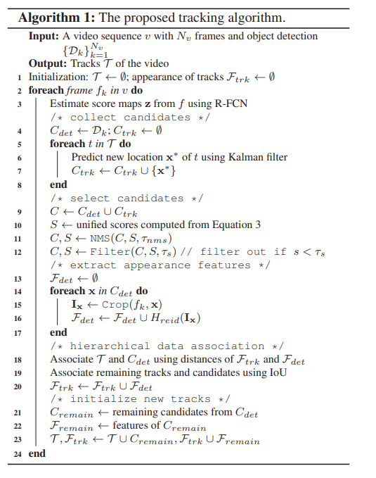
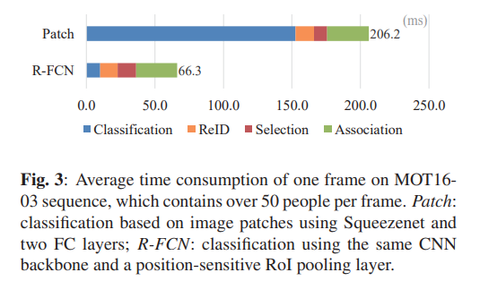

# 多目标跟踪论文（5）MOTDT论文

[Real-time multiple people tracking with deeply learned candidate selection and person re-identification](https://ieeexplore.ieee.org/abstract/document/8486597/)

https://github.com/longcw/MOTDT

## 1. 简介

高置信度的检测结果可以长期防止跟踪漂移，并且轨迹的预测可以处理由遮挡引起的嘈杂检测。

在过去的十年里，多目标跟踪技术从目标检测的进步中受益匪浅。目前比较流行的基于检测的跟踪方法是将检测器应用于每帧图像上，通过跨帧图像的关联检测来生成目标的轨迹。在这样一个跟踪框架[1,2]中，**类别内遮挡和不可靠的检测**都是巨大的挑战。类别内遮挡和对象的类似外观会导致数据关联的模糊性。融合了多个线索，包括运动，形状和对象外观，以缓解此问题[3，4]。 另一方面，检测结果并不总是可靠的。 拥挤场景中的姿势变化和遮挡通常会导致检测失败，例如误报，检测遗漏和绑定不准确。 一些研究提出以批处理方式处理不可靠的检测[2、5、6]。 这些方法通过引入来自未来帧的信息来解决检测噪声。 通过解决全局优化问题，整个视频帧或时间窗口的检测结果被采用并链接到轨迹。 批处理模式的跟踪是非因果的，因此不适合时间紧迫的应用程序。 与这些作品相比，我们仅使用当前和过去的框架来关注在线多人跟踪问题。

为了处理在线模式下不可靠的检测，我们的跟踪框架会从每个帧的检测输出和跟踪输出中最佳选择候选对象（Figure1）。在大多数现有的TBD的方法中，当谈论数据关联时，与现有轨道关联的候选对象仅由检测结果组成。 严等人。 [4]提出将跟踪器和物体检测器视为两个独立的身份，并将其结果作为候选者。 他们根据手工制作的特征（例如颜色直方图，光流和运动特征）选择了候选者。 生成冗余候选者的直觉是检测和跟踪在不同情况下可以相互补充。 一方面，在缺少检测或边界不准确的情况下，可以将来自**跟踪器的可靠预测用于短期关联**。 另一方面，**可靠的检测结果对于防止轨道长期漂移到背景**至关重要。 如何以统一的方式对检测和跟踪的输出进行评分仍是一个悬而未决的问题。

在本文中，我们充分利用深层神经网络的优势，以解决不可靠的检测和类内遮挡。我们的贡献有三个方面。首先，将检测和跟踪结果作为候选结果，并基于深层神经网络选择最优候选结果，处理在线跟踪中的不可靠检测。其次，提出了一种基于空间信息和深度学习人员重新识别特征的层次化数据关联策略。第三，我们在一个广泛使用的人员跟踪基准上演示了我们的跟踪器的实时和最先进的性能。

## 2. RELATED WORK

TBD方法已经成为多目标跟踪的主流策略。Bae 等人[1]根据可信度值，用不同的方法检测相关的轨迹。Sanchez-Matilla 等人[7]利用多个检测器来提高跟踪性能。在所谓的过检测过程中，他们收集了多个探测器的输出。结合多个检测器的结果可以提高跟踪性能，但是对于实时应用来说效率不高。相比之下，我们的跟踪框架只需要一个检测器，并从现有的轨道生成候选。Chu 等人[8]使用二进制分类器和单个目标跟踪器进行在线多目标跟踪。它们共享用于分类的特征映射，但计算复杂度仍然很高。

批处理方法制定跟踪作为一个全局优化问题。这些方法利用来自未来帧的信息来处理噪声检测和减少数据关联中的歧义。Liu 等人[10]提出了一种倒带跟踪策略来生成包含未来信息的后向轨迹，以获得更稳定的关联相似性度量。在[6,9,11]中也探讨了人员重新识别的全局优化问题。我们的框架在在线模式下利用了深度学习的ReID功能，从而在处理类别内遮挡问题时提高了识别能力。

## 3. PROPOSED METHOD

### 3.1. Framework Overview

在这项工作中，我们通过从detection和track的输出中收集候选来扩展传统的TBD。 我们的框架包括两个顺序的任务，即**候选选择和数据关联**。 

我们首先使用统一的评分功能来衡量所有候选。 如第3.2节和第3.3节中所述，将经过区分训练的分类器和经过良好设计的Tracklet置信度融合在一起，以制定评分功能。 随后使用估计分数执行非最大抑制（NMS）。 在获得没有冗余的候选者之后，我们使用**外观表示和空间信息**将现有 tracks与candidates分层关联。 我们的外观表示是从3.4节中所述的ReID中学习到的。 分层数据关联在第3.5节中详细介绍。

### 3.2. Real-Time Object Classification

将detection和tracks的输出结合起来将会导致候选过多。我们的分类器使用基于区域的全卷积神经网络分类器(R-FCN)[12]来分享整个图像的大部分计算。因此，相对于从高度重叠的候选区域进行图像块分类，该方法具有更高的分类效率。这两种方法的时间消耗比较见图3。

我们的有效分类器如图2所示。给定一个图像帧，可以使用encoder-decoder的全卷积神经网络来预测整个图像的得分图。 encoder是实时性能的轻量级卷积backbone，decoder部分引入了上采样功能，以提高输出得分图的空间分辨率，以便以后进行分类。 通过x =（x0，y0，w，h）将每个要分类的候选对象定义为关注区域（RoI），其中（x0，y0）表示左上角，w，h表示目标区域的宽度和高度。 为了提高计算效率，我们期望每个RoI的分类概率由共享分数图直接投票。 一种简单的投票方法是为图像上所有点构造前景概率，然后计算RoI内点的平均概率。 但是，这种简单的策略会丢失对象的空间信息。 有时，即使RoI仅覆盖对象的一部分，仍然可以获得较高的置信度得分。

为了将空间信息显式地编码到得分图中，我们使用了位置敏感的 RoI 池化 [12]并根据$k^2$个位置敏感得分图z估计分类概率。 特别是，我们通过规则网格将RoI分成k×k个bin。 每个箱具有相同的大小$\frac{w}{k}×\frac{h}{k}$，并表示对象的特定空间位置。 我们从$k^2$得分图中提取k×k个bin的响应。 每个分数图仅对应一个bin。 RoI x的最终分类概率公式为：

$\sigma$是sigmoid函数。$z_i$代表第i个得分图。

在训练过程中，我们随机抽取Ground Truth BBox周围的RoI作为正样本，并从背景中获取与RoI相同数量的作为负样本。通过端到端训练网络，decoder输出（即$k^2$得分图）学会了对象特定空间位置的响应。 例如，如果k = 3，则我们有9个得分图分别对应于对象的左上角，顶部中心，右上角，...，右下角。 这样，RoI池化层对空间位置敏感，并且在不使用可学习参数的情况下具有很强的区分对象的能力。 请注意，所提议的神经网络仅针对候选分类进行训练，而不针对边界框回归进行训练。

### 3.3. Tracklet Confidence and Scoring Function

给定一个新帧，我们使用卡尔曼滤波器估计每个现有track的新位置。 采用这些预测来处理由于对象的视觉特性变化和拥挤场景中的遮挡而导致的检测失败。 但是它们不适合长期跟踪。 如果长时间未通过检测更新卡尔曼滤波器，则可能会降低其精度。 Tracklet置信度旨在使用时间信息来衡量滤波器的准确性。

通过连续帧中候选帧的时间关联生成tracklet。我们可以将一个track分割成一组tracklet，因为一个track在它的生存期内可以被中断和恢复。每次track从失去状态恢复时，卡尔曼滤波器将重新初始化。因此，只利用最后一条tracklet的信息来计算track的置信度。在这里，我们将 $L_{det}$ 定义为与 tracklet 相关联的detection结果数，而 $L{trk}$ 定义为上一次detection被关联后的track预测数。Tracklet 置信度定义为:

$\mathbb{1}(\cdot)$是指示函数。我们要求$L_{det}≥2$，在track作为候选之前，利用detection建立一个合理的运动模型。

候选 x 的统一评分函数是通过融合分类概率和tracklet置信度得出的:

在这里，我们用$C_{det}$表示detection的候选者，用$C_{trk}$表示track的候选者，用$s_{trk}$∈[0，1]惩罚不确定track的候选者。 最终，使用非最大抑制基于统一分数来选择数据关联的候选。 我们通过阈值$τ_{nms}$定义了最大的交集（IoU），对于最小分数也有阈值$τ_s$。

### 3.4. Appearance Representation with ReID Features

候选对象之间的相似度函数是数据关联的关键组成部分。我们认为，通过数据驱动方法深入学习的对象外观，在相似度估计任务上优于传统的手工特征。为了学习目标的外观和相似度函数，我们采用深层神经网络从 RGB 图像中提取特征向量，并利用获得的特征之间的距离来计算相似度。

我们利用文献[13]中提出的网络体系结构，在几个大规模的ReID数据集的组合上训练网络。Hreid 网络由来自 GoogLeNet [14]的卷积骨干网和部分对齐的全连接(FC)层的 k 分支组成。关于网络体系结构的更多细节，我们参考[13]。给定一个人的 RGB 图像 i，外观表示形式为 f = Hreid (i)。我们直接使用特征向量之间的欧几里得度量来测量图像 Ii 和 Ij 的距离 dij。在训练过程中，训练数据图像被形成为一组三元组 t = { Ii，Ij，Ik } ，其中 Ii，Ij 是来自同一个人的正对，Ii，Ik 是来自两个不同人的负对。给定 n 个三元组，将要最小化的损失函数公式如下:

其中 m > 0是预定义的边距。为了提高学习特征表示的识别能力，我们忽略了易于处理的三元组，即 dik-dij > m

### 3.5. Hierarchical Data Association

track预测用于在拥挤场景下处理缺失检测问题。受类别内遮挡的影响，这些预测可能与其他物体有关。为了避免将不需要的对象和背景转为外观表示，我们使用不同的特征，层次化地将tracks与不同的候选关联起来。

特别是，我们首先将数据关联应用于detection中的候选者，使用外观表示，有最大距离阈值τd。 然后，基于候选者与tracks之间的IoU，将剩余的候选者与未关联的tracks相关联，给定阈值τiou。 当它们与detection相关联时，我们仅更新tracks的外观表示。 通过从关联detection中保存ReID特征来进行更新。 最后，根据剩余的检测结果初始化新的track。 所提出的在线跟踪算法的详细信息在算法1中进行了说明。通过分层数据关联，我们仅需要在每一帧的检测中为候选提取一次ReID特征即可。 将其与以前有效的评分功能和tracklet置信度相结合，我们的框架可以实时运行。

## 4. Experiments

