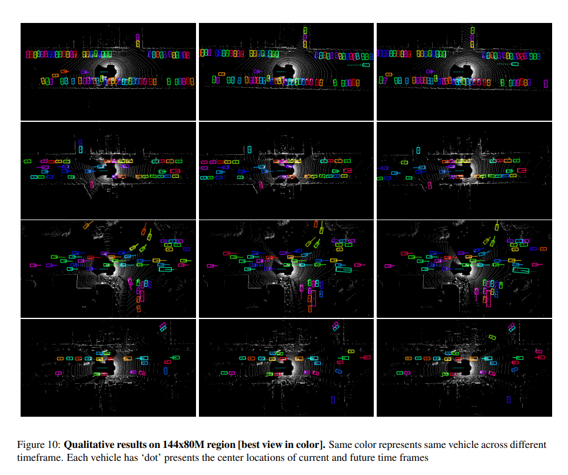

# 多目标跟踪论文（7）FAFNet论文

在本文中，我们提出了一种新颖的深度神经网络，该网络能够联合推理3D检测，给定3D传感器捕获的数据并进行运动预测。 通过共同推理这些任务，我们的整体方法在遮挡和稀疏范围内的数据方面更加强大。 我们的方法在鸟瞰3D世界的表示上跨空间和时间执行3D卷积，这在存储和计算方面都是非常有效的。 我们对在几个北美城市中捕获的超大规模新数据集的实验表明，我们可以大大超越最新技术。 重要的是，通过共享计算，我们可以在短短30毫秒内执行所有任务。

## 1. 介绍

现代自动驾驶方法将问题分为四个步骤：检测，对象跟踪，运动预测和运动计划。 通常使用级联方法，其中将检测器的输出用作跟踪器的输入，并将其输出馈送到运动预测算法，该算法预测交通参与者在接下来的几秒钟内将要移动的位置。 这又被馈送到运动计划器，该运动计划器估计自我车的最终轨迹。 这些模块通常是独立学习的，不确定性通常很少传播。 这可能会导致灾难性的故障，因为下游流程无法从流水线开头出现的错误中恢复。 

相反，在本文中，我们提出了一种端到端全卷积方法，该方法通过利用3D传感器捕获的时空信息来执行同时3D检测，跟踪和运动预测。我们认为这很重要，因为跟踪和预测可以帮助目标检测。例如，当处理阻塞物或远距离物体时，利用跟踪和预测信息可以减少检测FP。随着时间的推移，积累证据也可以减少假阳性。此外，我们的方法非常有效，因为它在所有这些任务之间共享计算。这对于自动驾驶来说非常重要，因为延迟可能会导致死亡。

我们利用3D传感器的优势，并设计了可在3D世界的鸟瞰（BEV）上运行的网络。 这种表示利用了传感器数据的3D性质，由于网络可以利用有关对象典型大小的先验知识，因此学习过程更加轻松。 我们的方法是一种一级检测器，它采用从多个连续时间帧创建的4D张量作为输入，并在空间和时间上执行3D卷积，以提取准确的3D边界框。 我们的模型不仅在当前帧上生成边界框，而且在未来生成多次图框。 我们通过简单的池化操作，合并来自过去和当前预测的证据，从这些预测中解码出tracklets。

我们在从北美驾驶的多辆车辆捕获的超大规模数据集上证明了我们模型的有效性，并表明我们的方法明显优于最新技术。 此外，所有任务只需30毫秒。

## 2. Related Work

**2D Object Detection:** 

在过去的几年中，已经开发了许多利用卷积神经网络来产生准确的2D对象检测的方法，这些检测通常来自单个图像。 这些方法通常根据是否采用专门用于创建对象建议的第一步而分为两类。 现代的两级检测器[24、8、4、11]利用区域提议网络（RPN）来学习潜在物体所在的感兴趣区域（RoI）。 在第二阶段，根据提案RoI的平均池中的要素预测最终的边界框位置。 Mask-RCNN [8]也采用了这种方法，但是使用了RoI对齐功能来弥补RoI池边界和量化效果。 此外，他们增加了一个额外的分割分支，以利用密集的逐像素监视功能，在2D图像检测和实例分割上均达到了最新的结果。 另一方面，一级检测器跳过提议生成步骤，而是学习直接生成对象绑定框的网络。 值得注意的例子是YOLO [23]，SSD [17]和RetinaNet [16]。 一级检测器在计算上非常吸引人，并且通常是实时的，尤其是在最近提出的架构 MobineNet [10]，SqueezeNet [31]（例如图1）的帮助下。 直到Lin等人（2000年）提出，一级检测器明显地超过两个阶段的方法 [16]通过利用facal loss和dense prediction显示了最新的结果。

**3D Object Detection:** 

在自动驾驶等机器人应用中，我们对检测3D空间中的物体感兴趣。 现代2D图像检测器背后的思想可以转移到3D对象检测中。 Chen等。 [2]使用立体图像执行3D检测。 Li [15]使用3D点云数据，并提出在点云的体素化表示上使用3D卷积。 Chen等。 [3]将图像和3D点云与融合网络结合在一起。 他们在BEV中利用了2D卷积，但是，他们使用手工制作的高度特征作为输入。 他们在KITTI上取得了不错的结果[6]，但由于在3D点云和图像上都进行了繁重的特征计算，因此每帧仅以360ms的速度运行。 这非常慢，尤其是如果我们有兴趣扩展这些技术以处理时间数据时，这尤其如此。

**Object Tracking: ** 

在过去的几十年中，许多方法被发展用于目标跟踪。在本节中，我们将简要回顾深度学习在跟踪中的应用。预先训练的 CNNs 通过相关[18]或回归[29，9]被用于提取特征和进行跟踪。 Wang和Yeung [30]使用自动编码器来学习有助于跟踪的良好功能表示。 陶等。 [27]使用siamese网络来执行跟踪。 Nam和Han [21]在推理时对CNN进行了微调，以跟踪同一视频中的对象。

**Motion Forecasting:** 

这是在给定多个过去帧的情况下预测每个对象将来的位置的问题。 Lee等。 [14]提出使用RNN进行长期预测。 Alahi等。 [1]使用LSTM对行人之间的交互进行建模并相应地执行预测。 Ma等。 [19]提出利用博弈论的概念来模拟行人之间的相互作用，同时预测未来的轨迹。 一些工作还集中于动态对象的短期预测[7，22]。 [28]使用变分自动编码器对密集像素的短期轨迹进行了预测。 [26，20]专注于在给定视频的情况下预测下一个未来帧，而无需明确推理每个像素的运动。

**Multi-task Approaches:** 

Feichtenhofer 等人[5]提出从视频中联合进行检测和跟踪。在训练过程中对两个输入图像之间对应物体的位移进行建模，并在推理过程中将其译码为目标管。

与以上工作不同的是，本文提出了一种利用时间信息的单一网络，解决了自主驾驶场景中的三维检测、短时运动预测和跟踪问题。时间信息为我们提供了运动预测的重要线索，整体推理允许我们更好地在整个网络中传播不确定性，提高我们的估计。重要的是，我们的模型是超级有效的，并有33 FPS 的实时速度。

## 3. Joint 3D Detection, Tracking and Motion Forecasting

在这项工作中，我们专注于通过利用产生3D点云的传感器来检测物体。 为了实现这一目标，我们开发了一种单级检测器，该检测器将多个帧作为输入，并对对象的未来轨迹进行检测，跟踪和短期运动预测。 我们的输入表示是一个4D张量，它编码了几个时间帧内3D空间的占用网格。 我们利用空间和时间上的3D卷积来产生快速而准确的预测。 由于点云数据本身在3D空间中稀疏，因此与在3D空间和时间上进行4D卷积相比，我们的方法节省了很多计算量。 我们将我们的方法命名为“速度与激情（FaF）”，因为它能够在短短30毫秒内创建非常准确的估算值。

我们首先在第3.1节描述我们的数据参量化，包括体素化和我们如何合并时态信息。在第3.2节中，我们介绍了我们的模型的体系结构，接着介绍我们用于网络训练的主题(第3.3节)。

### 3.1. Data Parameterization

在本节中，我们首先描述世界的单帧表示。 然后，我们扩展表示以利用多个框架。

**Voxel Representation: **

与输入为密集RGB图像的图像检测相比，点云数据固有地稀疏并且提供有关3D场景的几何信息。 为了获得可以轻松应用卷积的表示形式，我们对3D世界进行量化以形成3D体素网格。 然后，我们为每个体素编码分配一个二进制指示器，以指示该体素是否被占用。 我们说如果体素的3D空间中至少存在一个点，则该体素将被占用。 由于网格是规则网格，因此可以直接使用卷积。 我们在单帧表示中不使用3D卷积，由于网格非常稀疏，即大多数体素未被占用，将浪费大量计算量。 相反，我们执行了2D卷积并将高度尺寸视为通道尺寸。 这使网络能够学习提取高度维度中的信息。 这种对比方法例如MV3D [3]，该方法在x-y平面上执行量化并通过计算手工制作的高度统计量生成z维的表示。 请注意，如果网格的分辨率很高，那么我们的方法就相当于在不损失任何信息的情况下对每个点进行卷积。 我们请读者参考图2，以了解如何根据3D点云数据构造3D张量。

**Adding Temporal Information: **

为了进行运动预测，考虑时间信息是至关重要的。为了实现这个目标，我们从过去的 n 帧图像中取出所有的3 d 点，然后进行坐标变换，将其表示为当前车辆的坐标系。这对于解除安装传感器的车辆的自我运动很重要。在执行这个转换之后，我们为每个帧计算体素表示。现在每个帧都被表示为一个三维张量，我们可以沿着一个新的时间维添加多个帧来创建一个四维张量。这不仅提供了更多的三维点作为一个整体，而且还提供了线索，关于车辆的方向和速度，使我们能够做运动预测。如图3所示，为了可视化的目的，我们覆盖了多个帧，静态物体对齐得很好，而动态物体有阴影，代表它们的运动。

### 3.2. Model Formulation

我们的单级检测器采用4D输入张量，并在不使用区域建议的情况下，在不同时间点直接回归到对象边界框。 我们研究了两种不同的方法来利用4D张量上的时间维度：早期融合和晚期融合。 它们代表了准确性和效率之间的权衡，并且在汇总时间维度的级别上有所不同。

**Early Fusion:** 我们的第一种方法在第一层融合时间信息。因此，它的运行速度与使用单帧检测器一样快。然而，它可能缺乏捕获复杂时间特征的能力，因为这相当于从所有帧生成单个点云，但是对不同时间戳的贡献进行不同的权重。特别是，如图4所示，给定一个四维输入张量，我们首先在时间维数使用核大小 为n的一维卷积，以减少从 n 到1的时间维数。我们在所有特征映射之间共享权重，即，也称为group卷积。然后根据 VGG16执行卷积和最大池[25]，每层特征地的数量减少一半。注意，我们去掉了 VGG16中的最后一个卷积组，结果只有10个卷积层。

**Late Fusion:** 在这种情况下，我们逐渐合并时间信息。这使得模型能够捕捉高水平的运动特征。我们使用与早期融合模型相同数量的卷积层和特征映射，但对两层进行核大小为3 × 3 × 3的三维卷积，而不在时间维上进行填充，使时间维从 n 降低到1，然后对其他层进行核大小为3 × 3的二维空间卷积。我们请读者参阅图4，以便了解我们的结构。

然后我们添加两个分支的卷积层，如图5所示。第一种进行二分类，以预测成为交通工具的概率。第二个预测当前帧的BBox以及未来的 n-1帧。运动预测是可能的，因为我们的方法利用多帧作为输入，从而可以学习估计有用的特征，如速度和加速度。

在 SSD [17]之后，我们为每个特征图位置使用多个预定义的框。当我们利用一个 BEV 表示作为度量，我们的网络可以利用物体的物理尺寸的先验。这里我们使用的箱子在现实世界中相当于5米，长宽比分别为1:1,1:2,2:1,1:6,6:1和8米，长宽比分别为1:1。每个特征图位置共有6个预定义的框$a^{k}_{i,j}$，其中 i = 1，... ，I，j = 1，... ，J 是特征图中的位置，k = 1，... ，k 是预定义的框(即大小和高宽比)。使用多个预定义的方框，减少了回归目标的方差，使网络易于训练。请注意，我们没有使用预定义的朝向角。此外，为了避免180度模糊性，我们同时使用了 sin 和 cos 值。

特别地，对每个预定义的框$a^{k}_{i,j}$，我们的网络预测相应的归一化位置偏移量$\hat{l_x}, \hat{l_y}$，log正则化的尺寸$\hat{s_w}, \hat{s_h}$，航向参数$\hat{a}_{sin}, \hat{a}_{cos}$

**Decoding Tracklets:** 在每个时间戳上，我们的模型都会为n个时间戳输出检测边界框。 相反，每个时间戳将具有当前检测以及过去的n-1个预测。 因此，我们可以汇总过去的信息以生成准确的tracklets，而无需解决任何基于轨迹的优化问题。 请注意，如果检测和运动预测是完美的，我们可以解码完美的tracklets。 在实践中，我们将平均值用作聚合函数。 当当前和过去的预测检测结果之间存在重叠时，它们将被视为同一对象，并且其边界框将被简单地平均。 从直觉上讲，聚集过程特别有用，特别是当我们有很强的过去预测但没有当前证据时，例如，如果对象当前被遮挡或检测假阴性。 这使我们可以跟踪多个帧上的遮挡。 另一方面，当我们有很强的当前证据但没有过去的预测时，那么就有证据表明存在一个新的目标。

### 3.3. Loss Function and Training

我们最小化分类和回归的联合损失来训练网络。就回归而言，我们包含了当前帧和未来n帧预测：

t是当前帧，w是模型参数。

在所有位置和预定义框上使用二分类交叉熵损失：

$i, j, k$表示特征图位置和预定义的框。$q_{i,j,k}$是class label（如$q_{i,j,k}=1$表示车辆，$0$表示背景），$p_{i,j,k}$表示预测测量的概率。

为了检测和未来的预测定义回归损失，首先找到与它们关联的gt（ground truth）。我们通过将每个预定义的框与所有gt相匹配来定义它们的对应关系。特别地，对于每个预测的盒子，我们首先找到在IoU(intersection over union)上有最大重叠的gt。如果IoU大于固定的阈值(实际中为0.4)，把这个gt作为$\bar{a}_{i, j}^{k}$，同时将对应标签$q_{i,j,k}$置为1。根据SSD [17]，如果存在未分配给任何预定义框的gt，我们将忽略固定阈值，将其分配给其最高重叠的预定义框。 请注意，可以将多个预定义的框关联到同一gt，并且某些预定义的框可能没有任何对应的gt，这意味着它们的$q_{i,j,k}=0$ 。

则回归目标定义为：

在所有回归目标上使用带权重的smooth L1作为损失：

**Hard Data Mining:** 由于正负样本不平衡，在训练过程中需要使用困难样本挖掘。那些有相应gt的预定义框作为正样本$q_{i,j,k}=1$.对于负样本，我们根据分类分支的预测得分$p_{i,j,k}$对所有候选样本进行排序，并在实际应用中以3的比例取得最高的负样本。

## 4. Experimental Evaluation

没有公开评估3D检测，跟踪和运动预测的数据集。 因此，我们收集了一个非常大规模的数据集以对我们的方法进行基准测试。 它比KITTI [6]等数据集大2个数量级。

**Dataset:** 

我们的数据集是由一个安装在车顶的激光雷达在北美几个城市的车辆上收集的。它由从2762个不同的场景中收集的546,658帧图像组成。每个场景由一个连续的序列组成。我们的验证集由从100个场景中收集的5,000个样本组成，也就是说，从每个序列中收集50个连续的帧。为了展示强大的泛化能力，收集train和val的地理区域之间没有重叠。我们的标签可能包含没有3d 点的车辆，因为标签可以访问完整的序列，以便提供准确的注释。我们的标签包含每辆车的3 d 旋转包围盒以及track id。

**Training Setup:** 

在训练时，我们使用大小为144×80米的空间X-Y区域，其中每个网格单元为0.2×0.2米。 在高度尺寸上，我们以0.2米的间隔在-2到3.5米的范围内，得到29个bin。 对于时间信息，我们采用过去5个时间戳中的所有3D点。 因此，我们的输入是一个由时间，高度，X和Y组成的4维张量。

对于早期融合模型和晚期融合模型，我们使用Adam优化器[13]从零开始训练，learning rate为1e-4。 batch size为12，在4 Titan XP GPU服务器上进行训练。我们对模型进行100K迭代训练，学习率分别在60K和80K迭代时下降一半。

**Detection Results: **

我们将我们的模型与包括 SSD [17]、 MobileNet [10]和 SqueezeNet [12]在内的最先进的实时检测器进行了比较。注意，这些检测器都是为了从图像中进行2D检测而开发的。为了使它们具有竞争力，我们还在它们的系统中建立了预定义的盒子，这进一步简化了这些探测器的任务。推理时兴趣区域以ego-car为中心，为144 × 80M。我们对所有模型保持相同的体素化，使用至少三个3D点针对gt边界框评估检测结果。少于三个点的车辆被认为是不关心区域。如果对任何gt边界框的Iou大于0.7则认为检测正确。请注意，对于典型尺寸为3.5 × 6米的车辆来说，0.7 IoU 意味着我们最多错过宽度为0.35米、长度为0.6米的车辆。图6显示了所有方法的精度召回曲线，其中我们的模型能够实现更高的召回率，这对于自动驾驶至关重要。 此外，表1显示了使用不同IoU阈值的mAP。 我们可以看到我们的方法能够胜过所有其他方法。 特别是在IoU 0.7的情况下，我们的mAP比Mo bileNet [10]高出4.7％，同时快两倍，比SSD [17]高出5.2％，有相近的运行时间。

我们还将性能报告为最小3D点数的函数，用于在测试期间过滤gt边界框。 请注意，稀疏度高是由于遮挡或长途车辆。 如图7所示，我们的方法在所有层面上都可以胜过其他方法。 我们以至少0分进行评估，以显示利用时间信息的重要性。

我们也有兴趣了解模型是如何根据车辆距离作为一个函数进行计算的。 为了实现这一目标，我们将预测范围扩展到了100米之遥。 图8显示了在不同距离范围内的车辆上IoU为0.7的mAP。 我们可以看到，所有方法在附近的车辆上都运行良好，而从长距离来看，我们的方法明显更好。 请注意，由于该方法缺少3D点，因此所有方法在100米处的效果均不理想。

**Ablation Study:**

我们在框架内进行了消融实验，以显示每个组件的重要性。 我们固定了所有实验的训练设置。 如标签所示。 2，在早期融合中使用时间信息在0.7 Iou时可以使mAP改善3.7％。后期融合使用了与前期融合相同的信息，它可以模拟更复杂的时间特征，所以可以得到1.4% 的额外改进。此外，增加预测损失在当前帧上也能得到类似的检测结果，但是它使我们能够解码跟踪信号，并提供证据来输出更平滑的检测结果，从而得到最佳的性能，即在 IoU 0.7的 mAP 上比单帧检测器提高6% 。

**Tracking:**

我们的模型能够直接输出带有轨道ID的检测结果。 我们评估原始跟踪输出，而不在顶部添加任何复杂的跟踪管道。 表3在检测结果的基础上，显示了模型输出与匈牙利方法之间的比较。 我们遵循KITTI协议[6]，并在所有100个验证序列中计算MOTA，MOTP，大多数跟踪（MT）和大多数丢失（ML）。 评估脚本使用IoU 0.5作为关联以及0.9分数作为阈值，我们可以看到我们的最终输出在MOTA中达到了80.9％，比匈牙利提高了7.8％，在MT上提高了20％，在ML上降低了10％，同时仍具有相似的MOTP。

**Motion Forecasting:**

我们通过计算车辆中心位置的平均L1和L2距离来评估模型的预测能力。 如图9所示，我们能够预测L2距离小于0.33米的未来10帧。 请注意，由于问题的性质，我们只能评估真实的积极因素，在我们的案例中，这有92.5％的相应召回率。

**Qualitative Results:**

图10显示了我们在144×80米区域上的结果。 我们提供了4个序列，其中前3行显示了我们的模型在复杂场景下的性能很好，从而在小型车辆和大型卡车上都提供了精确的旋转边界框。 请注意，我们的模型还为快速行驶的车辆和静态车辆（所有未来的中心位置都重叠在当前位置）提供了准确的运动预测。 最后一行显示了一个故障案例，其中我们的检测器在中右蓝色车辆上发生了故障。 这是由于3D点的稀疏性。

## 3. Joint 3D Detection, Tracking and Motion Forecasting

3D点云传感器，一阶段检测器，多帧图像输入。3D空间上多个时间帧构成4D表示作为输入。

### 3.1

**Voxel Representation:** 3D世界量化为3D体素网格，使用2D卷积并将height作为通道维度。

**Adding Temporal Information:** 运动预测，考虑过去n帧的所有3D点云，并进行转换到当前车辆的坐标系表示。每帧计算体素表示，每帧是一个3D张量，添加一个时间维度，多帧构成一个4D张量。更多的3D点云作为整体，而且提供车辆方向和速度。

### 3.2. Model Formulation

在4D张量上使用时间维度的两种方法：早融合和晚融合。准确率和效率的平衡。

**Early Fusion:** 最开始的layer融合时间维度，快速但不能捕获复杂的时间维度特征。不同时间帧不同权重。1D卷积，将时间维度从n降到1。

**Late Fusion:** 逐步融合时间信息，捕获高层运动特征。使用同样数量的卷积层和特征图，但是在2个layer上使用3 × 3 × 3大小的3D卷积，没有时间维度的padding，将时间维度从n降到1。随后对其他层执行3 × 3的2D卷积。

将两个分支相加，第一个用来进行二分类，表示是否为一个车辆；第二个预测当前帧的边框和未来n-1帧的。

每个特征图位置，使用多个预定义的框。使用物体实际尺寸的先验知识。box对应真实世界的5有着1 : 1, 1 : 2, 2 : 1, 1 : 6, 6 : 1的比例，8米有着1 : 1的比例。每个特征图位置预定义6个box，$a^{k}_{i,j}$。

**Decoding Tracklets:** 每帧有当前的检测和过去n-1帧的预测，使用平均作为融合函数。当前帧的检测和过去预测存在重叠的话，被认为是同一物体，且边界框将通过平均得到。这有利于两种情况，一是存在过去的预测，但是没有当前帧信息，则说明物体被遮挡；而是由当前帧信息，但是没有过去预测，则说明是新物体。

### 3.3. Loss Function and Training

我们最小化分类和回归的联合损失来训练网络。就回归而言，我们包含了当前帧和未来n帧预测：

t是当前帧，w是模型参数。

在所有位置和预定义框上使用二分类交叉熵损失：

$i, j, k$表示特征图位置和预定义框的索引。$q_{i,j,k}$是class label（如$q_{i,j,k}=1$表示车辆，$0$表示背景），$p_{i,j,k}$表示预测测量的概率。

为检测和未来的预测定义回归损失，首先找到与它们关联的gt（ground truth）。我们通过将每个预定义的框与所有gt相匹配来定义它们的对应关系。特别地，对于每个预测的盒子，我们首先找到在IoU(intersection over union)上有最大重叠的gt。如果IoU大于固定的阈值(实际中为0.4)，把这个gt作为$\bar{a}_{i, j}^{k}$，同时将对应标签$q_{i,j,k}$置为1。根据SSD [17]，如果存在未分配给任何预定义框的gt，我们将忽略固定阈值，将其分配给其最高重叠的预定义框。 请注意，可以将多个预定义的框关联到同一gt，并且某些预定义的框可能没有任何对应的gt，这意味着它们的$q_{i,j,k}=0$ 。

则回归目标定义为：

在所有回归目标上使用带权重的smooth L1作为损失：

**Hard Data Mining:** 由于正负样本不平衡，在训练过程中需要使用困难样本挖掘。那些有相应gt的预定义框作为正样本$q_{i,j,k}=1$.对于负样本，我们根据分类分支的预测得分$p_{i,j,k}$对所有候选样本进行排序，并在实际应用中以3的比例取得最高的负样本。