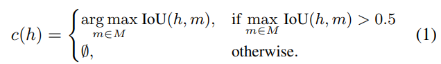
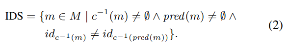
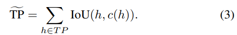
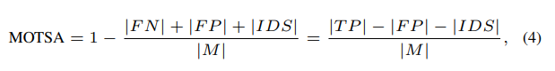
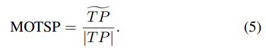
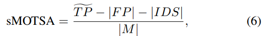
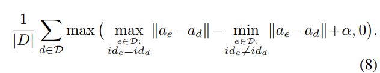

# 多目标跟踪论文（8）MOTS论文

[Mots: Multi-object tracking and segmentation](http://openaccess.thecvf.com/content_CVPR_2019/html/Voigtlaender_MOTS_Multi-Object_Tracking_and_Segmentation_CVPR_2019_paper.html)

https://github.com/VisualComputingInstitute/TrackR-CNN

文在MaskRCNN的框架下将多跟踪任务扩展到多对象跟踪和分割同时处理的新框架（MOTS），用分割结果以像素级的mask-iou指标辅助多目标跟踪中Association过程。由于缺少MOT和Seg联合的数据，作者自己构建两个基于KITTI 和 MOTChallenge 数据集 建立了两个分割和MOT相结合的数据集，MOTS在自己的数据集上取得了比较好的效果，实时性只有2fps。

## 1. 简介

将**检测，分割，跟踪三个任务融合在一起考虑**。提出将已知的多目标跟踪任务扩展到实例分割跟踪。

此前还没有用于此任务的数据集，多是用边界框跟踪的。而MOTS需要联合时间和模板才能施行，提出TrackR-CNN作为MOTS各任务的基线。 TrackR-CNN通过3D卷积扩展了Mask R-CNN [14]，以合并时间信息，并通过一个关联头来关联时间信息，该关联头用于随时间链接对象。

贡献：

1. 数据集：目前的多目标追踪数据集只提供bbox标注，作者希望引入mask做像素级别上的追踪来达到性能上的突破，通过CNN+人工校准从bbox生成了mask，主要包括：
   - KITTI训练集的21个video，目标对象是车辆和行人，12个train9个val；
   - MOT17训练集的其中4个video，目标对象是行人，leaving-one-out方式；
   - 共计10870个视频帧，977个不同的个体，65213个像素级mask，数据量较为充分
2. metrics：由于加入了分割方法，重新定义了评价指标，后面将在实验中详细说明
3. 提出了Track R-CNN 分割和MOT相统一的框架

## 2. Related Work

**Multi-Object Tracking Datasets.:**

- KITTI：街道场景
- MOTChallenge：不同角度的行人
- UA-DETRAC：街道场景，但是只包含车辆标注信息
- PathTrack：不同场景，行人轨迹标注信息

**Video Object Segmentation Datasets:**

**Video Instance Segmentation Datasets:**

**Methods:**

Seguin等。 [51]使用超级像素级别的聚类从给定的边界框轨迹中导出实例分割，但是它们不能解决检测或轨迹跟踪问题。 米兰等。 [38]考虑利用超像素信息和给定的物体检测在CRF中共同进行跟踪和分段。 与这两种方法相比，我们提出的基准是在像素而不是超像素级别上运行的。 CAMOT [42]使用立体信息对KITTI数据集上的通用对象执行基于掩模的跟踪，这限制了其对远距离对象的准确性。 CDTS [24]执行无监督的VOS，即不使用第一帧信息。 它仅考虑具有很少物体外观和消失感的短视频剪辑。 但是，在MOTS中，许多对象经常进入或离开拥挤的场景。 尽管上述方法能够使用分段掩码生成跟踪输出，但由于不存在带有MOTS批注的数据集，因此无法全面评估其性能。

Lu 等人[33]通过聚合每帧的位置和外观特征，并使用 LSTMs 跨时间组合这些特征来处理跟踪。Sadeghian 等人[50]还结合使用 LSTMs 组合的速度和交互信息的外观特征。在这两种情况下，组合特征被输入到传统的匈牙利匹配程序中。

对于我们的基准模型，我们使用时间信息直接丰富检测结果，并与检测器一起学习关联特征，而不仅仅是给定检测结果的“后处理”

**Semi-Automatic Annotation:**

我们的注释过程可以自动分割许多对象，使注释者可以专注于提升困难情况下的结果。 虽然这有点类似于主动学习设置[11，56]，但我们决定要用人工注释者来注释哪些对象，以确保所有注释都达到长期基准数据集所需的质量（参见 [32]）。

## 3. Datasets

**Semi-automatic Annotation Procedure.**

## 4. Evaluation Measures

## 5. Method

**Integrating temporal context.**

**Association Head.**

**Mask Propagation.**

**Tracking.**

