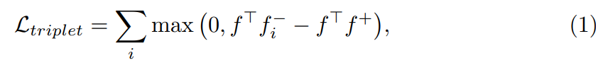

# 多目标跟踪论文（9）JDE论文

[Towards real-time multi-object tracking](https://link.springer.com/content/pdf/10.1007/978-3-030-58621-8_7.pdf)

https://github.com/Zhongdao/Towards-Realtime-MOT

https://blog.csdn.net/qq_41214679/article/details/110576051

现有多目标跟踪(MOT)大多基于TBD(tracking-by-detection)思想实现，由两个部分：1）物体检测模块；2）特征提取模块用于数据关联。但是两者都是各自独立，运行时间只是两者简单的加和，而没有考虑两者是否可以共享计算的结构。

本文提出一个可以将目标检测和外观嵌入在一个模型中共享学习的网络，将外观嵌入模型融合进single-shot检测器中，所以模型可以同时输出检测结果和响应的外观嵌入（外观特征）。同时提出一个简单快速的关联方法，同联合模型一起工作。在检测和关联两个阶段都显著降低计算量。

## 1. 简介

提出single-shot MOT网络JDE，也是一种检测与跟踪同时实现的方式。

作者定义了三种MOT的方式：

- SED：将检测和嵌入模型分别执行。这种方式的系统由两个部分组成：1）物体检测模块，定位目标；2）数据关联步骤，将检测到的目标同已存在的轨迹关联。所以由耗时部分：检测器和嵌入（ReID）模型。很难做到real-time。
- 两阶段任务：原理同Faster RCNN等。1）RPN提取RoI区域，输出检测框；2）利用Fast RCNN，通过度量学习将分类监督转化为嵌入模型。由于该方法采用两阶段设计，速度仍然有限，通常小于10fps。此外，第二阶段的运行时间也随着目标数目的增加而增加，和SDE类似。
- 本文提出：在single-shot网络中联合学习检测器和嵌入模型(JDE)。换句话说，JDE 使用单一的网络同时输出检测结果和相应检测框的外观嵌入。

研究问题：

- 训练数据：6个公开的数据集，都带有边界框标签，部分有身份标签；
- 基础网络：特征金字塔FPN网络作为基础网络；
- 训练过程：将训练过程看作多任务问题，anchor分类，边框回归，嵌入学习；引入动态权重来平衡任务的重要性；简单和快速的关联算法；
- 评估准则：AP衡量detector；TAR和FAR衡量嵌入；CLEAR衡量MOT；

## 2 Related Work

近期MOT研究工作分为：

- 将关联问题建模为某种形式的图优化问题；
- 将关联步骤通过端到端的网络实行；
- 寻找新颖的跟踪规范；

## 3 Joint Learning of Detection and Embedding

### 3.1 Problem Settings

训练集$\bold{\{I,B,y\}^N_{i=1}}$，$\bold{I} \in R^{c×h×w}$代表图像帧，$\bold{B} \in R^{k×4}$代表当前帧目标$k$的回归框标签，$y \in Z^k$代表部分身份标签。JDE旨在输出预测边界框$\bold{\hat{B}} \in R^{\hat{k}×4}$和外观嵌入矩阵$\bold{\hat{F}} \in R^{\hat{k}×D}$，$\hat{k}$是预测检测到的目标个数，$D$是嵌入的维度。

- $\bold{B}^*$尽可能接近$\bold{B}$
- 给定距离度量$d(\cdot)$，$∀(k_t,k_{t+\Delta{t}},k'_{t+\Delta{t}})$，$\bold{y}_{k_t}=\bold{y}_{k_{t+\Delta{t}}}$和$\bold{y}_{k_t} \neq \bold{y}_{k'_{t+\Delta{t}}}$，有$d(f_{k_t},f_{k_{t+\Delta{t}}}) <  d(f_{k_t},f_{k'_{t+\Delta{t}}})$，$f_{k_t}$是$\bold{\hat{F}}_t$的行向量，$f_{k_{t+\Delta{t}}}, f_{k'_{t+\Delta{t}}}$是$\bold{\hat{F}}_{t+\Delta{t}}$的行向量，分别时刻$t$和$t+\Delta{t}$帧的目标$k$和$k'$的嵌入。这个也就是表示，同一目标在不同帧$k_t, k_{t+\Delta{t}}$的距离应小于不同目标在不同帧$k_t, k'_{t+\Delta{t}}$的距离。其中距离使用欧氏距离。

### 3.2 Architecture Overview

- FPN多尺度检测，有利于检测不同大小的行人。经过FPN提取多尺度特征，分别是$\frac{1}{32}, \frac{1}{16}, \frac{1}{8}$三个尺度的下采样率。
- 添加预测头部，包含多个卷积层，输出预测，大小为$(6A + D) × H × W$，$A$是该尺度的anchor模板个数，$D$是嵌入维度，该预测输出分为三个部分：
  - box分类：$2A × H × W$
  - box回归：$ 4A × H × W$
  - 嵌入：$D × H × W$

以下从这三个问题讨论：

### 3.3 Learning to Detect

检测分支就是标准的RPN网络，但是有两个改进：

- anchor的数量，尺度，比例：根据先验知识所有比例为$1:3$；anchor数量为12，每个尺度有$A=4$；尺度(宽)范围为$11 ≈ 8 × 2^{1/2}$到$512 = 8 × 2^{12/2}$；
- IOU > 0.5的作为前景，IOU < 0.4的作为背景。

检测任务有两个损失：分类损失$\mathcal{L}_{\alpha}$和回归损失$\mathcal{L}_{\beta}$。

### 3.4 Learning Appearance Embeddings

度量学习，让相同身份的实例彼此靠近，而不同身份的实例彼此相距较远。

三元组损失的定义：

$f^⊤$是一个mini-batch中被选为锚的实例，$f^+$表示和$f^⊤$重叠的正样本，$f^-$是负样本。

但是这个损失带来两个挑战：

- 由于整个数据集规模大，作者通过在mini-batch中定义来解决该问题，挖掘mini-batch中的负样本和难分样本。
- 不稳定，难以收敛，定义另一个损失函数

和交叉熵函数比较相似：

$f^⊤$是一个mini-batch中被选为锚的实例，在这里，我们把正类(锚实例所属的类)的权值表示为$g^+$，把负类的权值表示为$g^-_i$。

具体的，如果一个锚框标记为前景，就会从密集嵌入图中提取他相应的嵌入，提取的嵌入喂入一个共享参数的全连接层，生成类级得分，对得分使用交叉熵损失。通过这种方式，来自多个尺度的嵌入共享同一空间，跨尺度的关联是可行的。如果嵌入的标签$y$为$-1$即没有身份标签，则直接忽略这个嵌入的损失。

作者将三种损失进行比对，最终选择交叉熵损失。

### 3.5 Automatic Loss Balancing

JDE 的每个预测头都可以看作是多任务问题，联合目标可以看作每一个尺度和部分损失的权重线性加和：

$M$是预测头的数量，$w^i_j, i=1,2,...,M,j=\alpha,\beta,\gamma$代表损失权重。损失权重通过如下定义：

1. $w^i_\alpha = w^i_\beta$
2. $w^1_{\alpha/\beta/\gamma} =...= w^M_{\alpha/\beta/\gamma}$
3. 有上述两个条件，则只剩下两个独立权重参数，搜索找到最好性能的权重。

但是上述约束导致搜索空间减少，也会导致给损失权重添加太强的限制，导致得到的损失结果原理最优结果。

所以进行如下改进：采用与任务无关的不确定性概念，利用[16]中提出的损失权重自动学习方案。

$s^i_j$表示每个损失的任务独立不确定性，定义为可学习的参数。

### 3.6 Online Association

一段tracklet用一个外观状态$e_i$和运动状态$m_i=(x,y,\gamma,h,\dot{x},\dot{y},\dot{\gamma},\dot{h})$所描述，$x,y$代表边界框的中心，$h$代表边界框高，$\gamma$代表比例，$\dot{x}$代表$x$方向的速度。tracklet的外观$e_i$被第一次观察的外观嵌入$f^0_i$初始化。维持一个tracklet pool，包含observations关联到的所有tracklet。

新一帧进来，计算所有observations和tracklet pool中两两的运动亲和矩阵$A_m$和外观亲和矩阵$A_e$，外观距离使用cosin距离，运动距离使用马氏距离。利用cost matrix $C=\lambda A_e + (1-\lambda)A_m$，进行匈牙利匹配，所有匹配的运动状态$m_i$使用卡尔曼滤波更新，外观状态$e_i$则使用下式更新：

$f^t_i$是当前匹配observation的外观嵌入，$\alpha=0.9$是动量系数。

剩下未匹配的observation被用来初始化新的tracklet，前提是该observation连续出现两帧。如果tracklet在最近的30帧内没有更新，则删除该tracklet。

该方法比SORT中的级联匹配更简单，每帧只应用一次匹配，且利用缓冲池。

