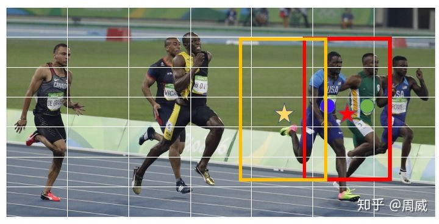
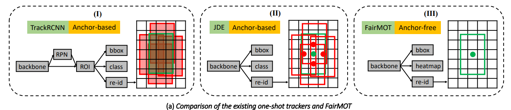
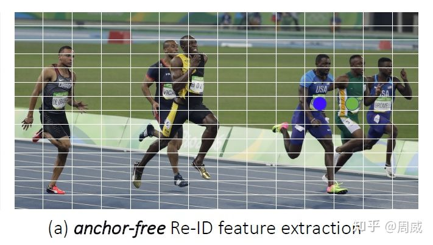
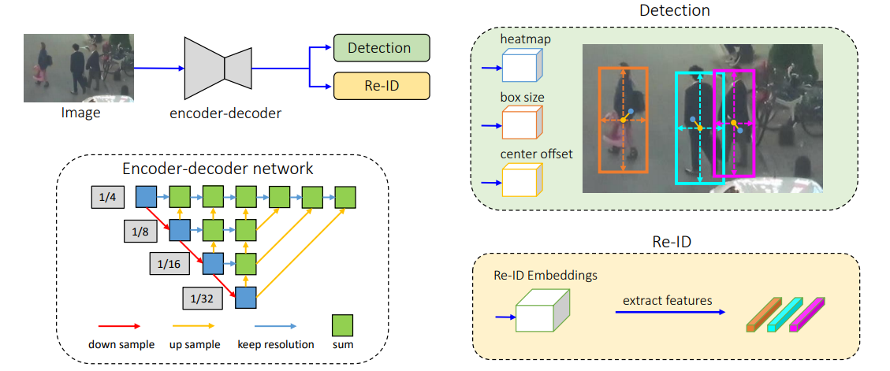
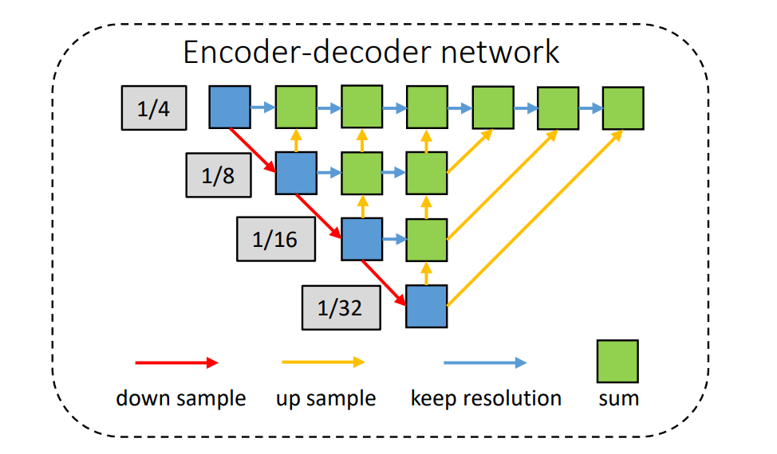
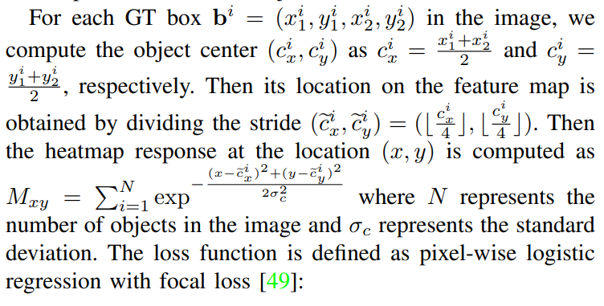
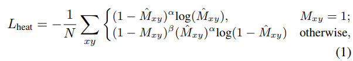
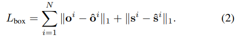
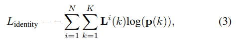
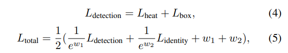

# 多目标跟踪论文（12）FairMOT论文

[【MOT】对FairMOT深度解析 - 知乎 (zhihu.com)](https://zhuanlan.zhihu.com/p/259356109)

[FairMOT论文详解](https://blog.csdn.net/weixin_42398658/article/details/110873083)

现存one-shot目标追踪算法的问题所在，提出了三个观点：

1. anchors对于Re-ID并不友好，应该采用anchor-free算法。
2. 多层特征的融合。
3. 对于one-shot方法，Re-ID的特征向量采用低维度更好。

在MOT15、MOT16、MOT17、MOT20等数据集上以30fps的帧数达到了目前的SOTA水平。

## 1. 简介

现存的SOTA方法当中大部分都是采用two-step方法两步走：

1. 通过目标检测算法检测到目标。
2. 再经过Re-ID模型进行匹配并根据特征上定义的特定度量将其链接到一个现有的轨迹。

随着近年来目标检测算法与Re-ID的发展，two-step方法在目标跟踪上也有明显的性能提升，但是two-step方法不会共享检测算法与Re-ID的特征图，所以其速度很慢，很难在视频速率下进行推理。
随着two-step方法的成熟，更多的研究人员开始研究同时检测目标和学习Re-ID特征的one-shot算法，当特征图在目标检测与Re-ID之间共享之后，可以大大的减少推理时间，但在精度上就会比two-step方法低很多。所以作者针对one-shot方法进行分析，提出了上述三个方面的因素。

### 1.1 Anchors 带来的问题

1. Anchors导致网络注重检测，而不是注重re-ID，使得获得的re-ID特征不好，这就会影响后面关联任务
2. 同一Anchor可能对应多个物体，这类方法通常从proposal 利用ROI-Pool 或 ROI-Align提取特征，可能采样到其他干扰物体，影响提取到的特征
3. 许多邻近的Anchors对应不同image patch，但是都属于同一个物体，对训练过程造成歧义

### 1.2 Feature带来的问题

one-shot跟踪任务，大多features在detection和re-ID任务共享，但是实际上它们需要来自不同层的feature。detection需要深层和抽象的特征取估计物体类别和位置，而re-ID需要低层特征去区分来自同类事物的不同实例。

### 1.3 Feature 维度带来的问题

先前的re-ID任务都是利用高维特征，实现了re-ID领域很好的成绩。但是one-shot MOT中，低维特征则更好：

1. 使用高维re-ID特征会对detection任务带来影响
2. 数据量少时，低维特征减少过拟合风险
3. 低维特征可以提高推理速度，实验得来

### 1.4 FairMOT

网络结构比较

Anchor-Based方法不适合one-shot MOT，便使用了**Anchor-Free目标检测范式**来代替，最常见的Anchor-Free目标检测范式由CornerNet、CenterNet等等

其实anchor-free的方法就是一种基于关键点检测的方法。目前最常见的就是检测物体的**中心点**。本文中正是采用了基于中心点检测的anchor-free方法，该方法可以有效解决上述讨论的问题。借用原图中的说明（anchor-free方法基本上没有什么网络模糊性，中心点没什么大的偏移问题）

网络结构如下：

整体网络流程为，输入图像，经过一个encoder-decoder提取特征，得到高分辨率的特征图（stride=4），然后紧接着同时执行两个任务，一个对应detection，一个Re-ID。

## 2. 相关工作

### 2.1 Non-deep Learning MOT Methods

很多在线跟踪算法几种关注数据关联部分，

Sort 使用卡尔曼滤波预测物体未来位置，计算它们和检测到的物体的重叠，采用匈牙利算法来进行匹配跟踪。

IOU-Tracker直接通过相邻帧物体检测框的重叠来进行跟踪。

都能达到很快的速度，且由于简单，所以使用广泛。

但是由于缺乏re-ID特征，在困难和拥挤场景下不能很好地工作。

### 2.2 Deep Learning MOT Methods

two-shot：

DeepSort等将detection和re-ID分别作为两个任务，首先使用检测网络检测物体框，然后将物体框送入嵌入网络提取re-ID特征，然后根据re-ID特征计算物体之间的距离来进行数据关联，从而实现跟踪。

这种方法很难满足视频的实时要求。

one-shot：

Track-RCNN，JDE在一些基础网络上添加detection和re-ID分支，同时进行检测和提取re-ID特征两个任务，但是精度上面会比tow-shot方法低。

## 3 FairMOT

### 3.1 Backbone Network

作者选择了一个叫做**DLA( Deep Layer Aggregation)**的网络进行特征提取，这个网络的最大特点就是**多层融合**（恰好符合Re-ID信息需要多层信息融合的特点）。

当然了，和分类任务或者基于anchor的检测任务不同（这些任务往往不需要多高的输出分辨率），基于关键点的检测（anchor-free）往往需要**分辨率更高**（一般为stride=4）的输出特征图，这样**不会产生较大的中心点偏移**了。所以作者采用了一种形似encoder-decoder的DLA网络作为特征提取，如下图所示。

**Detection**任务输出三个分支，每个分支都被称为一个**head分支**。每个head除了最后输出通道维度的不同，其组成都类似，论文中提到

> Each head is implemented by applying a 3 × 3 convolution (with 256 channels) to the output features of DLA-34, followed by a 1×1 convolutional layer which generates the final targets.

- （1）heatmap，形状为（1，H，W）,这里好像和其他anchor-free方法输出的featmap不同，这里**只有一个通道**，而其他方法有**类别数个通达（80居多）**。
- （2）center offset，形状为（2，H，W），和centerNet中的offset一样，弥补由于**下采样产生的轻微的offset**
- （3）bbox size，形状为（2，H，W），仅仅知道中心点位置还不行，还需要用这个特征图来计算中心点对应检测框的**宽高**

**Re-ID**任务：Re-ID Embedding，对每一个物体位置，在backbone后面接128个kernel，提取特征嵌入，形状为（128，H，W），也就是每个物体用一个**128维**向量表示。

对输入image尺寸 $H_{image} × W_{image}$，经过DLA-34后，feature map的尺寸为C × H × W，$H = H_{image}/4, W = W_{image}/4$。

### 3.2 损失函数

#### 3.2.1 Heatmap Head

这里$\hat{M}$是预测的heatmap特征图，$M$时ground truth，$\alpha, \beta$是focal loss定义的超参数。

#### 3.2.2 Box Offset and Size Heads

offset head为了使得物体定位更加准确。

$\hat S ∈ R^{W×H×2}, \hat O ∈ R^{W×H×2}$，分别代表size 和 offset head的输出。

对每一个GT box$\mathbf{b}^{i}=\left(x_{1}^{i}, y_{1}^{i}, x_{2}^{i}, y_{2}^{i}\right)$，计算尺寸$\mathbf{s}^{i}=\left(x_{2}^{i}-x_{1}^{i}, y_{2}^{i}-y_{1}^{i}\right)$，计算GT offset: $\mathbf{o}^{i}=\left(\frac{c_{x}^{i}}{4}, \frac{c_{y}^{i}}{4}\right)-\left(\left\lfloor\frac{c_{x}^{i}}{4}\right\rfloor,\left\lfloor\frac{c_{y}^{i}}{4}\right\rfloor\right)$，而$\hat{\mathbf{s}}^{i}, \hat{\mathbf{o}}^{i}$则分别代表预测的尺寸和偏移：

### 3.3 Re-ID的Embedding损失

和JDE一样，FairMOT中的Embedding也是需要借助分类（按照物体ID为不同物体分配不同的类别）进行学习的。那么分类的话自然需要softmax损失啦！

这里的$p(k)$为第k个物体的**预测的类别（ID编号）可能性分布**，$L(k)$为第k个物体**真实的one-hot编码**。

至此 ，有关FairMOT的网络结构和损失函数就讲解结束了。获得物体的**位置**和**Re-ID信息**后，配合**卡尔曼滤波**求解其代价矩阵（cost matrix），然后利用**匈牙利算法**进行匹配，FairMOT就结束了。

### 3.4 训练

联合训练detection和re-ID分支，将等式(1), (2), (3)的损失加在一起，

