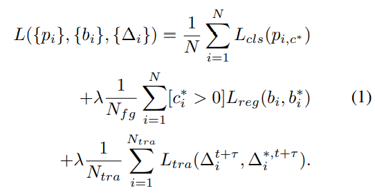

# 多目标跟踪论文（13）D&T论文

https://openaccess.thecvf.com/content_ICCV_2017/papers/Feichtenhofer_Detect_to_Track_ICCV_2017_paper.pdf

https://github.com/feichtenhofer/Detect-Track

https://blog.csdn.net/weixin_41963310/article/details/114534153

- 本文使用一个简单的卷积网络模型（ConvNet）在视频序列中**同时实现多目标的跟踪和检测**；

- 本文构建了一个新颖的损失函数，包括用于单帧检测的多任务损失和用于多帧间跟踪回归损失；

- 本文引入相关特征用于代表同一目标在不同帧图片中同时出现以此达到跟踪的目的；

- 本文检测和跟踪相互辅助，同时产生高精度的检测和跟踪性能；

- 本文提出在多帧中同时进行目标检测和跟踪任务，其中检测部分使用R-FCN框架，跟踪部分则将基于相关和回归的跟踪思想融入到上述检测框架中；

我们的ConvNet架构用于时空物体检测是在大型ImageNet VID数据集上进行评估的，该数据集可实现最新的结果。

## 2. Related work

**物体检测：** Faster两阶段系列，一阶段系列。

本文检测器使用R-FCN，全卷积，简单且计算量少，位置敏感Roi pooling。

**跟踪：** 借鉴Fully-convolutional siamese networks for object tracking和Learning to track at 100 FPS with deep regression networks。但它们只是单目标跟踪方法。

## 3. D&T Approach

给定两帧图像，首先经过共享的卷积网络（如ResNet-101）提取特征图；RPN提取RoI区域（基于在预定义框anchor中物体的可能性）；RoI pooling对RoI区域分别进行分类和回归；回归器来自两个帧的中间位置敏感回归映射(进行相关操作后，见下文)作为输入，输入到RoI跟踪去学习输出从一个帧到另一个帧的变换。最后为了推断视频中目标的运动轨迹，把检测结果进行链接。

实验表明，在D&T中添加跟踪损失（track loss）可以使静态图像学习进行更好的特征学习；在输入帧中添加时间间隔可以使得处理速度提高。

### 3.1. D&T overview

**联合物体检测和跟踪，提出D&T网络结构。**

基于R-FCN全卷积网络，扩展到多帧检测和跟踪。主要任务：

- 给定两帧图像，首先经过共享的卷积网络（如ResNet-101）提取特征图；
- RPN提取RoI区域（基于在预定义框anchor中物体的可能性）；
- 利用位置敏感RoI pooling对RoI区域分类，RoI pooling的输入来自ResNet最后一层提取的特征$x_{cls}^t$；
- 该RoI层一个分支产生$D_{cls}=k^2(C+1)$个分数图，对应$k×k$个网格，每个有$C$个类别和一个背景。另一个分支输出$x_{reg}^t$，再次对这组$D_{cls} = 4k^2$映射执行位置敏感的RoI合并操作，以对框$b =（b_x，b_y，b_w，b_h）$进行类无关的边界框预测。

回归器来自两个帧的中间位置敏感的回归映射(连同相关映射，见下文)作为输入，输出从一个帧到另一个帧的变换。

### 3.2. Object detection and tracking in R-FCN

1. 在t时刻图像帧，输入到卷积网络得到特征图，由第$l$层输出；
2. R-FCN由两个阶段：
   1. 首先，它使用RPN提取感兴趣的候选区域（RoI）[31]；
   2. 其次，由两个分支：分类和回归
      - 一个分支来自ResNet最后一个卷积层，加一个额外的卷积层得到输出$x_{cls}^t$，使用位置敏感的RoI-pooling层对RoI区域进行分类，区分出具体的类别和背景[3]。该RoI-pooling层得到一组位置敏感分数$D_{cls}=k^2(C+1)$，对应$k×k$个网格，每个有$C$个类别和一个背景。
      - 另一个分支来自ResNet最后一个卷积层，加一个卷积层得到输出$x_{reg}^t$，在$D_{cls} = 4k^2$个map执行位置敏感的RoI-pooling操作，以对框$b =（b_x，b_y，b_w，b_h）$进行类无关的边界框预测。

引入了一个帧间边界框回归层，该层对边界框回归的联合$\{x_{reg}^t, x_{reg}^{t+τ}\}$特征执行位置敏感的RoI pooling，预测t到t+τ的RoI的转换。

两帧图像经过同一卷积网络Conv得到特征图。两个特征图经过RoI-pooling，执行分类任务，检测物体类别信息。也得到检测的boxes信息，并同时将两个特征图做相关操作，将boxes检测框和相关特征输入到RoI-tracking，计算两帧的回归偏移。

### 3.3. Multitask detection and tracking objective

扩展了Fast R-CNN的多任务损失函数，包含分类$L_{cls}$和回归$L_{reg}$损失，记录两帧之间轨迹的$L_{tra}$。

$c_{i}^{*}$是gt的类标签；$p_{i,c^*}^{}$是对应的预测分数；$b_{i}^{*}$是gt回归目标；$\Delta_{i}^{*,t+τ}$是跟踪的回归目标；

$L_{cls}(p_{i,c^*})=-log(p_{i,c^*})$是box分类的交叉熵损失，$L_{cls}$ & $L_{reg}$是box和track回归的损失，损失函数是smooth L1损失。

ROI区域与ground-truth的IOU大于0.5，则对分类标签$c_{}^{*}$和回归目标$b_{}^{*}$进行赋值；如果ground-truth目标在两帧中均出现，则对跟踪目标$\Delta_{}^{*,t+τ}$进行赋值；N是一个训练批次中所有的边框，$N_{fg}$是前景ROI的数量，$N_{tra}$是在两帧之间有轨迹联系的ground-truth ROI的数量。

 为了实现轨迹回归（track regression），使用R-CNN中的边界框回归参数变量，对于单个目标，其在t帧的groun-truth边框坐标为$B^{t+\tau}=\left(B_{x}^{t}, B_{y}^{t}, B_{w}^{t}, B_{h}^{t}\right)$，其中$B_{x}^{t}, B_{y}^{t}$为边框的中心坐标，从而得到目标的轨迹回归值$\Delta^{*, t+\tau}=\left\{\Delta_{x}^{*, t+\tau}, \Delta_{y}^{*, t+\tau}, \Delta_{w}^{*, t+\tau}, \Delta_{h}^{*, t+\tau}\right\}$。

### 3.4. Correlation features for object tracking

为一个特征图所有位置计算相关映射，然后对特征图执行RoI pooling操作用来track回归。但是这样计算需要考虑到特征图的所有的循环位移，会产生高维输出和大量位移响应。所以本文提出，只在邻近区域执行相关操作。借鉴了光流估计的思想，引入相关层对两帧的特征图进行匹配。相关层是对两个特征图$\mathbb{x}_l^{t}, \mathbb{x}_l^{t+τ}$逐点匹配的：

$−d ≤ p ≤ d$和$−d ≤ p ≤ d$是特征图$i, j$位置邻近的正方形区域。相关层的输出也是一个特征图：

上式可以看作是两个特征图在大小定义为d的正方形邻域内的correlation，为了得到该correlation，使用conv3、conv4、conv5进行计算（为了与conv4和conv5得到同样大小的分辨率，在conv3中使用的stride大小为2），详细计算情况如下：

两个帧的相关特征。 对于（a）和（b）中的帧，在（c）（d）和（e）中分别使用conv3，conv4和conv5的特征计算出的相关图。 特征图显示为阵列，中心图对应于帧之间的0偏移，p，q，相邻行和列对应于递增的p，q的移位相关图。飞机向右上方移动； 因此，对应于p = 2，q = 3的特征图显示了强烈的响应（以红色突出显示）。conv4和conv5处的特征具有相同的分辨率，而在conv3处，使用stride=2来产生大小相等的输出。 （h）（i）和（j）是（f）和（g）两帧的多尺度相关图，这些图受到相机运动的影响，导致相关模式可以在较低层正确估计此值（conv3 会在动物的草和腿上做出反应，并在较高的conv5 下处理动物的独立运动。

## 4. Linking tracklets to object tubes

将tracklets与物体tubes进行连接。

高准确率目标检测有一个缺点就是高分辨率的输入图像必须要进行处理，这使得网络结构每次迭代过程中可以处理的帧数数量有了限制（主要是因为GPU的硬件限制）。因此如何权衡检测准确率和每次迭代可以处理的帧数（也就是检测速度）非常重要。

因为视频内含有大量的冗余信息且目标的移动通常都是平顺的，所以可以使用帧内的检测器来实时连接检测结果，并建立一个长期的对象通道（long-term object tube）。为此，采用一种动作定位的方法，将每帧检测结果和tube实时进行连接。

对时刻t的一帧的检测框$D_{i}^{t, c}=\left\{x_{i}^{t}, y_{i}^{t}, w_{i}^{t}, h_{i}^{t}, p_{i, c}^{t}\right\}$，$i$为框的索引；$x_{i}^{t}, y_{i}^{t}$为框中心位置；$w_{i}^{t}, h_{i}^{t}$为框宽和高；$p_{i, c}^{t}$为$c$类别的概率。同时还有时刻$t$到$t+\tau$的轨迹$T^{t,t+τ}_i = \{x^t_i , y^t_i , w^t_i , h^t_i ; x^t_i + ∆^{t+τ}_x , y^t_i + ∆^{t+τ}_y , w^t_i +∆^{t+τ}_w , h^t_i +∆^{t+τ}_h\}$，从而可以结合检测和跟踪结果来定义一个类别的连接分数：

其中：

如果检测框$D_{i}^{t}, D_{j}^{t+\tau}$和轨迹$T^{t,t+τ}$之间的IoU值大于0.5，则$\psi$的值为1否则为0，这一点非常重要，因为这样的话轨迹回归器（track regressor）的结果不需要额外与边框回归器（box regressor）的结果进行对比和匹配。

然后，可以通过最大化视频持续时间$\Tau$内的分数找到帧间的最优路径：

因为该等式使用了Viterbi algorithm（维特比算法），所以效率有所下降。一旦最佳tube $\bar{D}^*_c$被发现，对于该tube的检测结果被从region集合内删除，然后上述等式被应用在剩余的region上。

在发现了特定类别对应的$\bar{D}_c$后，使用最高检测分数的$\alpha =50\%$对所有的检测分数进行重新赋值——因为发现整体的性能表现对该参数具有很大的鲁棒性（当$\alpha$的值在10%到100%内浮动时，性能的变化区间低于0.5%）。

对检测分数进行重新赋值主要是为了增加那些因为检测器失误而被排除在检测结果外的positive 边框的分数，从而提高跟踪器的鲁棒性。该想法受Canny边缘检测器中滞后跟踪（hysteresis track）方法的启发。